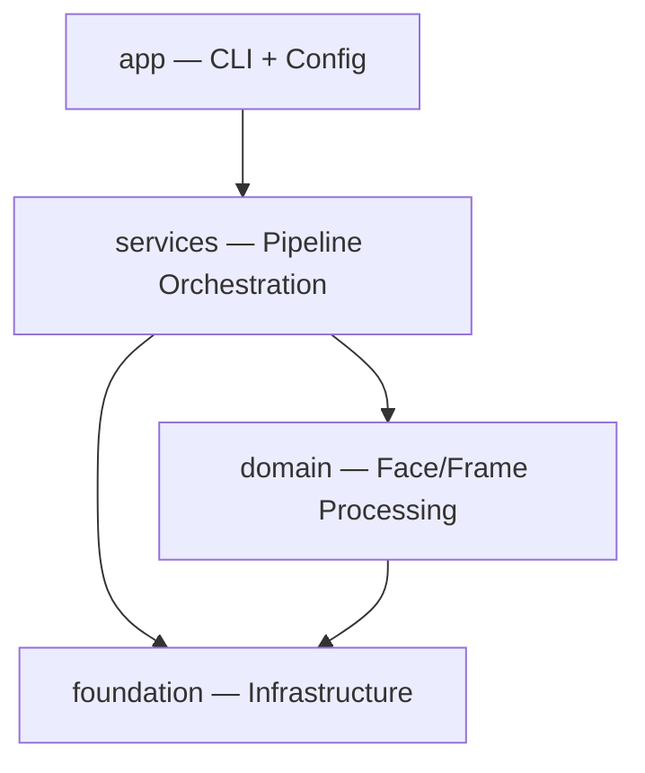
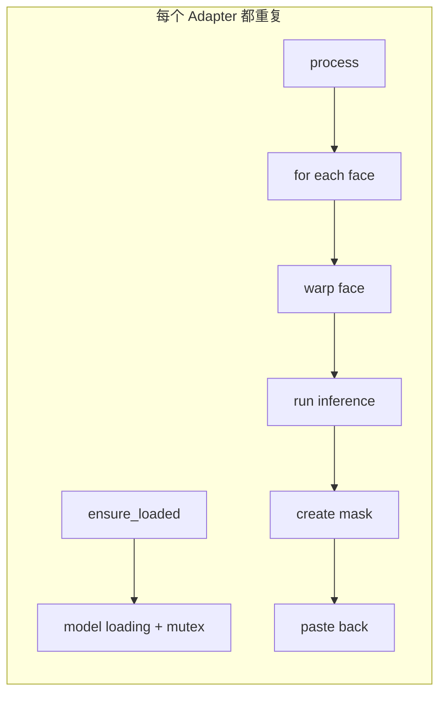

# FaceFusionCpp 代码异味与技术债务分析

> **分析时间**: 2026-02-20
> **项目规模**: 69 源文件, ~13,700 行源码, ~10,000 行测试代码

---

## 1. 项目架构概览

项目采用四层架构，使用 C++20 Modules (`.ixx`)：



| 层级 | 目录 | 职责 | 文件数 |
|------|------|------|--------|
| **app** | `src/app/` | CLI 入口、配置解析与验证 | ~21 |
| **services** | `src/services/` | Pipeline 编排、运行器 | ~15 |
| **domain** | `src/domain/` | 人脸检测/交换/增强/表情恢复、帧增强 | ~117 |
| **foundation** | `src/foundation/` | 推理会话、日志、进程、FFmpeg 媒体 | ~52 |

---

## 2. 代码异味清单

### 2.1 🔴 God Method — `AddProcessorsToPipeline` (严重)

- **文件**: [pipeline_runner.cpp](file:///home/hui/work_space/my_projects/faceFusionCpp/src/services/pipeline/pipeline_runner.cpp#L341-L507)
- **行数**: 170 行
- **问题**: 单个方法包含了 **全部四种处理器** (swapper/enhancer/expression/frame_enhancer) 的初始化逻辑，每个分支都重复以下模式：

```
1. 解析 step params (std::get_if)
2. 获取 model_name
3. m_model_repo->ensure_model()
4. 检查路径是否为空
5. 加载模型
6. 存入 domain_ctx
```

**影响**: 新增处理器类型需修改此函数，违反开闭原则 (OCP)。每个分支约 30-40 行，高度相似但不完全相同。

```diff
# 建议: 使用 Strategy/Registry 模式
- for (step : pipeline) {
-     if (step == "face_swapper") { ... 40 lines ... }
-     else if (step == "face_enhancer") { ... 30 lines ... }
-     else if (step == "expression_restorer") { ... 30 lines ... }
-     else if (step == "frame_enhancer") { ... 35 lines ... }
- }
+ // 每个处理器实现自己的 IProcessorInitializer::initialize(domain_ctx, step, model_repo)
+ for (step : pipeline) {
+     auto initializer = ProcessorInitializerRegistry::get(step.step);
+     initializer->initialize(domain_ctx, step, model_repo, inference_options);
+ }
```

---

### 2.2 🔴 重复的枚举解析 — Boilerplate 泛滥 (严重)

- **文件**: [config_parser.cpp](file:///home/hui/work_space/my_projects/faceFusionCpp/src/app/config/parser/config_parser.cpp#L160-L302)
- **代码行**: ~150 行 (16 个函数)
- **问题**: 8 种枚举类型，每种都有几乎相同结构的 `parse_xxx()` + `to_string()` 函数对：

```cpp
// 以下模式重复 8 次：
Result<EnumType> parse_xxx(const std::string& str) {
    auto lower = detail::ToLower(str);
    if (lower == "val1") return Result<EnumType>::ok(EnumType::Val1);
    if (lower == "val2") return Result<EnumType>::ok(EnumType::Val2);
    return Result<EnumType>::err(ConfigError(...));
}
std::string to_string(EnumType value) {
    switch (value) {
    case EnumType::Val1: return "val1";
    case EnumType::Val2: return "val2";
    }
    return "default";
}
```

**建议**: 使用 `std::map` 或 `constexpr` 查表 + 模板/宏生成，可将 150 行缩减到 ~30 行。

---

### 2.3 🟡 重复的 Metrics 初始化代码 (中等)

- **文件**: [pipeline_runner.cpp](file:///home/hui/work_space/my_projects/faceFusionCpp/src/services/pipeline/pipeline_runner.cpp#L244-L307)
- **问题**: `ProcessImageBatch` 和 `ProcessVideoTarget` 中有 **完全相同** 的 metrics 初始化逻辑 (约 8 行) 和相似的报告导出逻辑：

```cpp
// 在两个方法中都出现:
if (m_app_config.metrics.enable) {
    m_metrics_collector = std::make_unique<MetricsCollector>(task_config.task_info.id);
    m_metrics_collector->set_gpu_sample_interval(
        std::chrono::milliseconds(m_app_config.metrics.gpu_sample_interval_ms));
    context.metrics_collector = m_metrics_collector.get();
} else {
    context.metrics_collector = nullptr;
}
```

**建议**: 提取为 `SetupMetrics(context, task_config)` 和 `ExportMetricsReport(name)` 辅助方法。

---

### 2.4 🟡 过度使用 Singleton 模式 (中等)

项目中有 **6 个全局单例**：

| 单例类 | 文件位置 |
|--------|----------|
| `Logger` | `foundation/infrastructure/logger.cpp` |
| `FaceStore` | `domain/face/face_store.cpp` |
| `ModelRepository` | `domain/ai/model_repository.cpp` |
| `FaceModelRegistry` | `domain/face/analyser/face_model_registry.cpp` |
| `ProcessorFactory` | `domain/pipeline/processor_factory.ixx` |
| `InferenceSessionRegistry` | `foundation/ai/inference_session_registry.cpp` |

**问题**:
- 降低可测试性：测试需要 `reset_instance()` 之类的方法来绕过
- 隐藏依赖关系，使代码耦合变得不透明
- 多数使用 `shared_ptr` 包装，语义上是 `unique` 所有权

> [!TIP]
> `FaceModelRegistry` 已提供了 `set_instance_for_testing()` / `reset_instance()` — 说明团队已意识到此问题，但更好的方案是通过 **依赖注入** 传递这些服务。

---

### 2.5 🟡 Adapter 类中的结构性重复 (中等)

- **文件**: [pipeline_adapters.ixx](file:///home/hui/work_space/my_projects/faceFusionCpp/src/domain/pipeline/pipeline_adapters.ixx) (523 行)
- **问题**: `SwapperAdapter`、`FaceEnhancerAdapter`、`ExpressionAdapter` 三个 Adapter 有高度相似的结构：
  - 相同的 `ensure_loaded()` 模式 (mutex + flag + load)
  - 相同的 `process()` 主体结构 (遍历 faces → warp → process → mask → paste back)
  - 相同的成员变量集 (model_path, options, m_loaded, m_load_mutex, occluder, region_masker)



**建议**: 提取 `FaceProcessingAdapterBase` 基类，利用 Template Method 模式，子类仅实现 `do_process_face()` 步骤。

---

### 2.6 🟡 大文件 — 跨平台 `process.cpp` (中等)

- **文件**: [process.cpp](file:///home/hui/work_space/my_projects/faceFusionCpp/src/foundation/infrastructure/process.cpp) (744 行)
- **问题**: 使用 `#ifdef _WIN32 / #else` 将 Windows 和 POSIX 实现放在单个文件中。`Process::Process` 构造函数在 Windows 侧约 120 行。
- **影响**: 文件难以导航，修改一个平台的代码容易误触另一个平台。

**建议**: 拆分为 `process_win32.cpp` + `process_posix.cpp` + 公共接口，通过 CMake 条件编译选择。

---

### 2.7 🟢 `ParsePipelineStep` 中重复的参数解析 (轻微)

- **文件**: [config_parser.cpp](file:///home/hui/work_space/my_projects/faceFusionCpp/src/app/config/parser/config_parser.cpp#L477-L539)
- **问题**: `face_swapper`、`face_enhancer`、`expression_restorer` 三个分支都有相同的 `face_selector_mode` + `reference_face_path` 解析逻辑 (~8 行 × 3)：

```cpp
auto mode_str = detail::GetString(params_j, "face_selector_mode", "many");
auto mode_r = parse_face_selector_mode(mode_str);
if (!mode_r) { return Result<PipelineStep>::err(mode_r.error()); }
params.face_selector_mode = mode_r.value();

auto ref_path = detail::GetString(params_j, "reference_face_path", "");
if (!ref_path.empty()) { params.reference_face_path = ref_path; }
```

**建议**: 提取 `parse_face_selection_params()` 辅助函数，或使用一个通用的基础参数结构。

---

### 2.8 🟢 字符串魔术值 (轻微)

多处使用硬编码字符串进行类型匹配：

| 位置 | 字符串 |
|------|--------|
| `pipeline_runner.cpp:356` | `"face_swapper"`, `"face_enhancer"`, `"expression_restorer"`, `"frame_enhancer"` |
| `pipeline_runner.cpp:391` | `model_name.find("codeformer")` |
| `pipeline_runner.cpp:467` | `model_name.find("hat")` |
| `config_parser.cpp:486-532` | 步骤类型字符串匹配 |

**问题**: 字符串分散在多处，拼写错误难以发现，编译器无法检查。

**建议**: 使用 `constexpr` 字符串常量或枚举统一管理步骤类型标识。

---

### 2.9 🟢 `face_helper.cpp` 实用函数膨胀 (轻微)

- **文件**: [face_helper.cpp](file:///home/hui/work_space/my_projects/faceFusionCpp/src/domain/face/face_helper.cpp) (458 行, 25 个函数)
- **问题**: 包含了从 NMS、仿射变换、anchor 生成、插值到旋转的**各种不同职责**的函数。这是一个典型的 "Helper" / "Utils" 反模式。
- **建议**: 按职责拆分：
  - `face_geometry.cpp` — 仿射变换、warp、paste_back
  - `face_detection_utils.cpp` — NMS、anchor、bbox 距离计算
  - `face_math.cpp` — 插值、embedding 平均

---

### 2.10 🟢 `FaceStore` 使用 FNV1a 哈希整帧图像 (轻微)

- **文件**: [face_store.cpp](file:///home/hui/work_space/my_projects/faceFusionCpp/src/domain/face/face_store.cpp#L161-L180)
- **问题**: `get_key()` 对 **整个帧的像素数据** 计算哈希 — 对 1080p 帧约 6MB 数据做 FNV1a。视频处理中每帧都需要计算。
- **影响**: 可能成为性能瓶颈。且 FNV1a 在大数据量下碰撞概率不可忽略。
- **建议**: 考虑使用帧序号作为 key，或仅对采样像素 / 帅缩略图做哈希。

---

## 3. 架构层面的技术债

### 3.1 `services` 层过于单薄

`services/pipeline/` 是唯一的服务模块，且 `PipelineRunner::Impl` 承担了过多职责：
- 模型加载 / 管理
- Pipeline 组装
- Image/Video 分发
- Metrics 管理
- Source embedding 加载

> [!IMPORTANT]
> 建议将模型加载职责移至 `domain` 层的 `ModelLoader` 服务，Pipeline 组装移至独立的 `PipelineBuilder`。

### 3.2 `domain/pipeline` 中有 `PipelineContext` 但 `services` 层自建 `ProcessorContext`

存在两个用途重叠的上下文对象：
- `domain::pipeline::PipelineContext` — 持有各种处理器实例
- `services::pipeline::ProcessorContext` — 持有 model_repo、analyser、embedding 等

这导致数据在两个上下文间手动搬运，增加了理解和维护成本。

### 3.3 测试覆盖结构良好但缺少部分单元测试

```
tests/
├── unit/          — 单元测试
├── integration/   — 集成测试
└── benchmark/     — 性能基准测试
```

测试结构优秀，但以下核心模块 **缺少对应的单元测试目录**：
- `services/pipeline/` (仅在 `integration/app/` 中间接测试)
- `foundation/media/` (仅有集成测试)

---

## 4. 优先级排序与建议

| 优先级 | 问题 | 影响范围 | 建议行动 |
|--------|------|----------|----------|
| 🔴 P0 | God Method `AddProcessorsToPipeline` | 可扩展性 | 重构为 Registry + Strategy 模式 |
| 🔴 P0 | 枚举解析 Boilerplate | 维护成本 | 宏/模板生成 parse + to_string 对 |
| 🟡 P1 | Adapter 结构性重复 | 代码量 | 提取 Template Method 基类 |
| 🟡 P1 | Singleton 泛滥 | 可测试性 | 对核心服务改用依赖注入 |
| 🟡 P1 | Metrics 初始化重复 | DRY 原则 | 提取辅助方法 |
| 🟡 P2 | 跨平台 `process.cpp` | 可维护性 | 按平台拆分文件 |
| 🟢 P2 | 字符串魔术值 | 安全性 | 引入 constexpr 常量 |
| 🟢 P3 | Helper 反模式 | 可读性 | 按职责拆分 |
| 🟢 P3 | 双上下文对象 | 架构清晰度 | 统一为单个 Context 类 |
| 🟢 P3 | FaceStore 全帧哈希 | 性能 | 改用帧序号或采样哈希 |

---

## 5. 总结

项目整体架构分层清晰，C++20 Modules 使用规范，测试体系 (unit/integration/benchmark) 完整。主要技术债集中在：

1. **`services` 层的 God Class/Method** — `PipelineRunner::Impl` 职责过重
2. **`config` 层的 Boilerplate** — 枚举解析缺少元编程/代码生成
3. **`domain/pipeline` 的 Adapter 重复** — 缺少相似逻辑的抽象基类

这些问题不影响当前功能正确性，但随着新的处理器类型 (如 face classifier、inpainting 等) 的加入，维护成本会加速增长。建议优先处理 P0 级别的 God Method 和枚举 Boilerplate，投入产出比最高。
