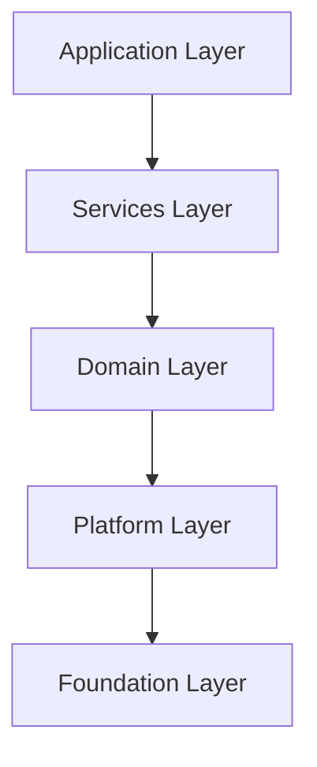
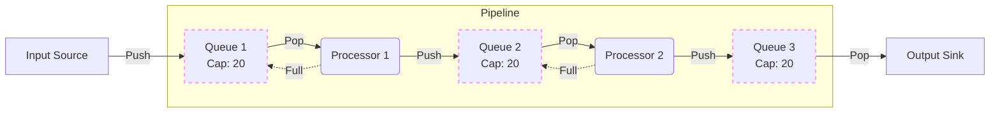

# 应用层架构设计说明书 (Application Layer Architecture Design Specification)

> **文档标识**: FACE-FUSION-APP-ARCH
> **密级**: 内部公开 (Internal Public)
> **状态**: 正式 (Official)
> **最后更新**: 2026-02-05

## 版本历史 (Version History)

| 版本 | 日期       | 修改人   | 说明                                                                                                                              |
| :--- | :--------- | :------- | :-------------------------------------------------------------------------------------------------------------------------------- |
| V1.0 | 2025-10-01 | ArchTeam | 初始版本                                                                                                                          |
| V2.0 | 2026-01-15 | ArchTeam | 重构为 C++20 模块化架构                                                                                                           |
| V2.3 | 2026-01-27 | ArchTeam | 新增命令行接口 (CLI) 设计; 优化工程化规范                                                                                         |
| V2.4 | 2026-01-28 | ArchTeam | 完善错误码定义、流水线图示及优雅停机策略; 移除实施路线图                                                                          |
| V2.5 | 2026-01-29 | ArchTeam | 优化构建规范、路径解析、日志标准及 FlatBuffers 依赖说明                                                                           |
| V2.6 | 2026-01-30 | ArchTeam | 添加目录导航; 完善资源管理参数 (LRU/TTL/背压); 增强日志轮转配置; 新增 CLI --validate 模式; 规范 Metrics JSON Schema; 修正拼写错误 |
| V2.7 | 2026-02-02 | ArchTeam | 新增 A.3 标准测试素材规范; 定义硬件适配验收标准; 补充边界情况测试要求                                                             |
| V2.8 | 2026-02-05 | ArchTeam | 更新 A.3.3 硬件适配验收标准; 添加当前测试环境基准 (RTX 4060 8GB); 优化性能基准表; 新增硬件适配策略分级指南                        |

---

## 目录 (Table of Contents)

- [应用层架构设计说明书 (Application Layer Architecture Design Specification)](#应用层架构设计说明书-application-layer-architecture-design-specification)
  - [版本历史 (Version History)](#版本历史-version-history)
  - [目录 (Table of Contents)](#目录-table-of-contents)
  - [1. 引言 (Introduction)](#1-引言-introduction)
    - [1.1 目的 (Purpose)](#11-目的-purpose)
    - [1.2 架构原则 (Architecture Principles)](#12-架构原则-architecture-principles)
  - [2. 核心架构设计 (Core Architecture Design)](#2-核心架构设计-core-architecture-design)
    - [2.1 关注点分离 (Separation of Concerns)](#21-关注点分离-separation-of-concerns)
    - [2.2 运行模式 (Execution Modes)](#22-运行模式-execution-modes)
  - [3. 详细设计规范 (Detailed Design Specifications)](#3-详细设计规范-detailed-design-specifications)
    - [3.1 应用配置 (App Configuration)](#31-应用配置-app-configuration)
    - [3.2 任务配置 (Task Configuration)](#32-任务配置-task-configuration)
    - [3.3 配置校验机制 (Config Validation Mechanism)](#33-配置校验机制-config-validation-mechanism)
      - [3.3.1 校验时机](#331-校验时机)
      - [3.3.2 错误报告格式](#332-错误报告格式)
      - [3.3.3 未来扩展](#333-未来扩展)
    - [3.4 构建系统规范 (Build System Specification)](#34-构建系统规范-build-system-specification)
    - [3.5 命令行接口 (Command Line Interface)](#35-命令行接口-command-line-interface)
      - [3.5.1 设计原则](#351-设计原则)
      - [3.5.2 命令结构](#352-命令结构)
      - [3.5.3 参数规格](#353-参数规格)
      - [3.5.4 `--system-check` 输出规范](#354---system-check-输出规范)
  - [4. 核心业务处理逻辑 (Core Business Logic)](#4-核心业务处理逻辑-core-business-logic)
    - [4.1 处理器与适配器 (Processor and Adapter)](#41-处理器与适配器-processor-and-adapter)
      - [4.1.1 换脸处理器 (Face Swapper)](#411-换脸处理器-face-swapper)
      - [4.1.2 人脸增强处理器 (Face Enhancer)](#412-人脸增强处理器-face-enhancer)
      - [4.1.3 表情还原处理器 (Expression Restorer)](#413-表情还原处理器-expression-restorer)
      - [4.1.4 全帧增强处理器 (Frame Enhancer)](#414-全帧增强处理器-frame-enhancer)
    - [4.2 流水线 (Pipeline)](#42-流水线-pipeline)
      - [4.2.1 流水线策略 (Pipeline Strategy)](#421-流水线策略-pipeline-strategy)
  - [5. 工程化约束与最佳实践 (Engineering Constraints)](#5-工程化约束与最佳实践-engineering-constraints)
    - [5.1 路径解析规范 (Path Resolution Criteria)](#51-路径解析规范-path-resolution-criteria)
    - [5.2 进度与遥测解耦 (Progress \& Telemetry Decoupling)](#52-进度与遥测解耦-progress--telemetry-decoupling)
    - [5.3 错误处理与恢复 (Error Handling \& Recovery)](#53-错误处理与恢复-error-handling--recovery)
      - [5.3.1 错误码定义 (Error Codes) - *Planned*](#531-错误码定义-error-codes---planned)
      - [5.3.2 错误策略](#532-错误策略)
    - [5.4 版本控制 (Versioning Strategy)](#54-版本控制-versioning-strategy)
    - [5.5 元数据管理 (Metadata Management)](#55-元数据管理-metadata-management)
    - [5.6 优雅停机 (Graceful Shutdown)](#56-优雅停机-graceful-shutdown)
    - [5.7 资源并发与流控 (Concurrency \& Flow Control)](#57-资源并发与流控-concurrency--flow-control)
    - [5.8 数据序列化 (Data Serialization) - *Implementation Pending*](#58-数据序列化-data-serialization---implementation-pending)
    - [5.9 断点续传 (Checkpointing)](#59-断点续传-checkpointing)
    - [5.10 增强日志规范 (Enhanced Logging Requirements)](#510-增强日志规范-enhanced-logging-requirements)
      - [5.10.1 日志分级策略 (Log Levels)](#5101-日志分级策略-log-levels)
      - [5.10.2 埋点位置要求 (Instrumentation Points)](#5102-埋点位置要求-instrumentation-points)
      - [5.10.3 隐私与合规 (Privacy \& Compliance)](#5103-隐私与合规-privacy--compliance)
    - [5.11 Metrics JSON Schema 参考](#511-metrics-json-schema-参考)
  - [6. 未来规划 (Future Roadmap)](#6-未来规划-future-roadmap)
    - [6.1 自动化配置校验 (Config Validation) - *部分实现*](#61-自动化配置校验-config-validation---部分实现)
    - [6.2 插件化处理器架构 (Plugin Architecture)](#62-插件化处理器架构-plugin-architecture)
    - [6.3 服务化接口 (Server Mode)](#63-服务化接口-server-mode)
  - [附录 (Appendix)](#附录-appendix)
    - [A.1 术语表 (Glossary)](#a1-术语表-glossary)
    - [A.2 配置文件快速对照](#a2-配置文件快速对照)
    - [A.3 标准测试素材 (Standard Test Assets)](#a3-标准测试素材-standard-test-assets)
      - [A.3.1 测试图片目录](#a31-测试图片目录)
      - [A.3.2 测试视频目录](#a32-测试视频目录)
      - [A.3.3 硬件适配验收标准](#a33-硬件适配验收标准)
      - [A.3.4 边界情况测试](#a34-边界情况测试)
    - [A.4 依赖项说明 (Dependencies)](#a4-依赖项说明-dependencies)
    - [A.5 数据格式选型 (Data Format Selection)](#a5-数据格式选型-data-format-selection)
      - [A.5.1 格式对比](#a51-格式对比)
      - [A.5.2 架构决策](#a52-架构决策)

---

## 1. 引言 (Introduction)

### 1.1 目的 (Purpose)
本文档旨在规范 **FaceFusionCpp** 项目应用层 (Application Layer) 的架构设计、配置管理规范及核心业务流程。作为应用层开发的最高指导原则，本文档明确了静态环境与动态作业的边界，规定了工程化实现的约束条件，以确保系统的高可用性、可维护性及扩展性。

### 1.2 架构原则 (Architecture Principles)
本设计严格遵循项目定义的 **5层分层架构 (5-Layered Architecture)**：



*   **依赖单向性 (Unidirectional Dependency)**: 上层仅依赖下层，严禁反向依赖或跨层跳跃调用。
*   **模块化 (Modularity)**: 基于 **C++20 Modules** (`.ixx` / `.cppm`) 构建，强制物理隔离接口与实现，子系统间仅通过明确定义的接口交互。

---

## 2. 核心架构设计 (Core Architecture Design)

### 2.1 关注点分离 (Separation of Concerns)
为实现系统配置的高内聚低耦合，将配置域严格划分为 **静态环境基础设施** 与 **动态业务流水线**。

| 维度         | **App Config (应用配置)**                      | **Task Config (任务配置)**                      |
| :----------- | :--------------------------------------------- | :---------------------------------------------- |
| **定位**     | 运行时环境与基础设施定义                       | 具体业务处理逻辑定义                            |
| **引用**     | [3.1 应用配置](#31-应用配置-app-configuration) | [3.2 任务配置](#32-任务配置-task-configuration) |
| **生命周期** | 进程级 (Global Static)                         | 任务级 (Task-Scoped Dynamic)                    |
| **可变性**   | 启动时加载，运行时不可变                       | 每次任务执行时动态加载                          |
| **典型内容** | 日志级别、模型仓库路径、硬件资源限额           | Pipeline 步骤拓扑、输入输出路径、算法参数       |

### 2.2 运行模式 (Execution Modes)
系统设计支持多种运行模式，底层核心逻辑（`RunPipeline` 接口）保持一致，仅在接入层（Access Layer）有所区分。

*   **命令行接口 (CLI Mode)** (Current Focus)
    *   通过命令行参数 (`--config`) 注入任务配置。
    *   适用于离线批处理、CICD 脚本自动化场景。
*   **服务化接口 (Server Mode)** (Future Roadmap)
    *   通过 HTTP/RPC 接收动态配置负载。
    *   适用于即时推理服务、Web 后端集成场景。
    *   **设计约束**: CLI 与 Server 模式除 "配置加载器" 与 "进度回调" 外，必须完全复用底层业务逻辑。

---

## 3. 详细设计规范 (Detailed Design Specifications)

### 3.1 应用配置 (App Configuration)
采用分层架构设计，确保配置的可读性与逻辑性。
*   **默认位置**: `config/app_config.yaml` (相对于系统根目录)。
*   **配置级联**: 遵循优先级 `Task Config > User Config > System Default`。
*   **硬编码禁令**: 必须显式定义所有关键路径与资源限额，禁止在代码中硬编码环境相关路径。

**Schema 参考**:
```yaml
# Schema Version
config_version: "1.0"

# 推理基础设施 (Inference Infrastructure)
inference:
  # 显卡/计算设备分配
  # 扩展预留: 未来可支持 device_ids: [0, 1]
  device_id: 0
  # 引擎缓存策略
  engine_cache:
    enable: true
    path: "./.cache/tensorrt" # 相对系统根目录 (FACEFUSION_HOME)
    # LRU 缓存容量上限 (Session Cache)
    max_entries: 3
    # 空闲超时时间 (秒)，超时后自动释放
    idle_timeout_seconds: 60
  # 默认推理后端优先级
  default_providers:
    - tensorrt
    - cuda
    - cpu

# 资源与性能 (Resources & Performance)
resource:
  # 内存策略 (strict/tolerant)
  # strict: 严格模式 (On-Demand with LRU).
  #         行为: 处理器仅在执行期间(run)持有模型资源。一旦完成当前分配的任务，尝试释放底层推理引擎资源。
  #               *优化*: 引入 Session Cache / LRU 机制，保留最近使用的 Engine Context，避免频繁加载/卸载造成的性能抖动，仅在显存压力大或超时未复用时真正释放。
  #         场景: 配合 execution_order: batch 使用效果最佳，可极大降低峰值显存。
  # tolerant: 宽容模式 (Cached).
  #         行为: 所有模型在系统启动时预加载，并常驻内存/显存，直到程序退出。
  #         场景: 适合高频实时任务或显存充足环境，避免模型重复加载开销。
  memory_strategy: "strict"
  # 全局内存配额 (用于背压流控)
  # 格式: "4GB", "2048MB" 等
  max_memory_usage: "4GB"

# 日志与调试 (System Logging)
logging:
  # 支持级别: trace, debug, info, warn, error
  level: "info"
  # 日志存储目录 (注意: 文件名固定为 app.log 或程序指定，不可配置，仅目录可配)
  directory: "./logs"
  # 轮转策略: daily, hourly, size
  rotation: "daily"
  # 最大保留文件数 (轮转后保留最近 N 个日志文件)
  max_files: 7
  # 日志总大小上限 (超出后自动删除最旧文件)
  max_total_size: "1GB"

# 可观测性 (Observability)
metrics:
  enable: true
  # 追踪每个 Step 的耗时分布 (Avg, P99)
  step_latency: true
  # 记录 GPU 显存变化曲线
  gpu_memory: true
  # 输出报告文件 (json)
  # 格式参考: 见 [Metrics JSON Schema 参考](#metrics-json-schema-参考)
  report_path: "./logs/metrics_{timestamp}.json"

# 模型管理 (Model Management)
models:
  # 模型基础目录
  path: "./assets/models"
  # 下载策略:
  # force: 无论模型是否存在都强制下载
  # skip: 模型不存在时跳过下载，从 model_repository 返回空路径，后续加载模型报错退出程序
  # auto: 模型不存在时自动下载 (默认)
  download_strategy: "auto"

# 临时文件管理 (Temp File Management)
temp_directory: "./temp"

# 默认任务配置 (Default Task Settings)
# 若 Task Config 中未指定，则回退使用此处的默认值
# 字段名与 task_config.yaml 完全一致，只要task_config.yaml有的字段和值都可以在这里设置，这里仅展示部分
default_task_settings:
  io:
    output:
      video_encoder: "libx264"
      video_quality: 80
      prefix: "result_"      # 与 task_config 一致
      suffix: ""             # 与 task_config 一致
      conflict_policy: "error"
      audio_policy: "copy"
```

### 3.2 任务配置 (Task Configuration)

基于 **Pipeline Pattern** 设计，由有序的 **Steps** 组成。
*   **Step 自包含性**: 每个 Step 包含完整的输入参数 (`params`)，不依赖全局隐式状态。
*   **链式处理 (Chain Processing)**: 无论执行顺序 (Sequential/Batch)，流水线均为链式处理 (S1结果 -> S2输入 -> S3)，而非原始帧独立处理。

**Schema 参考**:
```yaml
# Schema Version
config_version: "1.0"

# 任务元数据 (Task Metadata)
task_info:
  # 唯一任务标识 (Runtime Unique ID)
  # 格式: [a-zA-Z0-9_]
  # 策略: 若为空由程序生成；若指定且冲突则拒绝任务。
  id: "task_default_001"
  description: "Face swap and enhancement pipeline"
  # 是否启用独立任务日志 (Optional)
  # 若启用，将在日志目录生成 {task_id}.log
  enable_logging: true
  # 是否启用断点续处理 (Optional)
  enable_resume: false

# 输入输出 (I/O)
io:
  # 输入源列表 (支持多源)
  # 注意: 源目前仅支持图片文件 [png, jpg, bmp]
  # 可输入文件路径或目录路径；若为目录，自动扫描并添加目录下所有支持的图片文件
  source_paths:
    - "D:/projects/faceFusionCpp/data/source_face.jpg"

  # 目标列表
  # 支持图片、视频、目录混合输入
  # 可输入文件路径或目录路径；若为目录，自动扫描并添加目录下所有支持的媒体文件
  target_paths:
    - "D:/projects/faceFusionCpp/data/target_video.mp4"

  # 输出配置
  output:
    path: "D:/projects/faceFusionCpp/data/output/" # 强制绝对路径
    prefix: "result_"
    suffix: "_v1"  # 注意: 拼写为 suffix

    # 格式配置
    image_format: "png"      # [png, jpg, bmp]
    video_encoder: "libx264" # [libx264, libx265, h264_nvenc, ...]
    video_quality: 80        # [0-100]
    # 输出文件冲突策略: overwrite, rename, error
    conflict_policy: "error"
    # 音频处理策略: copy, skip
    # copy: 保留原视频音轨并合并到输出 (默认)
    # skip: 跳过音频，输出静音视频
    audio_policy: "copy"

# 资源控制 (Resource Control)
resource:
  # 任务并发线程数 (Thread count for this specific task)
  # 0: Auto (默认为机器最大线程数的一半 / 50% of CPU Cores)
  thread_count: 0
  # 队列最大容量 (Max Buffer Size per Pipeline Step)
  # 控制每个步骤的输入/输出队列上限，防止内存溢出 (OOM)。
  # 策略: 实际容量 = min(max_queue_size, AvailableRAM / FrameSize)
  # 默认: 20 (1080p RGBA ~160MB/Queue; 4 queues ~640MB Total)
  max_queue_size: 20
  # 处理顺序策略:
  # sequential: 顺序模式 (默认). 每一帧/图一次性经过流水线中所有处理器。
  #             优势: 低延迟，内存占用小 (仅需存当前帧).
  #             劣势: 频繁切换模型可能导致 VRAM 碎片或上下文切换开销 (若 strict 模式).
  # batch: 批处理模式. 全量帧 (或分块) 通过 Processor A 后再进入 Processor B.
  #        优势: 极大降低显存峰值 (可配合 strict 模式卸载模型)，最大化 GPU 吞吐量.
  #        劣势: 需要巨大的中间存储空间 (RAM/Disk)，首帧延迟高.
  #        *警告*: 处理长视频时极易导致 OOM 或磁盘爆炸。强烈建议配合 `segment_duration_seconds` 使用，或由系统自动分块 (Chunked Batch)。
  execution_order: "sequential"

  # 批处理中间存储策略 (仅 execution_order=batch 时有效)
  # memory: 存入 RAM. 速度快，但长视频易 OOM.
  # disk: 存入临时磁盘文件. 速度较慢 (IO瓶颈)，但支持无限长视频.
  batch_buffer_mode: "memory"
  # 注意:
  # 无论执行顺序如何，流水线均为链式处理 (S1结果 -> S2输入 -> S3)，而非原始帧独立处理模式。
  # 视频分段处理 (Optional)
  # 0: 不分段，整个视频一次性处理
  # >0: 按指定秒数分段处理，最后合并输出为单个文件
  segment_duration_seconds: 0

# 人脸分析配置 (Shared Analysis Config)
# 若多个步骤共享检测结果，可在此统一定义
face_analysis:
  face_detector:
    # Models: [retinaface, scrfd, yoloface]
    models: ["yoloface", "retinaface", "scrfd"] # 融合策略: 置信度越高越优先（采用 NMS 策略进行融合）
    score_threshold: 0.5
  face_landmarker:
    # Models: [2dfan4, peppa_wutz, face_landmarker_68_5]
    model: "2dfan4"
  face_recognizer:
    # 人脸识别/相似度匹配
    # Models: [arcface_w600k_r50]
    model: "arcface_w600k_r50"
    # 相似度阈值: 低于此值认为不是同一人，跳过处理
    # Range: [0.0, 1.0] (越高越严格)
    similarity_threshold: 0.6
  face_masker:
    # 多遮罩融合策略 (Mask Fusion)
    # 遮罩类型组合 (多选)
    types: ["box", "occlusion", "region"]
    # 遮挡检测模型 (用于 occlusion 类型)
    occluder_model: "xseg"  # Models: [xseg]
    # 人脸解析模型 (用于 region 类型)
    parser_model: "bisenet_resnet_34"  # Models: [bisenet_resnet_18, bisenet_resnet_34]
    # Supported Regions: [skin, left-eyebrow, right-eyebrow, left-eye, right-eye,
    #                     eye-glasses, left-ear, right-ear, earring, nose, mouth,
    #                     upper-lip, lower-lip, neck, necklace, cloth, hair, hat]
    # Default: "all" (if not specified or empty)
    region: ["all"] # 遮罩区域
    # 融合逻辑: 将由代码内部实现最佳遮罩计算

# 处理流水线 (Processing Pipeline)
# 有序定义处理步骤
#
# Supported Processors & Parameters:
#
# 1. face_swapper
#    - Models: [inswapper_128, inswapper_128_fp16]
#    - Params:
#        face_selector_mode: [reference, one, many] (default: many)
#        reference_face_path: "path/to/face.jpg" (required if mode=reference)
#          - 只有当图/帧中检测到与此参考图片中人脸相似的人脸时，才对该相似人脸进行处理
#          - 若参考图片中无人脸，则此图/帧透传 (Pass-through)，即直接输出原始帧，不进行处理
#
# 2. face_enhancer
#    - Models: [codeformer, gfpgan_1.2, gfpgan_1.3, gfpgan_1.4]
#    - Params:
#        blend_factor: 0.0 - 1.0 (default: 0.8)
#        face_selector_mode: [reference, one, many] (default: many)
#        reference_face_path: "path/to/face.jpg" (required if mode=reference)
#          - 同上：仅处理与参考人脸相似的人脸
#
# 3. expression_restorer
#    - Models: [live_portrait] (internally uses: feature_extractor, motion_extractor, generator)
#    - Params:
#        restore_factor: 0.0 - 1.0 (default: 0.8)
#        face_selector_mode: [reference, one, many] (default: many)
#        reference_face_path: "path/to/face.jpg" (required if mode=reference)
#          - 同上：仅处理与参考人脸相似的人脸
#
# 4. frame_enhancer
#    - Models: [real_esrgan_x2, real_esrgan_x2_fp16, real_esrgan_x4, real_esrgan_x4_fp16,
#               real_esrgan_x8, real_esrgan_x8_fp16, real_hatgan_x4]
#    - Params:
#        enhance_factor: 0.0 - 1.0 (default: 0.8)
#
# 注意: 支持多个同类型 Step (如两个 face_enhancer)，每个 Step 的 name 和 params 可不同
# 注意：name 是可选的，如果name 不存在，则默认为 step 的类型+下划线+索引
# 注意：params 是可选的，如果params 不存在则使用全局参数或默认参数，如果全局参数也不存在，则使用默认参数

global_pipeline_step_params: # 全局 Step 参数, 仅当 Step 没有显式定义时才生效
  face_selector_mode: "many"
  reference_face_path: "D:/ref_face.jpg"

pipeline:
  - step: "face_swapper"
    name: "main_swap"
    enabled: true
    params:
      model: "inswapper_128_fp16"
      face_selector_mode: "reference"
      reference_face_path: "D:/ref_face.jpg"

  - step: "face_enhancer"
    name: "post_enhancement"
    enabled: true
    params:
      model: "codeformer"
      blend_factor: 0.8
      face_selector_mode: "many"
      reference_face_path: "D:/ref_face.jpg" # 绝对路径

  - step: "expression_restorer"
    name: "main_expression_restorer"
    enabled: false
    params:
      model: "live_portrait"
      restore_factor: 0.8
      face_selector_mode: "many"
      reference_face_path: "D:/ref_face.jpg" # 绝对路径

  - step: "frame_enhancer"
    name: "main_frame_enhancer"
    enabled: false
    params:
      model: "real_esrgan_x4"
      enhance_factor: 1.0

```

---

### 3.3 配置校验机制 (Config Validation Mechanism)

为在应用启动早期拦截配置错误，系统实现以下校验机制：

#### 3.3.1 校验时机
*   **启动时校验**: 应用启动时自动校验 `app_config.yaml`。
*   **任务提交时校验**: 收到任务请求时校验 `task_config.yaml`。
*   **CLI 显式校验**: 通过 `--validate` 参数进行离线校验（见 [3.5.3 CLI 参数](#353-参数规格)）。

#### 3.3.2 错误报告格式
校验失败时，错误消息必须包含 **问题路径 (YAML Path)** 以便快速定位：

```text
[E201] YAML Format Invalid: Line 45, Column 3 - unexpected mapping entry
[E202] Parameter Out of Range: pipeline[1].params.blend_factor = 1.5, expected range [0.0, 1.0]
[E203] Config File Not Found: config/app_config.yaml does not exist
```

#### 3.3.3 未来扩展
*   引入 JSON Schema 或类似机制进行结构与类型的声明式校验。
*   支持配置 diff 与 migration 工具。

---

### 3.4 构建系统规范 (Build System Specification)
*   **单一事实来源 (Single Source of Truth)**: 必须使用 `CMakePresets.json` 定义所有构建预设 (Presets)，禁止在脚本中硬编码编译器标志。
*   **构建包装器**: `build.py` 仅作为跨平台包装器，负责调用 `cmake --preset` 并提供环境检查等辅助功能。
*   **开发预设**: 默认使用 `debug` 预设，确保启用所有调试符号与断言。
*   **发布预设**: 发布版本必须使用 `release` 预设，并启用 LTO (Link Time Optimization)。

### 3.5 命令行接口 (Command Line Interface)
本设计旨在平衡生产环境的配置管理需求与开发调试的便捷性。

#### 3.5.1 设计原则
*   **配置优先 (Configuration First)**: 生产环境应始终通过 `-c/--config` 加载完整 YAML，确保可复现性。
*   **参数覆盖 (CLI Override)**: 命令行显式参数优先级高于配置文件（例如在 Config 中定义了输出路径，但 CLI 又指定了 `-o`，则以 CLI 为准）。
*   **快捷模式 (Quick Run)**: 支持仅通过 CLI 参数 (`-s`, `-t`) 启动默认流水线，无需预先编写 YAML。

#### 3.5.2 命令结构
`FaceFusionCpp.exe [GLOBAL_OPTIONS] [TASK_OPTIONS] [PROCESSOR_FLAGS]`

#### 3.5.3 参数规格

| 类别     | 参数 (Short/Long) | 类型    | 描述                                                     |
| :------- | :---------------- | :------ | :------------------------------------------------------- |
| **全局** | `-h`, `--help`    | Flag    | 显示帮助与用法                                           |
|          | `-v`, `--version` | Flag    | 显示构建版本信息                                         |
|          | `-c`, `--config`  | Path    | **(核心)** 载入任务配置文件                              |
|          | `--log-level`     | String  | 覆盖日志级别                                             |
|          | `--validate`      | Flag    | 仅校验配置文件合法性，不执行任务 (Dry-Run)               |
|          | `--system-check`  | Flag    | 执行环境完整性自检（见下方输出规范）                     |
| **快捷** | `-s`, `--source`  | Path(s) | 源人脸图片路径 (支持多个，逗号分隔)                      |
|          | `-t`, `--target`  | Path(s) | 目标图片/视频路径 (支持多个)                             |
|          | `-o`, `--output`  | Path    | 输出目录或文件路径                                       |
|          | `--processors`    | String  | 启用的处理器 (逗号分隔，如 `face_swapper,face_enhancer`) |

> **注意**: 快捷模式参数与 `--config` 互斥。使用快捷参数时，系统将应用 `default_task_settings` 中的默认值。

#### 3.5.4 `--system-check` 输出规范
系统自检结果支持两种输出格式，便于人工查看与脚本集成：

**默认 (人类可读)**:
```text
[OK] CUDA Driver: 12.4
[OK] cuDNN: 8.9.7
[OK] TensorRT: 10.0.1
[WARN] Available VRAM: 6.2GB (Recommended: 8GB+)
[OK] Model Repository: 12 models found
[OK] FFmpeg Libraries: avcodec 60.3.100, avformat 60.3.100
[OK] ONNX Runtime: 1.17.0 (CUDA EP)
---
Result: 0 FAIL, 1 WARN
```

**JSON 格式** (添加 `--json` 标志):
```json
{
  "checks": [
    {"name": "cuda_driver", "status": "ok", "value": "12.4"},
    {"name": "vram", "status": "warn", "value": "6.2GB", "message": "Recommended: 8GB+"},
    {"name": "ffmpeg_libs", "status": "ok", "value": "avcodec 60.3.100, avformat 60.3.100"},
    {"name": "onnxruntime", "status": "ok", "value": "1.17.0", "provider": "CUDA"}
  ],
  "summary": {"ok": 6, "warn": 1, "fail": 0}
}
```

> **注意**: FFmpeg 使用动态库集成，而非命令行工具。详见 [附录 A.3 依赖项说明](#a3-依赖项说明-dependencies)。

---

## 4. 核心业务处理逻辑 (Core Business Logic)

### 4.1 处理器与适配器 (Processor and Adapter)

系统采用 **AI 核心与图像编排分离 (Core-Orchestration Decoupling)** 的设计原则。

*   **人脸处理器 (Processor)**: 作为 **AI 推理核心**，其职责仅限于处理 **归一化后的裁切图像 (Aligned Crop)**。
    *   **输入约束**: 仅接受符合模型规格（如 128x128）的裁切图及必要 Embedding 参数。
    *   **单一职责**: 专注于神经网络推理算法。不感知原图尺寸，不负责几何变换 (Warp/Crop) 或复杂的融合逻辑。
*   **流水线适配器 (Pipeline Adapter)**: 作为 **业务编排层**，负责维护图像的生命周期与空间变换。
    *   **几何变换**: 负责根据 Landmarker 关键点从原图中裁切 (Warp/Crop) 人脸。
    *   **后处理编排**: 调用处理器获取结果后，执行色彩匹配 (Color Matching)、遮罩处理 (Masking) 与贴回融合 (Paste back)。
    *   **并行加速**: 在适配器层利用线程池并行处理多个人脸，提高整体吞吐量。

#### 4.1.1 换脸处理器 (Face Swapper)
*   **核心功能**: 将源人脸 (Source) 特征映射至单张对齐过的目标人脸裁切图 (Target Crop)。
*   **处理流 (由 Adapter 驱动)**:
    1.  **裁切 (Adapter)**: 根据 Landmarker 计算仿射矩阵，获取对齐的 Target Crop。
    2.  **推理 (Processor)**: 将 Source Embedding 注入 Target Crop，生成 Swapped Crop。
    3.  **色彩匹配 (Adapter)**: 将 Swapped Crop 的色调转换至 Target Crop 空间。
    4.  **贴回 (Adapter)**: 应用遮罩并将处理后的人脸融合回原始全尺寸帧。

#### 4.1.2 人脸增强处理器 (Face Enhancer)
*   **核心功能**: 对单张归一化人脸裁切图进行超分辨率重建。
*   **处理流 (由 Adapter 驱动)**:
    1.  **裁切与推理**: 同上。
    2.  **融合**: 应用边缘融合 (Box/Region Blending) 并贴回。

#### 4.1.3 表情还原处理器 (Expression Restorer)
*   **核心功能**: 修正换脸后人脸裁切图的表情指标，使其贴合原始裁切图的神态。
*   **逻辑**: 处理单张裁切图序列，输出表情还原后的结果图。
*   **处理流 (由 Adapter 驱动)**: 负责维护原始帧与当前帧的裁切映射，并进行时序编排。

#### 4.1.4 全帧增强处理器 (Frame Enhancer)
*   **功能**: 对全画幅进行超分辨率处理。
*   **适用性**: 提升整体画质，处理背景与非人脸区域。
*   **Tile 分块处理策略**:
    *   **问题背景**: 高分辨率图像 (如 4K) 直接推理会导致显存溢出 (OOM)。
    *   **解决方案**: 将输入帧切分为固定大小的瓦片 (Tiles)，逐块推理后合并。
    *   **参数**:
        *   `tile_size`: 瓦片尺寸 `[width, height, overlap]`，默认 `[512, 512, 32]`
        *   `model_scale`: 模型放大倍数 (x2/x4/x8)
    *   **处理流程**:
        1.  **切分 (create_tile_frames)**: 按 `tile_size` 将输入帧切分为重叠瓦片。
        2.  **逐块推理**: 对每个瓦片单独进行超分辨率推理。
        3.  **合并 (merge_tile_frames)**: 通过重叠区域混合消除接缝伪影。
    *   **显存优化**: Tile 尺寸越小，峰值显存越低 (近似线性关系)，但处理时间增加。

### 4.2 流水线 (Pipeline)
*   **核心功能**: 顺序组织并串行执行多组处理器，实现复杂的多阶段图像/视频增强逻辑。
*   **架构设计**:
    *   **拓扑结构**: 采用 **线性链式 (Linear Chain)** 结构。
    *   **解耦机制**: 处理器间通过 **线程安全有界队列 (Thread-Safe Bounded Queues)** 进行物理解耦。
    *   **处理流**: 每个 Processor 节点仅负责从其 **输入队列 (Input Queue)** 消费数据，处理完成后推送到其 **输出队列 (Output Queue)**。
*   **设计优势**: 节点无需感知流水线的上下文，支持高度并发的任务流水化处理 (Pipelining)，最大化硬件吞吐量。
*   **逻辑示意**:


#### 4.2.1 流水线策略 (Pipeline Strategy)
*   **顺序模式 (Sequential)** (Default/Latency Oriented):
    *   **逻辑**: `Frame_1 -> [P1->P2->P3] -> Output`
    *   **适用**: 实时流处理，能够容纳同时加载多个模型到显存的高配机器。
    *   **优点**: 极低的首帧延迟，内存开销最小 (In-flight frames 极少)。
*   **批处理模式 (Batch)** (Throughput/VRAM Oriented):
    *   **逻辑**: `All_Frames -> P1 -> Buffer(Disk/RAM) -> P2 -> Output`
    *   **适用**: 显存受限设备 (低显存跑大模型)，或离线大批量处理。
    *   **优点**: 结合 `memory_strategy: strict` 可实现"单模型显存占用"，极大降低硬件门槛。
    *   **代价**: 需要较大的内存或磁盘空间存储中间结果 (`Frames * Resolution * Bytes`)。
---

## 5. 工程化约束与最佳实践 (Engineering Constraints)

为确保代码达到工业级交付标准，必须严格遵守以下工程规范。

### 5.1 路径解析规范 (Path Resolution Criteria)
*   **根目录定义 (Root Directory)**:
    *   默认为可执行文件所在目录的上一级 (假设结构为 `bin/` 和 `config/` 同级)。
    *   可通过环境变量 `FACEFUSION_HOME` 显式覆盖。
*   **标准目录布局 (Standard Layout)**:
    *   `bin/`: 可执行文件 (FaceFusionCpp)
    *   `config/`: 配置文件 (app_config.yaml)
    *   `assets/`: 模型与资源
    *   `logs/`: 运行日志
*   **路径解析原则**:
    *   **App Config**: 所有路径视为 **相对路径** (Relative to Root)。
    *   **Task Config**: 所有 I/O 路径 (Source/Target/Output) 必须强制转换为 **绝对路径 (Absolute Path)**。
        *   *Rationale*: 消除不同运行模式 (CLI/Server) 下 Current Working Directory (CWD) 不一致导致的路径歧义。

### 5.2 进度与遥测解耦 (Progress & Telemetry Decoupling)
*   **IOC 原则**: 核心 Pipeline 逻辑 **严禁** 直接操作 stdout/stderr。
*   **回调机制**: 必须通过 `std::function<void(TaskProgress)>` 注入状态回调。
    *   CLI 实现：更新 tqdm 风格控制台进度条。
    *   Server 实现：推送 WebSocket 消息。

### 5.3 错误处理与恢复 (Error Handling & Recovery)

#### 5.3.1 错误码定义 (Error Codes) - *Planned*
> **注意**: 当前版本尚未完全实装下列错误码，仅作为设计规范参考。实际运行时以标准异常日志为准。

系统采用统一的错误码规范：`Exxx` (E + 3位数字)，按模块划分区间。

| Code          | Category    | Description                | Recommended Action     |
| :------------ | :---------- | :------------------------- | :--------------------- |
| **E100-E199** | **System**  | **系统级基础设施错误**     | **重启/人工介入**      |
| E101          | Resource    | Out of Memory (OOM)        | 降低并发数或Batch Size |
| E102          | Device      | CUDA Device Not Found/Lost | 检查显卡驱动及硬件     |
| E103          | Thread      | Worker Thread Deadlock     | 重启服务               |
| **E200-E299** | **Config**  | **配置与初始化错误**       | **修正配置后重启**     |
| E201          | Schema      | YAML Format Invalid        | 检查配置文件语法       |
| E202          | Value       | Parameter Out of Range     | 修正参数值             |
| E203          | Path        | Config File Not Found      | 检查路径               |
| **E300-E399** | **Model**   | **模型资源错误**           | **检查Assets目录**     |
| E301          | Load        | Model Load Failed          | 检查模型文件损坏/版本  |
| E302          | Missing     | Model File Missing         | 运行下载脚本           |
| **E400-E499** | **Runtime** | **运行时/业务逻辑错误**    | **视策略(Skip/Fail)**  |
| E401          | IO          | Image Decode Failed        | 跳过坏帧               |
| E402          | IO          | Video Open Failed          | 检查视频文件           |
| E403          | Face        | No Face Detected           | 透传 (Pass-through)    |
| E404          | Face        | Face Not Aligned           | 忽略或重试             |

#### 5.3.2 错误策略
*   **非致命错误策略**:
    *   **检测失败 (No Face Detected, E403)**: 记录 WARN 日志，**透传 (Pass-through)** 当前帧，即保留原始图像直接送入输出队列，保持音画同步，严禁抛出异常或直接丢帧。
    *   **Batch 容错**: 单帧失败不影响 Batch 中其他帧的处理。
*   **致命错误**: 资源耗尽 (E101)、模型文件缺失 (E302)、I/O 权限拒绝等，应立即中断并上报。

### 5.4 版本控制 (Versioning Strategy)
*   **配置协议版本**: YAML 根节点必须包含 `config_version` (e.g., "1.0")。
*   **加载校验**: 启动时校验主版本号，不兼容版本必须明确报错拒绝加载。

### 5.5 元数据管理 (Metadata Management)
*   **编译期注入**: App Name, Version, Build Time 等信息通过 CMake 生成 `version.ixx`。
*   **单一事实来源 (SSOT)**: 严禁在配置文件中手动维护版本号，`main` 函数启动 banner 必须读取编译宏。

### 5.6 优雅停机 (Graceful Shutdown)
*   **信号处理**:
    *   **Linux/Unix**: 响应 `SIGINT` (Ctrl+C) / `SIGTERM`。
    *   **Windows**: 使用 `SetConsoleCtrlHandler` 捕获 `CTRL_C_EVENT` 和 `CTRL_CLOSE_EVENT`。
*   **停机序列**:
    1.  **停止接收**: 关闭 Input Gate，拒绝新帧进入 Pipeline。
    2.  **清空队列**: 等待 In-Flight 任务（GPU 中正在推理的帧）完成，防止数据损坏。
    3.  **资源释放**: 显式释放 GPU 上下文与句柄。
    4.  **超时强制**: 设置最大等待时间 (e.g., 5s)，超时后强制 kill。

### 5.7 资源并发与流控 (Concurrency & Flow Control)
*   **线程安全**: `ResourceManager` 必须实现线程安全，支持多线程并发访问模型实例。
*   **自适应背压 (Adaptive Backpressure)**:
    *   **基于配额 (Quota-based)**: 用户配置明确的 `resource.max_memory_usage` (e.g. 4GB)。
    *   **流控机制**: 使用信号量 (`std::counting_semaphore`) 维护全局内存配额。
    *   防止生产者 (CPU Decode) 速度远大于消费者 (GPU Inference) 导致的 OOM，避免依赖 OS 动态内存查询带来的不稳定性。
*   **队列生命周期管理 (Queue Lifecycle Management)**:
    *   必须实现 **显式关闭 (Explicit Shutdown)** 机制，防止消费者线程空转或死锁。
    *   **Shutdown 语义**: 标记队列"不再接受新输入" (`push` 返回失败)，但允许继续消费剩余数据。
    *   **退出条件**: 当 `State == Shutdown` 且 `Count == 0` 时，消费者收到结束信号（如 `pop` 返回 false）。
    *   **信号传递 (Propagation)**: 前级处理器的结束信号应自动触发下一级输入队列的 Shutdown，实现流水线的多米诺式自然闭合。

### 5.8 数据序列化 (Data Serialization) - *Implementation Pending*
*   **技术选型**: **FlatBuffers** (Google)。
*   **关键依赖**: 本模块是 [Batch 模式](#421-流水线策略-pipeline-strategy) 高效运行的前置条件。
*   **决策依据**:
    *   **Zero-Copy**: 支持直接对内存映射文件 (mmap) 进行读取而无需反序列化解析步，对于高频 IO 的 Batch 模式至关重要。
    *   **二进制效率**: 相比 JSON (需 Base64 编码，体积膨胀 ~33%)，FlatBuffers 紧凑且无编解码 CPU 开销。
    *   **强类型模式**: 通过 `.fbs` Schema 保证 C++ 结构的内存布局稳定性。
*   **实现策略**:
    *   使用 **C++20 `std::span`** 管理二进制视图，避免不必要的内存拷贝。
    *   定义 `FramePacket` Schema，包含 `Metadata` (Dims, Timestamp) 与 `Payload` (Raw Pixel Bytes / Tensor Data)。
    *   结合 `batch_buffer_mode: disk` 使用内存映射 (Memory Mapped File) 读写，减少系统调用开销。

### 5.9 断点续传 (Checkpointing)
*   **启用条件**: `task_info.enable_resume: true` 时激活。
*   **机制**: 长任务定期写入 `checkpoints/{task_id}.ckpt`。
*   **Checkpoint 内容**:
    *   `last_completed_frame_index`: 已成功处理的最后一帧索引。
    *   `pipeline_state`: 各 Processor 的内部状态快照 (若有状态)。
    *   `output_manifest`: 已生成的输出文件列表与校验和。
*   **恢复流程**:
    1.  启动时检测 `checkpoints/{task_id}.ckpt` 是否存在。
    2.  校验 checkpoint 完整性 (校验和验证)。
    3.  定位到 `last_completed_frame_index + 1`，跳过已处理帧。
    4.  继续执行剩余帧，追加写入输出文件。
*   **清理策略**: 任务成功完成后自动删除对应 checkpoint 文件。

### 5.10 增强日志规范 (Enhanced Logging Requirements)
为了确保系统的可观测性、调试效率及生产环境问题追踪能力，必须严格执行以下日志规范。

#### 5.10.1 日志分级策略 (Log Levels)
*   **TRACE**: 极详尽的执行路径追踪。
    *   *必选场景*: 复杂算法内部循环、大对象内存分配/释放细节、锁竞争细节。
    *   *性能影响*: 仅在开发调试时开启，生产环境禁用。
*   **DEBUG**: 关键流程节点的调试信息。
    *   *必选场景*:
        *   Pipeline 中每个 Step 的输入/输出参数（Dims, Format）。
        *   Processor 初始化参数。
        *   资源加载耗时。
*   **INFO**: 业务运行状态的关键里程碑。
    *   *必选场景*:
        *   系统启动 Banner (版本、Build Time)。
        *   配置加载摘要 (Config Summary)。
        *   任务开始/结束/耗时统计。
        *   关键硬件检测结果 (GPU Name, VRAM)。
*   **WARN**: 可恢复的非预期情况。
    *   *必选场景*:
        *   E403 未检测到人脸（透传处理）。
        *   非关键配置项回退到默认值。
        *   资源使用率接近阈值 (如 VRAM > 90%)。
*   **ERROR**: 导致当前任务中断或系统退出的错误。
    *   *必选场景*:
        *   所有 Fatal 异常捕获点。
        *   I/O 严重故障 (磁盘满、权限拒绝)。

#### 5.10.2 埋点位置要求 (Instrumentation Points)
*   **入口/出口追踪 (Entry/Exit Tracing)**:
    *   所有 `Public API` 和 `Pipeline` 关键接口必须记录 Entry/Exit 日志。
    *   格式: `[ClassName::MethodName] Enter params={...}` / `Exit result={...} duration=xxms`。
*   **异常捕获块 (Catch Blocks)**:
    *   所有 `catch` 块必须记录异常详情 (what) 及堆栈信息 (如果可能)。
    *   禁止静默吞掉异常 (Swallowing Exceptions)。
*   **性能关键路径 (Critical Path)**:
    *   Pipeline 每一帧的处理总耗时。
    *   每个 Processor 的 `process()` 方法耗时。
    *   *实现*: 建议使用 RAII 风格的 `ScopedTimer` 自动记录 DEBUG 级耗时日志。

#### 5.10.3 隐私与合规 (Privacy & Compliance)
*   **敏感数据脱敏**: 严禁在日志中明文打印用户密码、API Key 等敏感信息。
*   **图像数据**: 禁止将 Raw Pixel Data 打印到日志，仅允许打印 Tensor Shape / Metadata。

---

### 5.11 Metrics JSON Schema 参考

以下为 `metrics_{timestamp}.json` 的标准输出格式：

```json
{
  "schema_version": "1.0",
  "task_id": "task_default_001",
  "timestamp": "2026-01-30T12:34:56Z",
  "duration_ms": 125000,
  "summary": {
    "total_frames": 1500,
    "processed_frames": 1500,
    "failed_frames": 0
  },
  "step_latency": [
    {
      "step_name": "main_swap",
      "avg_ms": 32.5,
      "p50_ms": 30.0,
      "p99_ms": 45.2,
      "total_ms": 48750
    },
    {
      "step_name": "post_enhancement",
      "avg_ms": 28.1,
      "p50_ms": 27.0,
      "p99_ms": 38.5,
      "total_ms": 42150
    }
  ],
  "gpu_memory": {
    "peak_mb": 4200,
    "avg_mb": 3800,
    "samples": [
      {"timestamp_ms": 0, "usage_mb": 2000},
      {"timestamp_ms": 10000, "usage_mb": 4200},
      {"timestamp_ms": 125000, "usage_mb": 3500}
    ]
  }
}
```

---

## 6. 未来规划 (Future Roadmap)

### 6.1 自动化配置校验 (Config Validation) - *部分实现*
*   **当前状态**: 已在 [3.3 配置校验机制](#33-配置校验机制-config-validation-mechanism) 中实现基础校验。
*   **未来目标**: 引入 JSON Schema 进行声明式校验，支持配置迁移工具。

### 6.2 插件化处理器架构 (Plugin Architecture)
*   **目标**: 支持第三方开发者扩展 Processor 而无需修改核心代码。
*   **方案**: 定义稳定的 C++ ABI 接口，支持动态加载 (`.dll`/`.so`) 外部实现的 Processor。

### 6.3 服务化接口 (Server Mode)
*   **目标**: 支持 HTTP/RPC 远程调用。
*   **方案**: 复用现有 Pipeline 逻辑，通过 Websocket 推送进度，通过 REST API 接收任务。

---

## 附录 (Appendix)

### A.1 术语表 (Glossary)

| 术语                | 定义                                                                |
| :------------------ | :------------------------------------------------------------------ |
| **Pipeline**        | 由多个 Processor 串联组成的处理链，按顺序对帧数据进行加工           |
| **Processor**       | 单一功能的处理单元 (如 FaceSwapper, FaceEnhancer)，遵循统一接口规范 |
| **Backpressure**    | 当下游处理速度慢于上游时，通过队列满阻塞上游的流控机制              |
| **Pass-through**    | 透传：当检测失败或无需处理时，原样传递数据而不做任何修改            |
| **LRU Cache**       | 最近最少使用缓存，用于管理模型加载/卸载策略                         |
| **Checkpoint**      | 断点文件，记录任务执行进度以支持中断恢复                            |
| **FACEFUSION_HOME** | 系统根目录环境变量，所有相对路径的基准                              |

### A.2 配置文件快速对照

| 文件                | 位置                     | 生命周期 | 主要用途                      |
| :------------------ | :----------------------- | :------- | :---------------------------- |
| `app_config.yaml`   | `config/app_config.yaml` | 进程级   | 全局环境配置 (日志、模型路径) |
| `task_config.yaml`  | CLI `-c` 指定            | 任务级   | 单次任务的 I/O 与 Pipeline    |
| `{task_id}.ckpt`    | `checkpoints/`           | 临时     | 断点续传状态                  |
| `metrics_{ts}.json` | `logs/`                  | 归档     | 任务执行指标报告              |

### A.3 标准测试素材 (Standard Test Assets)

为确保集成测试的一致性与可重复性，项目提供以下标准测试素材：

#### A.3.1 测试图片目录

**路径**: `assets/standard_face_test_images/`

| 文件名 | 分辨率 | 格式 | 像素格式 | 文件大小 | 用途 |
| :----- | :----- | :--- | :------- | :------- | :--- |
| `lenna.bmp` | 512×512 | BMP | bgr24 | 768 KB | **推荐 Source Face** (经典测试图) |
| `tiffany.bmp` | 512×512 | BMP | bgr24 | 768 KB | 标准 Target |
| `girl.bmp` | 720×576 | BMP | bgr24 | 1.2 MB | 720p Target |
| `barbara.bmp` | 720×576 | BMP | bgr24 | 1.2 MB | 720p Target |
| `man.bmp` | 1024×1024 | BMP | pal8 | 1.0 MB | 边界测试 (调色板格式) |
| `woman.jpg` | 1992×1120 | WebP* | yuv420p | 51 KB | 压力测试 (接近 2K) |

> **注意**: `woman.jpg` 实际为 WebP 格式 (扩展名伪装)，用于测试格式自动检测能力。

#### A.3.2 测试视频目录

**路径**: `assets/standard_face_test_videos/`

| 文件名 | 分辨率 | 编码 | 帧率 | 时长 | 帧数 | 文件大小 | 备注 |
| :----- | :----- | :--- | :--- | :--- | :--- | :------- | :--- |
| `slideshow_scaled.mp4` | 720×1280 | H.264 High + AAC | 30 FPS | 16.4s | 491 帧 | 2.6 MB | **主测试视频** (竖屏 9:16) |

#### A.3.3 硬件适配验收标准

**当前测试环境 (Reference Baseline)**:
- **CPU**: Intel Core i9-14900HX (16核32线程)
- **内存**: 24GB DDR
- **GPU**: NVIDIA GeForce RTX 4060 Laptop GPU
  - VRAM: 8GB GDDR6
  - CUDA 驱动: 591.86
  - 计算能力: 8.9 (Ada Lovelace 架构)
- **操作系统**: Linux (WSL2 / Native)

根据不同 GPU 配置，验收标准应进行相应调整：

> **⚠️ 构建模式**: 以下性能指标均基于 **Release 模式** 测试，Debug 模式数据不具参考价值。

**性能基准表 (Performance Benchmarks)**:

| 测试项 | RTX 4090 (24GB) | RTX 4060 (8GB)* | RTX 3060 (12GB) | GTX 1650 (4GB) | 说明 |
| :----- | :-------------- | :-------------- | :-------------- | :------------- | :--- |
| **图片处理 (512px)** | < 0.5s | < 1s | < 1.5s | < 3s | 基线小图 |
| **图片处理 (720p)** | < 1s | < 2s | < 2.5s | < 5s | 标准分辨率 |
| **图片处理 (2K)** | < 2s | < 3s | < 4s | < 10s | 压力测试 |
| **视频 FPS (720p)** | > 30 FPS | > 15 FPS | > 12 FPS | ≥ 5 FPS | 491帧测试视频 |
| **视频总耗时** | < 20s | < 40s | < 50s | < 120s | 允许 20% 余量 |
| **显存峰值** | < 18 GB | < 6.5 GB | < 10 GB | < 3.5 GB | 留安全余量 |

> **\*** 当前测试环境基准配置

**硬件适配策略**:

| 显存分级 | 推荐配置 | 适用场景 |
| :------- | :------- | :------- |
| **≥ 12GB** (旗舰级) | `memory_strategy: tolerant`<br>`max_queue_size: 30`<br>`execution_order: sequential` | 高分辨率 (4K) 实时处理<br>复杂流水线 (4+ Processors) |
| **8-12GB** (主流级) | `memory_strategy: strict`<br>`max_queue_size: 20`<br>`execution_order: sequential` | 2K 及以下标准处理<br>3 Processors 以内流水线 |
| **4-8GB** (入门级) | `memory_strategy: strict`<br>`max_queue_size: 15`<br>`execution_order: batch`<br>`batch_buffer_mode: disk` | 1080p 及以下<br>建议启用分段处理 |
| **< 4GB** (低端) | `memory_strategy: strict`<br>`max_queue_size: 10`<br>`execution_order: batch`<br>`segment_duration_seconds: 5` | 仅支持 720p 以下<br>强制分段 + 磁盘缓存 |

> **低显存适配建议 (≤ 4GB)**:
> - ✅ 必须使用 `memory_strategy: strict` (按需加载模型)
> - ✅ 降低 `max_queue_size` 至 10 (减少帧缓冲)
> - ✅ 启用 `execution_order: batch` + `batch_buffer_mode: disk` (降低峰值显存)
> - ✅ 设置 `segment_duration_seconds: 5` (强制分段处理长视频)
> - ⚠️ 测试分辨率不超过 720p
> - ⚠️ 避免同时启用超过 2 个 Processors

#### A.3.4 边界情况测试

| 测试项 | 素材 | 验证点 |
| :----- | :--- | :----- |
| **调色板图片** | `man.bmp` (pal8) | 自动转换为 RGB24 |
| **格式伪装** | `woman.jpg` (实际 WebP) | 正确解码 |
| **竖屏视频** | `slideshow_scaled.mp4` (9:16) | 纵横比正确处理 |
| **无人脸帧** | 视频中可能存在 | 透传 (Pass-through)，E403 警告日志 |

### A.4 依赖项说明 (Dependencies)

本项目核心外部依赖的集成方式如下：

| 依赖项           | 集成方式        | 说明                                                                                                                |
| :--------------- | :-------------- | :------------------------------------------------------------------------------------------------------------------ |
| **FFmpeg**       | 动态库 (Shared) | 使用 `libavcodec`, `libavformat`, `libavutil`, `libswscale` 等库进行视频解码/编码。**不依赖 `ffmpeg` 命令行工具**。 |
| **ONNX Runtime** | 动态库 (Shared) | 提供跨后端 (CPU/CUDA/TensorRT) 的统一推理接口。                                                                     |
| **TensorRT**     | 动态库 (Shared) | 通过 ONNX Runtime TensorRT Execution Provider 加速推理。                                                            |
| **CUDA/cuDNN**   | 系统安装        | GPU 计算基础设施，需预装 CUDA Toolkit 及 cuDNN。                                                                    |
| **OpenCV**       | 静态库 (Static) | 图像处理基础库，编译时静态链接。                                                                                    |
| **spdlog**       | Header-Only     | 高性能日志库。                                                                                                      |
| **yaml-cpp**     | 静态库 (Static) | YAML 配置解析。                                                                                                     |

> [!IMPORTANT]
> **FFmpeg 集成说明**：本项目通过 C++ 直接调用 FFmpeg 动态库 API（如 `avcodec_open2`, `av_read_frame` 等），而非通过 `subprocess` 调用命令行工具。这种方式：
> - ✅ 无需将 `ffmpeg.exe` 放入 PATH
> - ✅ 减少进程间通信开销
> - ✅ 更精细的错误处理与资源管理
> - ⚠️ 需确保运行时能找到 FFmpeg `.dll`/`.so` 文件（建议放置于 `bin/` 目录或系统库路径）

### A.5 数据格式选型 (Data Format Selection)

本项目同时依赖 `yaml-cpp` 和 `nlohmann-json` 两个库，根据使用场景采用不同的数据格式：

#### A.5.1 格式对比

| 维度             | **YAML**                     | **JSON/JSONC**               |
| :--------------- | :--------------------------- | :--------------------------- |
| **可读性**       | ✅ 优秀（缩进式，无括号噪音） | ⚠️ 中等（括号/逗号较多）      |
| **注释支持**     | ✅ 原生支持 `#`               | ✅ JSONC 支持 `//` 和 `/* */` |
| **多行字符串**   | ✅ 原生支持 `                 | ` 和 `>`                     | ❌ 需转义 |
| **解析性能**     | ⚠️ 较慢（语法复杂）           | ✅ 较快                       |
| **错误定位**     | ⚠️ 缩进错误定位较模糊         | ✅ 明确的行列定位             |
| **生态系统兼容** | ⚠️ 主要用于配置文件           | ✅ REST API / 前端集成标准    |

#### A.5.2 架构决策

| 用途                              | 格式 | 库              | 理由                     |
| :-------------------------------- | :--- | :-------------- | :----------------------- |
| **配置文件** (人编辑)             | YAML | `yaml-cpp`      | 可读性优秀，原生注释支持 |
| └─ `app_config.yaml`              |      |                 |                          |
| └─ `task_config.yaml`             |      |                 |                          |
| **数据输出** (机器生成/消费)      | JSON | `nlohmann-json` | 解析快，生态系统兼容性好 |
| └─ `metrics_{timestamp}.json`     |      |                 |                          |
| └─ `--system-check --json` 输出   |      |                 |                          |
| **API 响应** (Future Server Mode) | JSON | `nlohmann-json` | REST API 标准格式        |
| **FlatBuffers 辅助**              | JSON | `nlohmann-json` | Schema 验证与调试        |

> [!NOTE]
> **统一原则**: 配置文件统一使用 YAML，不提供 JSON 配置替代方案，避免维护成本和用户困惑。
