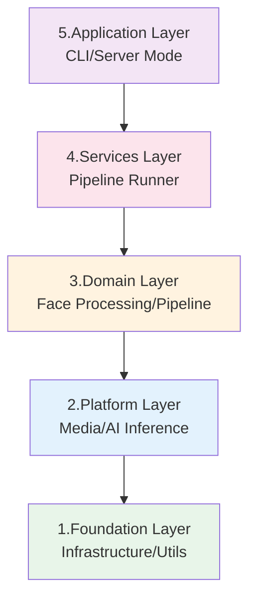

# FaceFusionCpp 应用层实施路线图

> **标准参考 & 跨文档链接**:
> *   架构设计文档: [应用层架构设计说明书](./design.md)
> *   质量与评估标准: [C++代码质量与评估标准指南](./C++_quality_standard.md)
> *   最后更新: 2026-02-05
> *   更新内容: 更新 10.4 验收标准汇总至 RTX 4060 8GB 基准；扩展 10.5 测试配置模板（新增低显存/高端配置）

## 0. 计划概述

### 0.1 目标与范围

本路线图旨在根据 [design.md](./design.md) 架构设计，按照**严格的依赖顺序**（底层先行，上层后建）规划 FaceFusionCpp 项目的完整实施路径。核心原则：

- **依赖单向性**: Foundation → Platform → Domain → Services → Application
- **零反向依赖**: 上层仅依赖下层，严禁反向依赖或跨层跳跃调用
- **增量交付**: 每个里程碑产出可独立验证的组件

### 0.2 架构层级概览



---

## 里程碑总览 (Milestone Overview)

> **图例**: ✅ 已完成 | 🔄 进行中 | ⏳ 未开始

| 里程碑  | 阶段名称                   | 核心交付物                                                     |    状态    |    依赖    |
| :-----: | :------------------------- | :------------------------------------------------------------- | :--------: | :--------: |
| **M1**  | Foundation Layer           | 基础设施模块 (Logger/FileSystem/ThreadPool/ConcurrentQueue)    |  ✅ 已完成  |     无     |
| **M2**  | Platform Layer - Media     | 媒体处理模块 (FFmpeg 封装/图像编解码)                          |  ✅ 已完成  |     M1     |
| **M3**  | Platform Layer - AI        | 推理引擎封装 (ONNX Runtime/TensorRT EP)                        |  ✅ 已完成  |     M1     |
| **M4**  | Domain Layer - Core        | 人脸领域模型 (Face/Embedding/Mask 类型)                        |  ✅ 已完成  |     M1     |
| **M5**  | Domain Layer - Analyzer    | 人脸分析器 (Detector/Landmarker/Recognizer/Masker)             |  ✅ 已完成  |   M3, M4   |
| **M6**  | Domain Layer - Processor   | 处理器实现 (Swapper/Enhancer/ExpressionRestorer)               |  ✅ 已完成  |     M5     |
| **M7**  | Domain Layer - Pipeline    | 流水线基础架构 (Queue/Context/Adapters)                        |  ✅ 已完成  |     M4     |
| **M8**  | Services Layer             | Pipeline Runner 服务 (Image/Video 处理调度)                    |  ✅ 已完成  | M2, M6, M7 |
| **M9**  | Application Layer - Config | 配置管理 (AppConfig/TaskConfig 解析与校验/ConfigMerger)        |  ✅ 已完成  |     M1     |
| **M10** | Application Layer - CLI    | 命令行接口 (参数解析/系统检查/--validate/任务执行)             |  ✅ 已完成  |   M8, M9   |
| **M11** | Integration & Verification | 端到端集成测试/性能验证/Metrics JSON Schema                    |  🔄 进行中  |    M10     |

---

## 阶段一: Foundation Layer (M1) ✅ 已完成

### 1.1 目标

构建系统最底层的基础设施组件，为所有上层模块提供通用能力。

### 1.2 模块清单

| 模块                | 文件                                             | 职责                         | 状态  |
| :------------------ | :----------------------------------------------- | :--------------------------- | :---: |
| **Logger**          | `foundation/infrastructure/logger.ixx`           | 日志分级、轮转、格式化       |   ✅   |
| **FileSystem**      | `foundation/infrastructure/file_system.ixx`      | 路径解析、文件操作、目录遍历 |   ✅   |
| **ThreadPool**      | `foundation/infrastructure/thread_pool.ixx`      | 任务调度、工作线程管理       |   ✅   |
| **ConcurrentQueue** | `foundation/infrastructure/concurrent_queue.ixx` | 线程安全有界队列、背压支持   |   ✅   |
| **Progress**        | `foundation/infrastructure/progress.ixx`         | 进度回调接口、状态上报       |   ✅   |
| **Crypto**          | `foundation/infrastructure/crypto.ixx`           | 哈希/校验和 (SHA1)           |   ✅   |
| **Network**         | `foundation/infrastructure/network.ixx`          | HTTP 下载 (模型自动下载)     |   ✅   |
| **CoreUtils**       | `foundation/infrastructure/core_utils.ixx`       | 工具函数 (类型转换/随机数)   |   ✅   |

### 1.3 任务分解

#### 1.3.1 子任务: Logger 实现 ✅

**目标**: 实现符合 [5.10 增强日志规范](./design.md#510-增强日志规范-enhanced-logging-requirements) 的日志系统

- [x] **Task 1.1.1**: 定义日志级别枚举 (TRACE/DEBUG/INFO/WARN/ERROR/CRITICAL)
- [x] **Task 1.1.2**: 实现日志格式化器
- [x] **Task 1.1.3**: 集成 spdlog 后端
- [x] **Task 1.1.4**: 实现日志轮转 (daily/hourly/size)
- [x] **Task 1.1.5**: 添加 `max_files` / `max_total_size` 配置支持 (对应 design.md 3.1 日志轮转配置增强)

#### 1.3.2 子任务: ConcurrentQueue 实现 ✅

**目标**: 实现线程安全有界队列，支持 [5.7 资源并发与流控](./design.md#57-资源并发与流控-concurrency--flow-control)

- [x] **Task 1.2.1**: 实现 `push()` / `pop()` 接口
- [x] **Task 1.2.2**: 添加容量限制 (`max_size`)
- [x] **Task 1.2.3**: 实现显式关闭 (Explicit Shutdown) 机制
- [x] **Task 1.2.4**: 实现 `try_pop()` 非阻塞接口
- [x] **Task 1.2.5**: 实现 `reset()` / `clear()` 方法

#### 1.3.3 子任务: 其他基础模块 ✅

- [x] **Task 1.3.1**: FileSystem - 路径规范化与文件操作
- [x] **Task 1.3.2**: ThreadPool - 工作线程池实现 (PIMPL, Singleton)
- [x] **Task 1.3.3**: Progress - `IProgressObserver` 接口 + `ProgressBar` 实现
- [x] **Task 1.3.4**: Crypto - SHA1 校验和
- [x] **Task 1.3.5**: CoreUtils - 类型转换工具 (random/conversion partitions)
- [x] **Task 1.3.6**: Network - HTTP 下载、批量下载、文件大小查询

---

## 阶段二: Platform Layer (M2 + M3) ✅ 已完成

### 2.1 Media 子模块 (M2) ✅

#### 2.1.1 目标

封装 FFmpeg 动态库接口，提供视频/图像的解码编码能力。

#### 2.1.2 模块清单

| 模块              | 文件                                  | 职责                            | 状态  |
| :---------------- | :------------------------------------ | :------------------------------ | :---: |
| **FFmpeg**        | `foundation/media/ffmpeg.ixx`         | FFmpeg 通用封装 (Reader/Writer) |   ✅   |
| **FFmpegRemuxer** | `foundation/media/ffmpeg_remuxer.ixx` | 音视频重混流                    |   ✅   |
| **Vision**        | `foundation/media/vision.ixx`         | 图像处理工具 (OpenCV 封装)      |   ✅   |

#### 2.1.3 任务分解 ✅

- [x] **Task 2.1.1**: FFmpeg Reader - 视频解码封装
- [x] **Task 2.1.2**: FFmpeg Writer - 编码器配置
- [x] **Task 2.1.3**: Vision - 图像 I/O 和变换
- [x] **Task 2.1.4**: FFmpeg Remuxer - 音频重混流

### 2.2 AI 推理子模块 (M3) ✅ 已完成

> **评估状态**: 底层 SessionPool (LRU/TTL) 已完整实现，`engine_cache` 配置字段已完成对接。
> 详见: [engine_cache 配置集成评估报告](./evaluation/C++_evaluation_engine_cache.md)

#### 2.2.1 目标

封装 ONNX Runtime + TensorRT Execution Provider，提供统一推理接口。

#### 2.2.2 模块清单

| 模块                         | 文件                                           | 职责                 | 状态  |
| :--------------------------- | :--------------------------------------------- | :------------------- | :---: |
| **InferenceSession**         | `foundation/ai/inference_session.ixx`          | Session 生命周期管理 |   ✅   |
| **InferenceSessionRegistry** | `foundation/ai/inference_session_registry.ixx` | Session 注册与管理   |   ✅   |
| **ModelRepository**          | `domain/ai/model_repository.ixx`               | 模型路径管理与下载   |   ✅   |

#### 2.2.3 任务分解 ✅

- [x] **Task 2.2.1**: InferenceSession - ONNX Runtime Session 封装
- [x] **Task 2.2.2**: InferenceSessionRegistry - Session 注册管理
- [x] **Task 2.2.3**: ModelRepository - 模型路径解析与 `download_strategy` 实现
- [x] **Task 2.2.4**: SessionPool - LRU 缓存实现 (`max_entries`) - 对应 design.md 3.1 engine_cache 配置
  > ⚠️ **注意**: 底层 LRU 机制已完成，但配置未对接。详见 [评估报告](./evaluation/C++_evaluation_engine_cache.md)
- [x] **Task 2.2.5**: SessionPool - TTL 空闲释放 (`idle_timeout_seconds`) - 对应 design.md 3.1 engine_cache 配置
  > ⚠️ **注意**: 底层 TTL 机制已完成，但配置未对接。详见 [评估报告](./evaluation/C++_evaluation_engine_cache.md)
- [x] **Task 2.2.6**: EngineCacheConfig 扩展 - 添加 `max_entries` 和 `idle_timeout_seconds` 字段及 YAML 解析 *(新增)*
- [x] **Task 2.2.7**: 配置集成 - 移除 InferenceSessionRegistry 硬编码，从 AppConfig 加载参数；传递 cache path 到 InferenceSession *(新增)*

---

## 阶段三: Domain Layer - Core (M4) ✅ 已完成

### 3.1 目标

定义人脸处理领域的核心数据类型，作为所有人脸相关模块的基础。

### 3.2 模块清单

| 模块             | 文件                            | 职责                              | 状态  |
| :--------------- | :------------------------------ | :-------------------------------- | :---: |
| **Face**         | `domain/face/face.ixx`          | Face 结构体定义                   |   ✅   |
| **FaceTypes**    | `domain/face/face_types.ixx`    | 人脸相关枚举与类型别名            |   ✅   |
| **FaceHelper**   | `domain/face/face_helper.ixx`   | 人脸几何变换工具函数              |   ✅   |
| **FaceStore**    | `domain/face/face_store.ixx`    | 人脸缓存与查询                    |   ✅   |
| **FaceSelector** | `domain/face/face_selector.ixx` | 人脸选择策略 (reference/one/many) |   ✅   |

### 3.3 任务分解 ✅

- [x] **Task 3.1**: Face 结构体 - Bbox/Landmarks/Embedding/Mask 成员定义
- [x] **Task 3.2**: FaceTypes - `FaceSelectorMode` 枚举
- [x] **Task 3.3**: FaceHelper - Warp/Affine 矩阵计算 (~400 行实现)
- [x] **Task 3.4**: FaceStore - 线程安全人脸缓存
- [x] **Task 3.5**: FaceSelector - 基于相似度的人脸筛选

---

## 阶段四: Domain Layer - Analyzer (M5) ✅ 已完成

### 4.1 目标

实现人脸分析全链路：检测 → 关键点 → 识别 → 遮罩。

### 4.2 模块清单 (按执行顺序)

| 顺序  | 模块                    | 模型                      | 依赖                             | 状态  |
| :---: | :---------------------- | :------------------------ | :------------------------------- | :---: |
|   1   | **FaceDetector**        | RetinaFace/SCRFD/YOLOFace | InferenceSession                 |   ✅   |
|   2   | **FaceLandmarker**      | 2DFAN4/PeppaWutz/68by5    | InferenceSession, FaceDetector   |   ✅   |
|   3   | **FaceRecognizer**      | ArcFace                   | InferenceSession, FaceLandmarker |   ✅   |
|   4   | **FaceMasker**          | Occlusion/Region          | InferenceSession, FaceLandmarker |   ✅   |
|   5   | **FaceAnalyser** (聚合) | -                         | 上述所有 Analyzer                |   ✅   |

### 4.3 任务分解

#### 4.3.1 FaceDetector ✅

- [x] **Task 4.1.1**: 定义 `IFaceDetector` 接口 (`face_detector_api.ixx`)
- [x] **Task 4.1.2**: 实现 RetinaFace 检测器 (`impl/retina.cpp`)
- [x] **Task 4.1.3**: 实现 SCRFD 检测器 (`impl/scrfd.cpp`)
- [x] **Task 4.1.4**: 实现 YOLOFace 检测器 (`impl/yolo.cpp`)
- [x] **Task 4.1.5**: 检测器工厂 (`face_detector_factory.ixx`)

#### 4.3.2 FaceLandmarker ✅

- [x] **Task 4.2.1**: 定义 `IFaceLandmarker` 接口 (`face_landmarker_api.ixx`)
- [x] **Task 4.2.2**: 实现 2DFAN4 68点关键点检测 (`impl/t2dfan.cpp`)
- [x] **Task 4.2.3**: 实现 PeppaWutz 关键点检测 (`impl/peppawutz.cpp`)
- [x] **Task 4.2.4**: 实现 68by5 关键点检测 (`impl/t68by5.cpp`)

#### 4.3.3 FaceRecognizer ✅

- [x] **Task 4.3.1**: ArcFace 特征提取 (`impl/`)
- [x] **Task 4.3.2**: 余弦相似度计算
- [x] **Task 4.3.3**: 工厂模式实现 (`face_recognizer_factory.ixx`)

#### 4.3.4 FaceMasker ✅

- [x] **Task 4.4.1**: Box Mask 生成 (`mask_compositor.ixx`)
- [x] **Task 4.4.2**: Occlusion Masker - 遮挡检测 (`impl/occlusion_masker.cpp`)
- [x] **Task 4.4.3**: Region Masker - 人脸解析 (`impl/region_masker.cpp`)
- [x] **Task 4.4.4**: 多遮罩融合 (`mask_compositor.ixx`)

#### 4.3.5 FaceAnalyser ✅

- [x] **Task 4.5.1**: 聚合调用链编排 (`face_analyser.cpp` ~18k 行)
- [x] **Task 4.5.2**: 单帧完整分析 API
- [x] **Task 4.5.3**: FaceModelRegistry 模型注册 (`face_model_registry.ixx`)

---

## 阶段五: Domain Layer - Processor (M6) ✅ 已完成

### 5.1 目标

实现四大核心处理器，符合 [**4.1 处理器与适配器**](./design.md#41-处理器与适配器-processor-and-adapter) 设计规范。

### 5.2 处理器清单

| 处理器                 | 模型              | 核心逻辑                  | 状态  |
| :--------------------- | :---------------- | :------------------------ | :---: |
| **FaceSwapper**        | InSwapper         | 源脸特征 → 目标脸区域映射 |   ✅   |
| **FaceEnhancer**       | CodeFormer/GFPGAN | 人脸超分辨率重建          |   ✅   |
| **ExpressionRestorer** | LivePortrait      | 原始表情还原              |   ✅   |
| **FrameEnhancer**      | RealESRGAN        | 全帧超分辨率              |   ✅   |

### 5.3 任务分解

#### 5.4.1 FaceSwapper ✅
- [x] **Task 5.1.1**: InSwapper 模型推理 (Legacy)
- [x] **Task 5.1.2**: 色彩匹配 (Color Matching) —— 已移至 Adapter
- [x] **Task 5.1.3**: 边缘融合 (Edge Blending) —— 已移至 Adapter
- [x] **Task 5.1.4**: 接口重构 (Aligned Crop Only)
- [x] **Task 5.1.5**: 工厂模式实现

#### 5.4.2 FaceEnhancer ✅

- [x] **Task 5.2.1**: CodeFormer 模型推理 (`impl/code_former.cpp`)
- [x] **Task 5.2.2**: GFPGAN 模型推理 (`impl/gfp_gan.cpp`)
- [x] **Task 5.2.3**: 工厂模式实现 (`face_enhancer_factory.ixx`)

#### 5.4.3 ExpressionRestorer ✅

- [x] **Task 5.3.1**: LivePortrait 特征提取器
- [x] **Task 5.3.2**: Motion 提取与生成
- [x] **Task 5.3.3**: 完整实现 (`impl/live_portrait.cpp` ~22k 行)

#### 5.4.4 FrameEnhancer ✅

- [x] **Task 5.4.1**: RealESRGAN 实现 (`frame/enhancer/impl/`)
- [x] **Task 5.4.2**: 工厂模式实现 (`frame_enhancer_factory.cpp`)

---

## 阶段六: Domain Layer - Pipeline (M7) ✅ 已完成

### 6.1 目标

构建流水线基础架构，实现 [**4.2 流水线**](./design.md#42-流水线-pipeline) 设计。

### 6.2 模块清单

| 模块                 | 职责                                           | 状态  |
| :------------------- | :--------------------------------------------- | :---: |
| **PipelineQueue**    | 线程安全有界队列 (`queue.ixx`)                 |   ✅   |
| **PipelineContext**  | 流水线上下文 (`pipeline_context.ixx`)          |   ✅   |
| **PipelineAdapters** | 处理器适配器 (`pipeline_adapters.ixx` ~13k 行) |   ✅   |
| **ProcessorFactory** | 处理器工厂 (`processor_factory.ixx`)           |   ✅   |
| **PipelineTypes**    | 流水线类型定义 (`pipeline_types.ixx`)          |   ✅   |
| **PipelineAPI**      | 流水线 API (`pipeline_api.ixx`)                |   ✅   |

### 6.3 任务分解 ✅

- [x] **Task 6.1**: PipelineContext - 配置加载与状态管理
- [x] **Task 6.2**: PipelineAdapters - **职责加固**: 实现 Warp/Crop/Fusion 逻辑
- [x] **Task 6.3**: ProcessorFactory - 工厂模式实现
- [x] **Task 6.4**: Queue Lifecycle - Shutdown 信号传递

### 6.4 待优化项 (Industrial Hardening) ✅

> 详细任务文档: [C++_task_pipeline_adapters_hardening.md](./plan/domain/pipeline/C++_task_pipeline_adapters_hardening.md)

- [x] **Task 6.5**: 日志规范化 - 移除所有 `std::cerr`，统一使用 `Logger` 模块
- [x] **Task 6.6**: 性能埋点 - 为所有 Adapter 的 `process()` 注入 `ScopedTimer`
- [x] **Task 6.7**: 错误处理补全 - 填充空的 `catch` 块，记录 `[E7xx]` 错误码

---

## 阶段七: Services Layer (M8) ✅ 已完成

### 7.1 目标

实现 Pipeline Runner 服务，协调 Media 解码、Processor 处理、输出编码。

### 7.2 模块清单

| 模块               | 职责                                          | 状态  |
| :----------------- | :-------------------------------------------- | :---: |
| **PipelineRunner** | 主调度器 (`pipeline_runner.ixx`)              |   ✅   |
| **ImageRunner**    | 单图处理流程 (`runner_image.cpp`)             |   ✅   |
| **VideoRunner**    | 视频逐帧处理流程 (`runner_video.cpp` ~13k 行) |   ✅   |
| **RunnerTypes**    | Runner 相关类型 (`runner_types.cpp`)          |   ✅   |

### 7.3 任务分解 ✅

- [x] **Task 7.1**: PipelineRunner - 入口调度逻辑 (`pipeline_runner.cpp` ~16k 行)
- [x] **Task 7.2**: ImageRunner - 图片处理流程
- [x] **Task 7.3**: VideoRunner - 视频处理流程
- [x] **Task 7.4**: 输出文件命名 (`prefix`/`suffix`/`conflict_policy`)
- [x] **Task 7.5**: 进度回调集成 (`ProgressCallback`)
- [x] **Task 7.6**: 错误处理 - `Result<void, ConfigError>` 返回类型

---

## 阶段八: Application Layer - Config (M9) ✅ 已完成

### 8.1 目标

实现配置解析与校验，支持 [3.1 应用配置](./design.md#31-应用配置-app-configuration) 和 [3.2 任务配置](./design.md#32-任务配置-task-configuration)。

### 8.2 模块清单

| 模块                | 职责                              |   状态   |
| :------------------ | :-------------------------------- | :------: |
| **AppConfig**       | 应用配置解析 (`app_config.ixx`)   |    ✅     |
| **TaskConfig**      | 任务配置解析 (`task_config.ixx`)  |    ✅     |
| **ConfigTypes**     | 配置类型定义 (`config_types.ixx`) |    ✅     |
| **ConfigParser**    | YAML 配置解析器 (`parser/`)       |    ✅     |
| **ConfigValidator** | 配置校验器                        |    ✅     |
| **ConfigMerger**    | 配置级联合并                      |    ✅     |

### 8.3 任务分解

- [x] **Task 8.1**: AppConfig - 完整 Schema 实现
  - [x] InferenceConfig, ResourceConfig, LoggingConfig, ModelsConfig
  - [x] DefaultModels 默认模型配置
- [x] **Task 8.2**: TaskConfig - Pipeline Step 解析
  - [x] TaskInfo, IOConfig, OutputConfig
  - [x] FaceSwapperParams, FaceEnhancerParams, ExpressionRestorerParams, FrameEnhancerParams
  - [x] FaceAnalysisConfig (Detector/Landmarker/Recognizer/Masker)
  - [x] PipelineStep 定义
- [x] **Task 8.3**: ConfigValidator 增强 - *已完成*
  > 详细任务文档: [C++_task_M9_config_validator_enhancement.md](./plan/config/C++_task_M9_config_validator_enhancement.md)
  - [x] 基础校验框架 (`ConfigValidator` 类)
  - [x] AppConfig 版本校验 (`config_version`)
  - [x] 路径存在性校验 (`validate_path_exists`)
  - [x] 参数范围校验 (`validate_range`)
  - [x] TaskConfig 版本校验
  - [x] face_swapper 参数校验
  - [x] face_analysis 参数校验
- [x] **Task 8.4**: ConfigMerger - 级联优先级 (Task > User > Default) - *已完成*
  > 详细任务文档: [C++_task_M9_config_merger_implementation.md](./plan/config/C++_task_M9_config_merger_implementation.md)
  >
  > **设计说明** (来自 design.md 第 217 行):
  > `default_task_settings` 字段名与 `task_config.yaml` 完全一致，可包含 TaskConfig 的任意字段作为默认值。
  - [x] `DefaultTaskSettings` 结构定义 (使用 `std::optional` 表示可选字段)
  - [x] `default_task_settings` YAML 解析 (仅解析配置文件中存在的字段)
  - [x] `MergeConfigs()` 合并逻辑 (仅当 TaskConfig 字段为空/默认时应用)
  - [x] CLI 集成调用
- [x] **Task 8.5**: `--validate` Dry-Run 模式 - *已实现* (对应 design.md 3.5.3 CLI 参数规格)

> [!NOTE]
> **M9 已完成** (2026-02-02 确认):
> - ConfigValidator: 完整实现 TaskConfig/AppConfig 版本校验、face_swapper/face_analysis 参数校验
> - ConfigMerger: 完整实现级联优先级 (Task > App > Hardcoded)，含单元测试覆盖
> - 详见: `src/app/config/config_validator.cpp` (247行), `config_merger.cpp` (136行)

---

## 阶段九: Application Layer - CLI (M10) ✅ 已完成

### 9.1 目标

实现命令行接口，符合 [3.5 命令行接口](./design.md#35-命令行接口-command-line-interface) 设计。

### 9.2 当前实现

| 功能                | 状态  | 说明                             |
| :------------------ | :---: | :------------------------------- |
| 基础框架            |   ✅   | `app_cli.ixx` + `app_cli.cpp`    |
| `-c/--config` 参数  |   ✅   | 载入任务配置文件                 |
| `-v/--version` 参数 |   ✅   | 显示版本信息 (`print_version()`) |
| `run_pipeline()`    |   ✅   | 执行流水线                       |
| `-s/-t/-o` 快捷模式 |   ✅   | 快捷参数已实现                   |
| `--processors`      |   ✅   | 处理器选择已实现                 |
| `--system-check`    |   ✅   | 系统自检完整实现                 |
| `--validate`        |   ✅   | 配置校验模式已实现               |
| `--log-level`       |   ✅   | 日志级别覆盖已实现               |
| 信号处理            |   ✅   | `ShutdownHandler` 已实现         |

### 9.3 任务分解

- [x] **Task 9.1**: 参数解析基础 (`-c`)
- [x] **Task 9.2**: 版本信息 (`-v`)
- [x] **Task 9.3**: `-h/--help` 帮助信息 (CLI11 自动生成)
- [x] **Task 9.4**: `-s/-t/-o` 快捷模式参数
- [x] **Task 9.5**: `--processors` 处理器选择
- [x] **Task 9.6**: `--system-check` 系统自检完善 - *已完成*
  > 详细任务文档: [C++_task_M9_system_check_completion.md](./plan/config/C++_task_M9_system_check_completion.md)
  - [x] CUDA Driver 版本检查
  - [x] VRAM 可用量检查
  - [x] FFmpeg 库版本检查
  - [x] ONNX Runtime 版本检查
  - [x] cuDNN 版本检查
  - [x] TensorRT 版本检查
  - [x] Model Repository 检查
- [x] **Task 9.7**: `--validate` 配置校验模式
- [x] **Task 9.8**: `--log-level` 日志级别覆盖
- [x] **Task 9.9**: 信号处理 (Graceful Shutdown)
- [x] **Task 9.10**: 启动 Banner 增强 (版本/构建时间/配置摘要) - *已完成*
  > 详细任务文档: [C++_task_M10_startup_banner_enhancement.md](./plan/services/C++_task_M10_startup_banner_enhancement.md)
  - [x] CMake 版本注入 (消除 `print_version()` 中 v1.0.0 硬编码)
  - [x] 启动 Banner 通过 Logger (INFO 级) 输出
  - [x] 配置加载摘要日志 (Config Summary)
  - [x] 硬件检测信息记录到启动日志

> [!NOTE]
> **M10 已完成** (2026-02-02 确认):
> - 所有 CLI 参数已实现 (-c, -v, -s/-t/-o, --processors, --system-check, --validate, --log-level)
> - 信号处理 (ShutdownHandler) 已完成
> - 启动 Banner 增强已完成:
>   - CMake 版本注入 (`cmake/version.cmake` + `version.cpp.in`)
>   - 版本模块 (`app.version`) 消除硬编码
>   - `print_startup_banner()` 通过 Logger 输出
>   - `log_config_summary()` 配置摘要日志
>   - `log_hardware_info()` 硬件检测信息日志

---

## 阶段十: Integration & Verification (M11) ⏳ 未开始

### 10.1 目标

端到端集成测试与性能验证，确保系统在真实场景下的稳定性与性能表现。

> **标准测试素材**: 详见 [design.md - A.3 标准测试素材](./design.md#a3-标准测试素材-standard-test-assets)

### 10.2 测试素材

#### 10.2.1 标准 Source Face

推荐使用 `lenna.bmp` (512×512, bgr24) 作为统一 Source Face：
- ✅ 经典测试图，人脸清晰正面
- ✅ 标准 BMP 格式，无解码歧义
- ✅ 文件最小，加载快

**路径**: `assets/standard_face_test_images/lenna.bmp`

#### 10.2.2 测试矩阵

| 用例名称 | Source | Target | 类型 | 分类 |
| :------- | :----- | :----- | :--- | :--- |
| `img_512_baseline` | `lenna.bmp` | `tiffany.bmp` (512×512) | 图片 | P0 基线 |
| `img_720p_standard` | `lenna.bmp` | `girl.bmp` (720×576) | 图片 | P0 基线 |
| `img_2k_stress` | `lenna.bmp` | `woman.jpg` (1992×1120) | 图片 | P1 压力 |
| `img_palette_edge` | `lenna.bmp` | `man.bmp` (1024×1024, pal8) | 图片 | P2 边界 |
| `video_720p_vertical` | `lenna.bmp` | `slideshow_scaled.mp4` (720×1280, 491帧) | 视频 | P0 基线 |

### 10.3 任务分解

#### 10.3.1 P0 - 核心功能验证 (必须通过)

- [x] **Task 10.1**: 端到端图片换脸测试
  - 测试用例: `img_512_baseline`, `img_720p_standard`
  - 验证点:
    - 输出文件存在且可正常打开
    - 人脸区域已被替换 (视觉检查或 SSIM 对比)
    - 无异常日志 (ERROR 级别)
  - 验收标准: 参见 [design.md A.3.3 硬件适配验收标准](./design.md#a33-硬件适配验收标准)

- [x] **Task 10.2**: 端到端视频换脸测试
  - 测试用例: `video_720p_vertical`
  - 验证点:
    - 输出视频帧数 = 输入帧数 (491帧)
    - 音轨正确保留 (AAC, 44.1kHz)
    - 处理 FPS 达标 (GTX 1650: ≥ 5 FPS)
  - 验收标准: 总耗时 < 120s (GTX 1650 适配)

- [x] **Task 10.5**: Metrics JSON 输出验证
  - 验证点:
    - 文件生成于 `logs/metrics_{timestamp}.json`
    - JSON Schema 符合 [design.md 5.11](./design.md#511-metrics-json-schema-参考) 规范
    - 包含 `schema_version`, `task_id`, `duration_ms`, `summary`, `step_latency`
  - 依赖: 需在 Task 10.1/10.2 完成后验证

#### 10.3.2 P1 - 性能与资源监控

- [x] **Task 10.4**: 性能基准测试
  - 测试场景: `video_720p_vertical` (491帧)
  - 采集指标:
    - 平均 FPS / P50 / P99 帧耗时
    - 每个 Pipeline Step 的延迟分布
  - 输出: 性能基准报告 (Markdown 格式)

- [ ] **Task 10.6**: 内存/显存峰值监控
  - 监控方式:
    - 显存: NVML API 或 `nvidia-smi` 采样
    - 内存: 平台 API (`GetProcessMemoryInfo` / `/proc/self/status`)
  - 验收标准:
    - GTX 1650 (4GB): 显存峰值 < 3.5 GB
    - 无内存泄漏 (处理前后 RSS 差异 < 50MB)

#### 10.3.3 P2 - 边界与增强功能

- [ ] **Task 10.3**: 断点续传测试 (Checkpointing)
  - 前置依赖: [design.md 5.9 断点续传](./design.md#59-断点续传-checkpointing) 机制实现
  - 测试场景:
    1. 正常中断恢复 (SIGINT 后重启)
    2. Checkpoint 文件损坏检测
    3. 帧索引跳转准确性验证
  - 验证点:
    - `checkpoints/{task_id}.ckpt` 正确生成
    - 恢复后继续处理，无重复帧
    - 任务完成后自动清理 checkpoint

- [ ] **Task 10.7**: 边界情况测试
  - 测试用例: `img_palette_edge` (调色板图片)
  - 验证点:
    - 调色板格式 (pal8) 自动转换为 RGB24
    - WebP 伪装文件 (`woman.jpg`) 正确解码
    - 无人脸帧透传处理，生成 WARN 日志

### 10.4 验收标准汇总

> **当前测试环境 (Reference Baseline)**:
> - **CPU**: Intel Core i9-14900HX (16核32线程)
> - **内存**: 24GB DDR
> - **GPU**: NVIDIA GeForce RTX 4060 Laptop GPU (8GB VRAM, 计算能力 8.9)
> - **CUDA 驱动**: 591.86
> - **操作系统**: Linux (WSL2 / Native)
>
> **⚠️ 构建模式要求**:
> - **性能测试 (Task 10.1/10.2/10.4)**: **必须使用 Release 模式**，Debug 模式数据无参考价值
> - **功能正确性测试**: Debug 或 Release 均可
> - **内存泄漏检测 (Task 10.6)**: 使用 Debug 模式 + ASan，或 Release + Valgrind

**性能验收基准 (RTX 4060 8GB)**:

| 测试类别 | 测试项 | 阈值 (Release) | 说明 |
| :------- | :----- | :------------- | :--- |
| **图片 - 512px** | 处理耗时 | < 1s | 基线小图 |
| **图片 - 720p** | 处理耗时 | < 2s | 标准分辨率 |
| **图片 - 2K** | 处理耗时 | < 3s | 压力测试 |
| **视频 - 720p** | 处理 FPS | > 15 FPS | 491帧测试视频 |
| **视频 - 720p** | 总耗时 | < 40s | 允许 20% 余量 |
| **显存峰值** | 所有测试 | < 6.5 GB | 留 1.5GB 安全余量 |
| **内存泄漏** | 处理前后 | Δ < 50MB | Valgrind/ASan 验证 |

> **多硬件档位参考**: 完整性能基准表见 [design.md A.3.3](./design.md#a33-硬件适配验收标准)
> - **RTX 4090 (24GB)**: 旗舰级性能基准
> - **RTX 3060 (12GB)**: 中端性能参考
> - **GTX 1650 (4GB)**: 低端适配标准

### 10.5 测试配置模板

#### 10.5.1 标准测试配置 (RTX 4060 8GB 主流配置)

```yaml
# test_config_baseline.yaml - 基线测试配置 (RTX 4060 8GB)
config_version: "1.0"

task_info:
  id: "m11_e2e_baseline"
  description: "M11 End-to-End Baseline Test (RTX 4060 8GB)"
  enable_logging: true
  enable_resume: false

io:
  source_paths:
    - "./assets/standard_face_test_images/lenna.bmp"
  target_paths:
    - "./assets/standard_face_test_videos/slideshow_scaled.mp4"
  output:
    path: "./test_output/"
    prefix: "m11_test_"
    conflict_policy: "overwrite"
    audio_policy: "copy"

resource:
  thread_count: 0  # Auto (16核 → 8线程)
  max_queue_size: 20  # 主流级 (8-12GB) 推荐值
  execution_order: "sequential"  # 顺序模式，低延迟

pipeline:
  - step: "face_swapper"
    enabled: true
    params:
      model: "inswapper_128_fp16"
      face_selector_mode: "many"
```

#### 10.5.2 低显存适配配置 (GTX 1650 4GB)

```yaml
# test_config_low_vram.yaml - 低显存适配配置 (≤ 4GB)
config_version: "1.0"

task_info:
  id: "m11_e2e_low_vram"
  description: "M11 Low VRAM Adaptation Test (GTX 1650 4GB)"
  enable_logging: true

io:
  source_paths:
    - "./assets/standard_face_test_images/lenna.bmp"
  target_paths:
    - "./assets/standard_face_test_videos/slideshow_scaled.mp4"
  output:
    path: "./test_output/"
    prefix: "m11_lowvram_"
    conflict_policy: "overwrite"

resource:
  max_queue_size: 10  # 低显存适配
  execution_order: "batch"  # 批处理模式降低峰值显存
  batch_buffer_mode: "disk"  # 磁盘缓存避免 OOM
  segment_duration_seconds: 5  # 强制分段处理

pipeline:
  - step: "face_swapper"
    enabled: true
    params:
      model: "inswapper_128_fp16"
      face_selector_mode: "many"
```

#### 10.5.3 高端压力测试配置 (RTX 4090 24GB)

```yaml
# test_config_high_end.yaml - 高端压力测试配置 (≥ 12GB)
config_version: "1.0"

task_info:
  id: "m11_e2e_high_end"
  description: "M11 High-End Stress Test (RTX 4090 24GB)"
  enable_logging: true

io:
  source_paths:
    - "./assets/standard_face_test_images/lenna.bmp"
  target_paths:
    - "./assets/standard_face_test_images/woman.jpg"  # 2K 压力测试
  output:
    path: "./test_output/"
    prefix: "m11_highend_"
    conflict_policy: "overwrite"

resource:
  max_queue_size: 30  # 旗舰级配置
  execution_order: "sequential"

pipeline:
  - step: "face_swapper"
    enabled: true
    params:
      model: "inswapper_128_fp16"
  - step: "face_enhancer"
    enabled: true
    params:
      model: "codeformer"
      blend_factor: 0.8
  - step: "frame_enhancer"
    enabled: true
    params:
      model: "real_esrgan_x4"  # 4K 超分辨率
      enhance_factor: 1.0
```

---

## 待完成任务汇总

### 高优先级 (P0) - 核心功能缺失

| 任务                         | 所属阶段 | 描述                                       | 任务文档                                                                 |
| :--------------------------- | :------: | :----------------------------------------- | :----------------------------------------------------------------------- |
| ~~**ConfigValidator 增强**~~ |    M9    | ✅ 已完成                                   | [C++_task_M9_config_validator_enhancement.md](./plan/config/C++_task_M9_config_validator_enhancement.md) |
| ~~**ConfigMerger**~~         |    M9    | ✅ 已完成                                   | [C++_task_M9_config_merger_implementation.md](./plan/config/C++_task_M9_config_merger_implementation.md) |

### 中优先级 (P1) - 设计规范完整性

| 任务                       | 所属阶段 | 描述                                                      | 任务文档                                                                             |
| :------------------------- | :------: | :-------------------------------------------------------- | :----------------------------------------------------------------------------------- |
| ~~**SystemCheck 完善**~~   |   M10    | ✅ 已完成                                                  | [C++_task_M9_system_check_completion.md](./plan/config/C++_task_M9_system_check_completion.md) |
| ~~**SessionPool LRU**~~    |    M3    | ✅ 已完成 (Task 2.2.4 + 2.2.5)                             | [C++_task_session_pool_lru_ttl.md](./plan/platform/C++_task_session_pool_lru_ttl.md) |

### 低优先级 (P2) - 增强功能

| 任务              | 所属阶段 | 描述                                                      | 任务文档 |
| :---------------- | :------: | :-------------------------------------------------------- | :------- |
| **Checkpointing** |   M11    | 断点续传                                                  | - |
| **Metrics JSON**  |   M11    | 性能指标输出 (schema_version/step_latency/gpu_memory)     | - |
| ~~**EngineCacheConfig 扩展**~~ | M3 | ✅ 已完成 (Task 2.2.6) | [评估报告](./evaluation/C++_evaluation_engine_cache.md) |
| ~~**配置集成**~~ | M3 | ✅ 已完成 (Task 2.2.7) | [评估报告](./evaluation/C++_evaluation_engine_cache.md) |

---

## 依赖关系总图

```mermaid
graph TD
    subgraph "M1: Foundation ✅"
        Logger
        FileSystem
        ThreadPool
        ConcurrentQueue
        Progress
        Crypto
        Network
        CoreUtils
    end

    subgraph "M2: Platform/Media ✅"
        FFmpeg
        Vision
    end

    subgraph "M3: Platform/AI ✅"
        InferenceSession
        ModelRepository
    end

    subgraph "M4: Domain/Core ✅"
        Face
        FaceTypes
        FaceHelper
        FaceStore
        FaceSelector
    end

    subgraph "M5: Domain/Analyzer ✅"
        FaceDetector
        FaceLandmarker
        FaceRecognizer
        FaceMasker
        FaceAnalyser
    end

    subgraph "M6: Domain/Processor ✅"
        FaceSwapper
        FaceEnhancer
        ExpressionRestorer
        FrameEnhancer
    end

    subgraph "M7: Domain/Pipeline ✅"
        PipelineContext
        PipelineAdapters
        ProcessorFactory
    end

    subgraph "M8: Services ✅"
        PipelineRunner
        ImageRunner
        VideoRunner
    end

    subgraph "M9: App/Config ✅"
        AppConfig
        TaskConfig
        ConfigParser
    end

    subgraph "M10: App/CLI ✅"
        CLI
    end

    %% Dependencies
    FFmpeg --> FileSystem
    FFmpeg --> Logger
    Vision --> FileSystem

    InferenceSession --> Logger
    ModelRepository --> FileSystem
    ModelRepository --> Network

    Face --> CoreUtils
    FaceHelper --> Face
    FaceStore --> ConcurrentQueue
    FaceStore --> Face

    FaceDetector --> InferenceSession
    FaceDetector --> FaceTypes
    FaceLandmarker --> InferenceSession
    FaceLandmarker --> Face
    FaceRecognizer --> InferenceSession
    FaceRecognizer --> Face
    FaceMasker --> InferenceSession
    FaceMasker --> Face
    FaceAnalyser --> FaceDetector
    FaceAnalyser --> FaceLandmarker
    FaceAnalyser --> FaceRecognizer
    FaceAnalyser --> FaceMasker

    FaceSwapper --> FaceAnalyser
    FaceEnhancer --> FaceAnalyser
    ExpressionRestorer --> FaceAnalyser
    FrameEnhancer --> InferenceSession

    PipelineContext --> FaceStore
    ProcessorFactory --> FaceSwapper
    ProcessorFactory --> FaceEnhancer
    ProcessorFactory --> ExpressionRestorer
    ProcessorFactory --> FrameEnhancer

    PipelineRunner --> FFmpeg
    PipelineRunner --> Vision
    PipelineRunner --> ProcessorFactory
    PipelineRunner --> PipelineContext
    ImageRunner --> PipelineRunner
    VideoRunner --> PipelineRunner

    AppConfig --> FileSystem
    TaskConfig --> FileSystem
    ConfigParser --> AppConfig
    ConfigParser --> TaskConfig

    CLI --> PipelineRunner
    CLI --> ConfigParser
    CLI --> Progress
```



---

## 风险管理

| 风险点                 | 可能性 | 影响         | 缓解措施                                          |
| :--------------------- | :----: | :----------- | :------------------------------------------------ |
| TensorRT 版本兼容性    |   高   | 推理失败     | 多版本测试矩阵；明确 CUDA/cuDNN/TensorRT 版本组合 |
| FFmpeg API 变更        |   中   | 编译失败     | 锁定 FFmpeg 7.x 版本；封装抽象层                  |
| ONNX 模型精度差异      |   中   | 输出质量下降 | 与 Python 版本 A/B 对比测试                       |
| 视频分段处理时音画同步 |   中   | 输出错误     | 帧级时间戳精确管理；集成测试覆盖                  |
| 显存 OOM (长视频)      |   高   | 处理中断     | 实现 `segment_duration_seconds` 分段；背压流控    |

---

## 附录: 开发规范提醒

> [!IMPORTANT]
> 每个里程碑开始前，务必阅读以下文档：
> - [项目规则](../../AGENTS.md) - 开发禁令与工作流程
> - [设计文档](./design.md) - 架构设计与接口规范
> - [质量标准](./C++_quality_standard.md) - 代码质量与测试要求

> [!WARNING]
> **严禁违反以下规则**:
> - 直接在主分支 (`windows/dev` 或 `master`) 开发
> - 未运行 `build.py test` 即提交代码
> - 引用不存在的文件路径
> - 反向依赖或跨层调用
