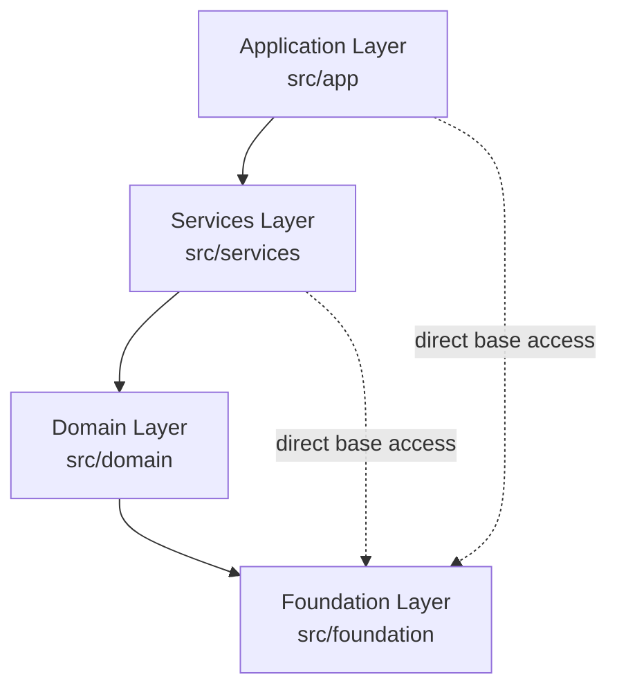

# Layered Architecture Implementation Details

> **Document Control**
> - **Document ID**: FFC-DEV-EN-ARCH-LAYERS-2026
> - **Version**: V2.0.0
> - **Status**: Official
> - **Authority**: Normative
> - **Owner**: 王辉
> - **Reviewer**: 王辉
> - **Last Updated**: 2026-08-14

## Revision History

| Version | Date | Author | Reviewer | Description |
| :--- | :--- | :--- | :--- | :--- |
| **V2.0.0** | 2026-08-14 | AI Agent | 王辉 | Refactored per [layers_doc_assessment.md](../../evaluation/layers_doc_assessment.md): removed the fictitious Platform layer, corrected to the actual **4-layer structure**; fixed FFmpeg wrapper ownership (Foundation/media); added layer↔directory↔CMake target mapping and per-layer module inventory; added dependency enforcement notes. |
| **V1.0.0** | 2026-08-13 | AI Agent | 王辉 | Initialized document control info per documentation governance. |

---

## 1. Architecture Overview

FaceFusionCpp follows a strict **4-layer unidirectional dependency** (Application → Services → Domain → Foundation):

> **Note**: The Platform layer (`src/platform/`) from earlier designs **no longer exists** — its responsibilities (file system, threading abstraction) were merged into the Foundation `infrastructure` subgroup. The codebase currently has 4 top-level directories (`src/CMakeLists.txt` includes only foundation/domain/services/app).

## 2. Layer Details

### 2.1 Layer 1: Application (`src/app/`) — Access Layer
CMake targets: `app_facefusioncpp` (main binary), `app_cli`, `app_version`

| Subdirectory | Key Modules | Responsibility |
| :--- | :--- | :--- |
| `cli/` | `app_cli.ixx`, `system_check.ixx` | CLI11 argument parsing; `--system-check` environment self-check |
| `config/` | `app_config.ixx`, `task_config.ixx`, `config_types.ixx` | Config schema definitions and `ErrorCode` enum |
| | `config_validator.ixx`, `config_merger.ixx` | Config validation (with YAML path location); cascade merging |
| | `parser/config_parser.ixx` | YAML parsing implementation |
| root | `face_fusion.cpp`, `version.ixx` | Program entry; compile-time version injection |

### 2.2 Layer 2: Services (`src/services/pipeline/`) — Orchestration Layer
CMake target: `services_pipeline`

| Key Modules | Responsibility |
| :--- | :--- |
| `pipeline_runner.ixx`, `runner_image.cpp`, `runner_video.cpp` | Producer-consumer pipeline orchestration; `ProcessVideoSegmented` segmented video processing |
| `checkpoint_manager.ixx` | Resume support (`{task_id}.ckpt` with checksum/config_hash validation) |
| `shutdown_handler.ixx` | Graceful shutdown (SIGINT/SIGTERM/CTRL_C_EVENT) |
| `metrics_collector.ixx` | Metrics collection (step_latency / gpu_memory → `metrics_{ts}.json`) |
| `utils.ixx` | Service-layer utilities |

### 2.3 Layer 3: Domain (`src/domain/`) — AI Core & Image Orchestration Layer
CMake targets: `domain_face`, `domain_frame`, `domain_pipeline`, `domain_ai`, `domain_common`

**Sub-domain breakdown**:

| Subdirectory | Key Modules | Responsibility |
| :--- | :--- | :--- |
| `ai/` | `model_repository.ixx` | Model repository (download/locate) |
| `common/` | `common.ixx`, `common_types.ixx` | Domain-shared types |
| `face/detector/` | `yolo.cpp`, `retina.cpp`, `scrfd.cpp` | Face detection (fusion: confidence-first + NMS) |
| `face/landmarker/` | `t2dfan.cpp`, `t68by5.cpp`, `peppawutz.cpp` | Landmark detection |
| `face/recognizer/` | `arcface.cpp` | Face recognition / similarity |
| `face/swapper/` | `inswapper.cpp` | Face swap inference (aligned crops) |
| `face/enhancer/` | `gfp_gan.ixx`, `code_former.ixx` | Face enhancement |
| `face/masker/` | `region_masker.ixx`, `occlusion_masker.ixx` | Masking (region/occlusion) |
| `face/analyser/` | `face_model_registry.cpp` | Face analysis model lifecycle management |
| `face/` root | `face_selector.ixx`, `face_helper.ixx`, `face_store.ixx` | Face selection (reference/one/many), helpers & caching |
| `frame/enhancer/` | `frame_enhancer.ixx` + `impl/` | Full-frame enhancement (tiled inference, `create_tile_frames`/`merge_tile_frames`) |
| `pipeline/` | `pipeline_api.ixx`, `pipeline_adapters.ixx` | Pipeline public interface; adapters (Warp/Crop, color matching, mask paste-back orchestration) |
| | `queue.ixx`, `processor_factory.ixx`, `processor_param_registry.ixx` | Bounded queues; processor factory; parameter metadata registry (dynamic CLI flags) |

> **Note**: Image/video wrappers (OpenCV/FFmpeg) are **not** in Domain — they belong to the Foundation `media` subgroup (see §2.4).

### 2.4 Layer 4: Foundation (`src/foundation/`) — Common Base
CMake targets: `foundation_ai`, `foundation_infrastructure`, `foundation_media`

Foundation is organized into 3 responsibility subgroups:

| Subgroup | Key Modules | Responsibility |
| :--- | :--- | :--- |
| `ai/` | `inference_session.ixx`, `session_pool.ixx`, `inference_session_registry.ixx` | TensorRT / ONNX Runtime inference engine wrappers and session pooling |
| `infrastructure/` | `file_system.ixx`, `concurrent_file_system.ixx` | Cross-platform file operations & path normalization (formerly Platform layer) |
| | `thread_pool.ixx`, `concurrent_queue.ixx` | Thread pool, bounded concurrent queues (formerly Platform layer) |
| | `logger.ixx`, `logger_types.ixx`, `console.ixx` | spdlog-based logging, console output |
| | `progress.ixx`, `network.ixx`, `process.ixx`, `core_utils.ixx` | Progress callbacks, networking, subprocess, utilities (backpressure semaphores/UUID etc.) |
| `media/` | `ffmpeg.ixx`, `ffmpeg_reader.cpp`, `ffmpeg_writer.cpp`, `vision.cpp` | FFmpeg shared-library wrappers (read/write/resample), OpenCV vision utilities |

> **Note**: FFmpeg is integrated via **shared-library APIs** (`avcodec_open2`/`av_read_frame` etc.), not the CLI tool. See [design.md](./design.md) Appendix A.4.

---

## 3. Layer ↔ Directory ↔ CMake Target Mapping

| Layer | Directory | CMake Targets | Dependencies (downward only) |
| :--- | :--- | :--- | :--- |
| **Application** | `src/app/` | `app_facefusioncpp`, `app_cli`, `app_version` | foundation, domain, services |
| **Services** | `src/services/` | `services_pipeline` | domain, foundation |
| **Domain** | `src/domain/` | `domain_face`, `domain_frame`, `domain_pipeline`, `domain_ai`, `domain_common` | foundation |
| **Foundation** | `src/foundation/` | `foundation_ai`, `foundation_infrastructure`, `foundation_media` | 3rd-party libs (CUDA/ONNX/TensorRT/FFmpeg/OpenCV/spdlog/yaml-cpp etc.) |

---

## 4. Dependency Rules

1. **Unidirectional**: Upper layers depend only on lower layers. Measured dependencies: `app → {services, domain, foundation}`, `services → {domain, foundation}`, `domain → foundation` — no reverse or circular links.
2. **Foundation Access**: Foundation is the common base; **any upper layer may depend on it directly** (e.g., `app_version` links `foundation_infrastructure`).
3. **No Layer Skipping**: Application must not call private Domain interfaces directly; business orchestration must go through Services (PIMPL hides internals, physically preventing this).
4. **No Circular Dependencies**: When circular dependencies are found, extract common logic down into the Foundation layer.
5. **Interface First**: Modules communicate via `.ixx` module interfaces, hiding internal implementation (PIMPL).
6. **Enforcement**: Layering is enforced through hierarchical CMake targets — each target only declares `target_link_libraries` to allowed lower targets; keep the direction when adding dependencies, audit via `grep target_link_libraries src/*/CMakeLists.txt` or `cmake --graphviz`.
