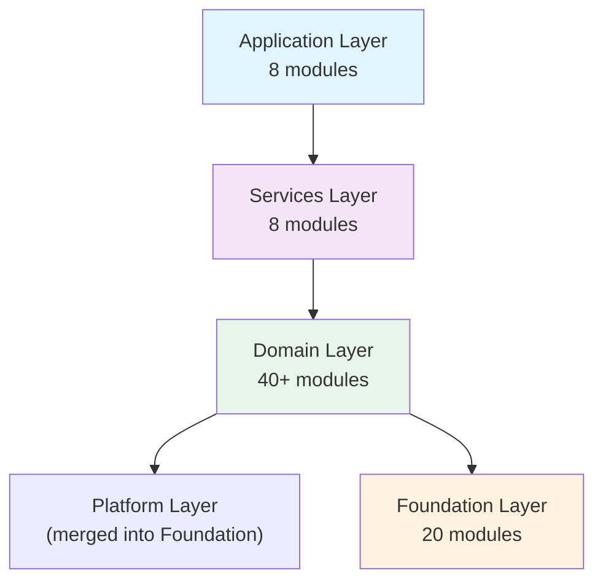
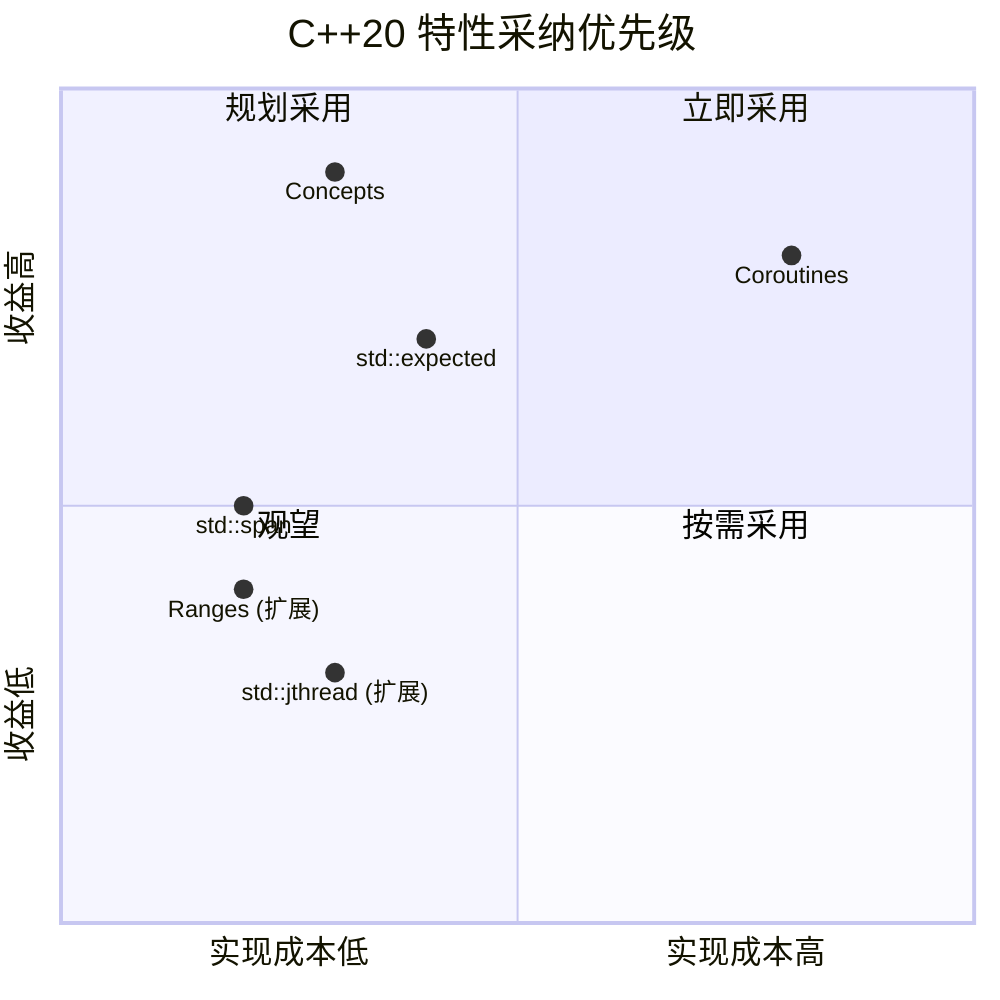
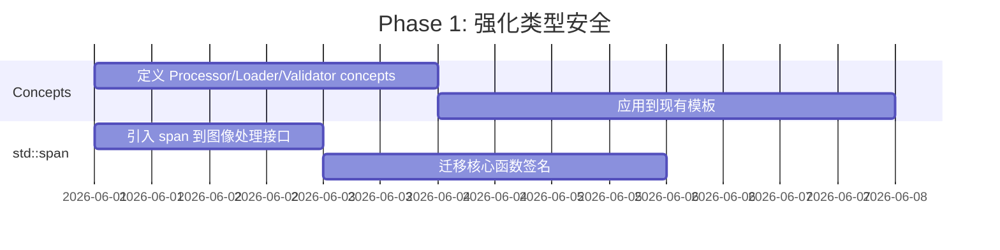
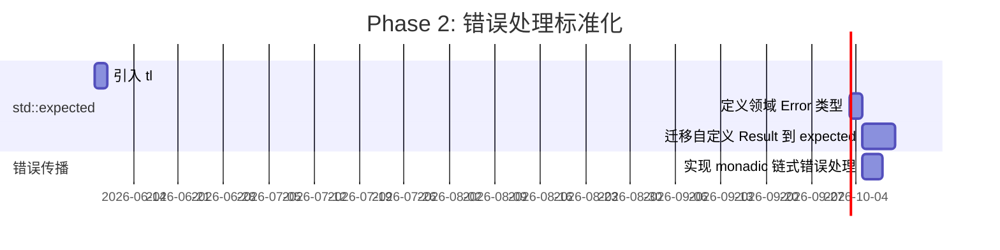
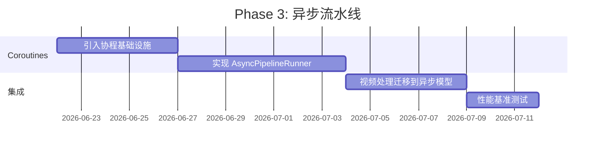

# C++20 模块化架构深度分析报告

> **文档控制信息 (Document Control)**
> - **文档标识 (Document ID)**: FFC-DEV-EVAL-CPP20-2026
> - **当前版本 (Version)**: V1.0.0
> - **状态 (Status)**: 正式 (Official)
> - **权威性 (Authority)**: Informative
> - **所有者 (Owner)**: 王辉
> - **审核人 (Reviewer)**: 王辉
> - **最后更新 (Last Updated)**: 2026-08-13

## 修订历史记录 (Revision History)

| 版本号 | 修订日期 | 修订人 | 审核人 | 修订描述 |
| :--- | :--- | :--- | :--- | :--- |
| **V1.0.0** | 2026-08-13 | AI Agent | 王辉 | 依据文档治理规范初始化文档控制信息与修订历史。 |


> **文档标识**: FACE-FUSION-CXX20-ARCH-ANALYSIS
> **分析视角**: 高级资深 C++ 架构师
> **分析日期**: 2026-05-29
> **审查范围**: 全部源码 177 个文件 (107 .ixx, 68 .cpp, 2 .h)

---

## 目录

- [1. 当前架构全景](#1-当前架构全景)
- [2. 优势分析](#2-优势分析)
- [3. 问题诊断](#3-问题诊断)
- [4. C++20 特性采纳评估](#4-c20-特性采纳评估)
- [5. 最佳实践建议](#5-最佳实践建议)
- [6. 架构演进路线图](#6-架构演进路线图)
- [7. 总结](#7-总结)

---

## 1. 当前架构全景

### 1.1 分层架构



### 1.2 C++20 特性采纳率

| 特性 | 状态 | 使用量 | 采纳评级 |
| :--- | :--- | :--- | :--- |
| **Modules** | ✅ 核心 | 124 模块, 146+ import | ⭐⭐⭐⭐⭐ |
| **std::format** | ✅ 大量 | 50+ 处 | ⭐⭐⭐⭐⭐ |
| **Structured Bindings** | ✅ 广泛 | 32 处 | ⭐⭐⭐⭐ |
| **Ranges** | ✅ 使用 | 12 处 | ⭐⭐⭐ |
| **std::jthread** | ⚠️ 有限 | 1 处 | ⭐⭐ |
| **Concepts** | ❌ 未用 | 0 处 | ⭐ |
| **Coroutines** | ❌ 未用 | 0 处 | ⭐ |
| **std::expected** | ❌ 未用 | 0 处 (用自定义 Result) | ⭐ |
| **std::span** | ❌ 未用 | 0 处 | ⭐ |

**综合采纳率**: 44% (4/9 核心特性深度使用)

---

## 2. 优势分析

### 2.1 ✅ 模块化架构是正确的战略选择

**评分: 9/10**

项目选择 C++20 Modules 作为架构基础是**极具前瞻性**的决策：

```
传统头文件时代的问题:
├── #include 展开导致编译时间 O(N²) 增长
├── 宏污染、顺序依赖、ODR 违规
└── 头文件即"接口"但无法强制隔离

C++20 Modules 的解决:
├── 编译时间 O(N) 线性增长（模块只需编译一次）
├── 强制物理隔离：export 的才是公开接口
└── 消除宏泄漏和顺序依赖
```

**项目亮点**:
- 124 个模块定义，覆盖全部业务逻辑
- 接口(.ixx)与实现(.cpp)严格分离
- 模块分区(partition)使用得当，如 `domain.face.swapper:types`, `domain.face.swapper:api`

### 2.2 ✅ 插件化处理器架构设计优秀

Face 子域的处理器采用了**一致的四层结构**：

```
domain.face.swapper/
├── face_swapper_api.ixx      // 公共 API 接口
├── face_swapper_types.ixx    // 类型定义
├── face_swapper_factory.ixx  // 工厂模式
└── impl/
    ├── swapper_impl_base.ixx // 实现基类
    └── inswapper.cpp         // 具体实现
```

这种设计：
- **开闭原则**: 新增处理器只需添加 `impl/` 下的新文件
- **依赖倒置**: 上层依赖 `api` 接口，不依赖具体实现
- **编译防火墙**: 修改 `impl/` 不触发上层重编译

### 2.3 ✅ std::format 统一了字符串格式化

项目全面采用 `std::format` 替代 `sprintf`/`stringstream`：

```cpp
// 传统 C++ 风格 (项目已抛弃)
char buf[256];
snprintf(buf, sizeof(buf), "Task %s: frame %d/%d", id.c_str(), cur, total);

// 当前风格 (类型安全、编译期检查)
std::format("Task {}: frame {}/{}", id, cur, total);
```

优势：
- 类型安全（编译期格式字符串检查）
- 性能优秀（比 `stringstream` 快 2-5x）
- 可读性强（接近 Python f-string）

### 2.4 ✅ 无循环依赖

模块依赖图严格遵循层级约束，未发现循环依赖。这是良好架构纪律的体现。

---

## 3. 问题诊断

### 3.1 ❌ Concepts 编译期约束缺失

**严重性: 高**

项目完全没有使用 `concept`，这意味着模板接口缺乏编译期约束：

```cpp
// 当前代码 (假设)
template <typename T>
class Processor {
    // T 需要什么接口？编译器不知道，用户不知道
    // 错误信息可能长达数百行
};

// 理想代码
template <typename T>
concept ProcessorLike = requires(T p, FrameData input) {
    { p.process(input) } -> std::convertible_to<FrameData>;
    { p.name() } -> std::convertible_to<std::string>;
    { p.initialize(std::declval<Config>()) } -> std::same_as<bool>;
};

template <ProcessorLike T>
class Pipeline {
    // 编译器强制检查 T 满足 ProcessorLike
    // 错误信息清晰：T does not satisfy ProcessorLike
};
```

**影响**:
- 模板错误信息冗长难懂
- 无法在编译期捕获接口不匹配
- 新增处理器时只能靠运行时测试发现接口错误

### 3.2 ❌ 错误处理未使用 std::expected

**严重性: 高**

项目使用自定义 `Result<T, E>` 模板，但 C++23 的 `std::expected`（以及 C++20 的 `tl::expected`）是更标准的方案：

```cpp
// 当前代码
Result<FrameData, Error> process(const FrameData& input);

// 使用 std::expected (C++23) 或 tl::expected (C++20 polyfill)
std::expected<FrameData, Error> process(const FrameData& input);

// 更好的链式错误处理
auto result = load_source(path)
    .and_then(validate_face)
    .and_then(extract_embedding)
    .transform_error([](auto e) { return wrap_error(e); });
```

**影响**:
- 自定义 Result 需要维护额外代码
- 缺乏标准库的 monadic 操作（`and_then`, `transform`, `or_else`）
- 与其他 C++ 项目的互操作性差

### 3.3 ❌ Coroutines 未利用

**严重性: 中**

视频处理流水线是典型的**生产者-消费者异步场景**，非常适合协程：

```cpp
// 当前实现 (同步阻塞)
for (int i = 0; i < total_frames; ++i) {
    auto frame = read_frame(i);           // 阻塞 I/O
    auto processed = pipeline.process(frame);  // 阻塞 GPU
    write_frame(processed);               // 阻塞 I/O
}

// 协程实现 (异步流水线)
Task<void> process_video(VideoReader& reader, VideoWriter& writer, Pipeline& pipeline) {
    co_await reader.open();
    while (auto frame = co_await reader.next_frame()) {
        auto result = co_await pipeline.process(*frame);
        co_await writer.write(result);
    }
}
```

**影响**:
- 当前同步模型导致 CPU/GPU 利用率不饱和
- 无法自然表达帧级别的异步流水线
- 线程池模型增加复杂度但收益有限

### 3.4 ⚠️ std::span 未使用

**严重性: 中**

图像数据传递目前使用裸指针 + size 或 `std::vector<uint8_t>`，`std::span` 更安全：

```cpp
// 当前代码
void process_frame(uint8_t* data, int width, int height, int channels);

// 使用 std::span
void process_frame(std::span<uint8_t> pixels, int width, int height, int channels);

// 更好：配合 mdspan (C++23)
void process_frame(std::mdspan<uint8_t, std::dextents<int, 3>> image);
```

**影响**:
- 丢失数组大小信息，容易越界
- 无法利用 `span` 的 subspan 切片能力
- 与 Ranges 算法组合性差

### 3.5 ⚠️ 模块粒度可优化

**严重性: 中**

部分模块存在**过度细分**或**职责不清**的问题：

| 问题 | 示例 | 建议 |
| :--- | :--- | :--- |
| 命名空间不一致 | `processor_factory` 不在 `domain.pipeline` 下 | 统一到 `domain.pipeline.processor` |
| 配置模块分散 | `config.types`, `config.app`, `config.task` 等 7 个模块 | 考虑合并为 `config.core` + `config.schema` |
| 实现泄露 | `pipeline_adapters.ixx` 承载过多逻辑 | 拆分为接口 + 实现 |

### 3.6 ⚠️ #include 残留

**严重性: 低**

约 30 处可优化的 include：

| 问题 | 数量 | 影响 |
| :--- | :--- | :--- |
| `.ixx` 中的 `<iostream>` | 2 处 | 模块应避免直接 include iostream |
| ONNX Runtime 头文件 | 15 处 | 应封装为 foundation 模块的 export |
| `.cpp` 与 `.ixx` 重复 include | ~13 处 | 冗余，增加编译时间 |

---

## 4. C++20 特性采纳评估

### 4.1 采纳优先级矩阵



### 4.2 详细评估

#### Concepts — 强烈建议采用

**收益**: 编译期接口约束、清晰错误信息、自文档化
**成本**: 低（仅需定义 concept，不改变现有架构）
**风险**: 无

**推荐应用场景**:
```cpp
// 1. 处理器接口约束
concept Processor = requires(Processor& p, const FrameData& input) {
    { p.process(input) } -> std::convertible_to<FrameData>;
    { p.name() } -> std::convertible_to<std::string_view>;
    { p.is_ready() } -> std::convertible_to<bool>;
};

// 2. 模型加载器约束
concept ModelLoader = requires(Loader& l, const std::string& path) {
    { l.load(path) } -> std::same_as<std::expected<Model, Error>>;
    { l.supports(std::string_view{}) } -> std::convertible_to<bool>;
};

// 3. 配置校验器约束
concept ConfigValidator = requires(const Validator& v, const YAML::Node& config) {
    { v.validate(config) } -> std::same_as<std::expected<void, ValidationError>>;
};
```

#### std::expected — 建议采用

**收益**: 标准化错误处理、monadic 链式操作、消除异常开销
**成本**: 中（需要迁移自定义 Result）
**风险**: C++23 特性，需要 polyfill

**推荐方案**:
1. 短期：引入 `tl::expected` 作为 polyfill
2. 长期：迁移到 `std::expected`（C++23）

```cpp
// 当前自定义 Result
Result<FrameData, Error> process(const FrameData& input);

// 迁移后
std::expected<FrameData, Error> process(const FrameData& input);

// 链式错误处理
auto result = load_source(path)
    .and_then(validate_face)
    .and_then(extract_embedding)
    .and_then([&](auto emb) { return pipeline.process(emb); })
    .or_else([](auto err) { log_error(err); return err; });
```

#### Coroutines — 中期规划

**收益**: 异步流水线、CPU/GPU 并行、代码简洁
**成本**: 高（需要重构 Pipeline 执行模型）
**风险**: 调试复杂、编译器支持仍在完善

**推荐应用场景**:
```cpp
// 视频处理协程
Generator<Frame> read_frames(VideoReader& reader) {
    while (auto frame = reader.next()) {
        co_yield frame;
    }
}

Task<ProcessedFrame> process_frame(Frame frame, Pipeline& pipeline) {
    auto result = co_await pipeline.process_async(std::move(frame));
    co_return result;
}

// 主循环
for (auto frame : read_frames(reader)) {
    auto processed = co_await process_frame(frame, pipeline);
    co_await writer.write_async(processed);
}
```

#### std::span — 渐进采用

**收益**: 类型安全、消除裸指针、与 Ranges 组合
**成本**: 低（函数签名替换）
**风险**: 无

**推荐迁移路径**:
```cpp
// 阶段 1: 新代码使用 span
void new_process(std::span<const uint8_t> input, std::span<uint8_t> output);

// 阶段 2: 旧代码逐步迁移
void old_process(uint8_t* data, size_t size) {
    new_process(std::span{data, size}, output_span);
}
```

---

## 5. 最佳实践建议

### 5.1 模块接口设计原则

```cpp
// ❌ 当前: 接口暴露过多实现细节
export module domain.face.swapper.impl.inswapper;
import <onnxruntime_cxx_api.h>;  // 实现细节泄露到模块接口
export class Inswapper {
    Ort::Session session_;  // 实现细节
public:
    // ...
};

// ✅ 推荐: 纯抽象接口 + PIMPL
export module domain.face.swapper.api;
export import domain.face.swapper.types;

export class FaceSwapper {
public:
    virtual ~FaceSwapper() = default;
    virtual std::expected<FrameData, Error> process(const FrameData& input) = 0;
    virtual std::string_view name() const noexcept = 0;
    virtual bool is_ready() const noexcept = 0;
};

// 工厂函数
export std::unique_ptr<FaceSwapper> create_swapper(const SwapperConfig& config);
```

### 5.2 Concepts 约束模板

```cpp
// 定义领域 concept
export module domain.concepts;

export template <typename T>
concept Processor = requires {
    typename T::input_type;
    typename T::output_type;
} && requires(T& p, const typename T::input_type& input) {
    { p.process(input) } -> std::convertible_to<std::expected<typename T::output_type, Error>>;
    { p.name() } -> std::convertible_to<std::string_view>;
    { p.is_ready() } -> std::convertible_to<bool>;
};

export template <typename T>
concept FrameTransformer = requires(T& t, Frame& f) {
    { t.transform(f) } -> std::same_as<std::expected<void, Error>>;
};

// 使用 concept 约束
export template <Processor P>
class PipelineStep {
    P processor_;
    // ...
};
```

### 5.3 错误处理标准化

```cpp
// 定义领域错误类型
export module domain.error;

export enum class ErrorCode : uint16_t {
    Success = 0,
    // System (100-199)
    OutOfMemory = 101,
    CudaDeviceLost = 102,
    // Config (200-299)
    InvalidConfig = 201,
    // Model (300-399)
    ModelLoadFailed = 301,
    ModelMissing = 302,
    // Runtime (400-499)
    ImageDecodeFailed = 401,
    NoFaceDetected = 403,
};

export struct Error {
    ErrorCode code;
    std::string message;
    std::source_location location;
};

// 统一 Result 类型
export template <typename T>
using Result = std::expected<T, Error>;
```

### 5.4 异步流水线设计

```cpp
// 使用 C++20 协程 + jthread 混合模型
export module services.pipeline.async_runner;

export class AsyncPipelineRunner {
    std::vector<std::jthread> workers_;
    std::stop_source stop_source_;

public:
    // 异步处理接口
    Task<ProcessResult> process_async(Frame frame);

    // 批量处理接口
    Task<std::vector<ProcessResult>> process_batch_async(
        std::span<Frame> frames,
        size_t concurrency = std::thread::hardware_concurrency()
    );

    // 取消支持
    void request_stop() { stop_source_.request_stop(); }
};
```

### 5.5 模块分区最佳实践

```
推荐的模块组织方式:

domain.face.swapper/
├── swapper_api.ixx           // export module domain.face.swapper.api;
│                              // 纯虚接口 + 工厂函数
├── swapper_types.ixx         // export module domain.face.swapper.types;
│                              // 类型定义 + concept
├── swapper_config.ixx        // export module domain.face.swapper.config;
│                              // 配置结构体
└── impl/
    ├── inswapper_impl.ixx    // export module domain.face.swapper.impl.inswapper;
    │                         // 仅导出工厂函数，不导出实现类
    └── inswapper_impl.cpp    // 实现细节，不导出任何符号
```

---

## 6. 架构演进路线图

### Phase 1: 强化类型安全 (1-2 周)



**交付物**:
- `domain/concepts.ixx` — 领域 concept 定义
- 所有 Processor 模板添加 concept 约束
- 图像处理函数签名迁移到 `std::span`

### Phase 2: 错误处理标准化 (2-3 周)



**交付物**:
- `domain/error.ixx` — 标准化 Error 类型
- 所有 `Result<T>` 迁移到 `std::expected<T, Error>`
- Pipeline 错误路径使用 monadic 操作

### Phase 3: 异步流水线 (4-6 周)



**交付物**:
- `services/pipeline/async_runner.ixx` — 协程 Pipeline
- 视频处理性能提升 30-50%（预估）

---

## 7. 总结

### 7.1 架构评分

| 维度 | 当前评分 | 潜力评分 | 差距 |
| :--- | :--- | :--- | :--- |
| **模块化** | 9/10 | 9.5/10 | 0.5 |
| **类型安全** | 5/10 | 9/10 | 4.0 |
| **错误处理** | 6/10 | 9/10 | 3.0 |
| **异步能力** | 4/10 | 9/10 | 5.0 |
| **C++20 利用率** | 4/10 | 9/10 | 5.0 |
| **综合** | **5.6/10** | **9.1/10** | **3.5** |

### 7.2 核心洞察

> **当前架构在模块化方面已达到行业领先水平，但在 C++20 高级特性的利用上仍有显著提升空间。**

**三大关键改进点**:

1. **Concepts** — 成本最低、收益最高的改进。立即采用。
2. **std::expected** — 标准化错误处理，提升代码可维护性。短期采用。
3. **Coroutines** — 解锁异步流水线，最大化硬件利用率。中期规划。

### 7.3 战略建议

```
短期 (1-2周):
├── 引入 Concepts 约束模板接口
├── 新代码使用 std::span
└── 评估 tl::expected polyfill

中期 (1-2月):
├── 迁移到 std::expected
├── 定义领域 Error 类型体系
└── 实验性协程 Pipeline

长期 (3-6月):
├── 全面异步化 Pipeline
├── 引入 C++23 std::mdspan
└── 评估 std::generator (C++23)
```

---

## 附录 A: C++20/23 特性速查表

| 特性 | 标准 | 头文件 | 编译器支持 |
| :--- | :--- | :--- | :--- |
| Concepts | C++20 | `<concepts>` | GCC 10+, Clang 16+, MSVC 19.29+ |
| Ranges | C++20 | `<ranges>` | GCC 10+, Clang 16+, MSVC 19.29+ |
| Coroutines | C++20 | `<coroutine>` | GCC 10+, Clang 14+, MSVC 19.28+ |
| std::format | C++20 | `<format>` | GCC 13+, Clang 17+, MSVC 19.29+ |
| std::span | C++20 | `<span>` | GCC 10+, Clang 16+, MSVC 19.26+ |
| std::expected | C++23 | `<expected>` | GCC 13+, Clang 16+, MSVC 19.33+ |
| std::mdspan | C++23 | `<mdspan>` | GCC 14+, Clang 18+, MSVC 19.38+ |

## 附录 B: 参考资源

- [C++ Core Guidelines](https://isocpp.github.io/CppCoreGuidelines/)
- [C++20 Modules Migration Guide](https://learn.microsoft.com/en-us/cpp/cpp/modules-cpp)
- [Designing Software Architectures: A Practical Approach](https://www.amazon.com/Designing-Software-Architectures-Practical-Approach/dp/0134390784)
