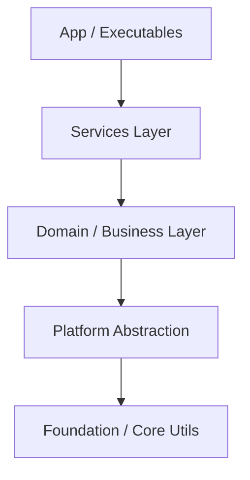

<!-- AI_CONTEXT
你是一名高级 C++ 架构师。
你的目标是设计一个可扩展且严格遵循项目工程指南的 C++20 模块系统。
在填写此模板时，你必须根据项目的“元规则”验证每一个决定。
-->

# {计划名称} 实施计划

> **标准参考 & 跨文档链接**:
> *   TDD 与开发规范: [AGENTS.md](../../../AGENTS.md)
> *   质量与评估标准: [C++代码质量与评估标准指南](../process/C++_quality_standard.md)
> *   相关任务单: 见各阶段的 "对应 Task" 链接
> *   评估报告: [链接至对应评估](../evaluation/C++_evaluation_{title}.md) (计划完成后创建)

## 0. 计划前验证 (AI Agent 自检)
> **指令**: 在编写本计划其余部分之前，列出你已阅读和分析的具体文件，以确保本计划基于事实。

*   [ ] 我已阅读 [AGENTS.md](../../../AGENTS.md) 中的 C++20 开发规范。
*   [ ] 我已阅读相关现有模块的 `CMakeLists.txt` (如有)。
*   [ ] 我已确认建议的模块名称不与现有的冲突。
*   [ ] **TDD 承诺**: 我确认本计划的所有实施阶段将严格遵循 TDD 流程 (🔴 Red → 🟢 Green → 🔵 Refactor)。

**已检查的上下文:**
*   文件 1: `...`
*   文件 2: `...`

## 1. 计划概述

### 1.1 目标与范围
> @brief 简述本计划要解决的核心问题和交付成果

*   **核心目标**: {目标描述}
*   **涉及模块**: {列出涉及的模块名称}

### 1.2 关键约束 (C++20 & Modules)
> @brief 确认本项目特定的技术约束，确保符合大型工程规范

*   [ ] **标准**: C++20 (MSVC/Clang/GCC 兼容)
*   [ ] **构建**: CMake + Ninja (支持并行构建)
*   [ ] **模块化**: 严格遵循 "逻辑模块(Module) != 物理库(Library)" 原则。
*   [ ] **依赖**: 禁止反向依赖 (App -> Service -> Domain -> Platform -> Foundation)。
*   [ ] **验证**: 我已阅读 [AGENTS.md](../../../AGENTS.md) 中的模块开发规范并将在设计中应用。

> **验证指令**: 如果无法勾选某项，请**停止**并优化计划。

---

## 2. 架构设计 (核心)

### 2.1 模块与库映射表 (Physical Layout)
> **强制要求**: 避免"一模块一Target"。请规划如何将多个逻辑模块(`.ixx`)聚合到少数几个物理库(`add_library`)中。

| 物理库 (CMake Target) | 包含的逻辑模块 (Logical Modules) | 依赖的物理库 | 理由 (Reasoning) |
| :--- | :--- | :--- | :--- |
| `domain_face` | `domain.face` `domain.face.types` | `foundation_core` | **聚合理由?** 紧密的人脸处理业务域。 **依赖关系:** 使用核心工具库。 |
| `service_pipeline` | `service.pipeline.api` `service.pipeline.workflow` | `domain_face` | **聚合理由?** 处理流水线编排。 **依赖关系:** 消费领域模型。 |

### 2.2 接口设计策略 (Module Interface)
> **BMI 优化**: 确保接口文件(`.ixx`)轻量化，实现细节放入(`.cpp`)。

*   **Public Modules**:
    *   `{module_name}`: 仅导出 {核心类/函数}
*   **Internal Modules/Partitions**:
    *   `{module_name}:impl`: 封装 {实现细节}
*   **Test Support Modules**:
    *   `test.{module_name}`: 暴露 {内部状态} 供测试使用 (严禁生产代码依赖)

### 2.3 依赖关系图 (逻辑视图)
> 使用 Mermaid 描述**逻辑模块**间的依赖关系。
> **约束**: 使用标准节点名称 (如 `ModuleA` 而非 `Module A`)。ID 中不要使用特殊字符。

---

## 3. 实施路线图

### 3.1 阶段一: {阶段名称} (原型/核心/基础)
**目标**: {简述目标，如：完成核心数据结构定义与基础编译通过}

*   [ ] **任务 1.1**: {任务描述} → 对应 Task: [链接](./plan/{name}/task/C++_task_{title}.md)
*   [ ] **任务 1.2**: {任务描述} → 对应 Task: [链接](./plan/{name}/task/C++_task_{title}.md)
*   [ ] **验收标准**:
    *   🔴 **TDD 合规**: 适用代码必须有对应的失败测试先行编写（适用范围详见 [AGENTS.md](../../../AGENTS.md)）
    *   编译通过 (无警告)
    *   核心接口定义冻结
    *   🧪 单元测试全部通过

**阶段内研究检查点** (2-Action Rule 实施):
> 每完成 2 个小任务，停下来更新下方研究表，记录关键发现。

| 时间               | 发现内容                     | 来源                         | 影响评估       |
| :----------------- | :--------------------------- | :--------------------------- | :------------- |
| {YYYY-MM-DD HH:MM} | {技术细节/API 行为/性能数据} | {文档链接/代码路径/测试结果} | {对阶段的影响} |

### 3.2 阶段二: {阶段名称} (实现/功能/测试)
**目标**: {简述目标，如：完成主要业务逻辑并添加单元测试}

> ⚠️ **TDD 强制**: 本阶段适用代码必须严格遵循 Red-Green-Refactor 循环（适用范围详见 [AGENTS.md](../../../AGENTS.md)）。

*   [ ] **任务 2.1**: {任务描述} → 对应 Task: [链接](./plan/{name}/task/C++_task_{title}.md)
*   [ ] **任务 2.2**: {任务描述} → 对应 Task: [链接](./plan/{name}/task/C++_task_{title}.md)
*   [ ] **验收标准**:
    *   🔴 **TDD 合规**: 每个功能实现前必须有失败测试
    *   🟢 **测试驱动**: 代码仅满足当前测试需求，无过度设计
    *   🔵 **重构验证**: 重构后所有测试仍通过
    *   单元测试覆盖率 > {80}%
    *   通过 Clang-Tidy 检查

**阶段内研究检查点** (2-Action Rule 实施):
> 每完成 2 个小任务，停下来更新下方研究表，记录关键发现。

| 时间               | 发现内容                     | 来源                         | 影响评估       |
| :----------------- | :--------------------------- | :--------------------------- | :------------- |
| {YYYY-MM-DD HH:MM} | {技术细节/API 行为/性能数据} | {文档链接/代码路径/测试结果} | {对阶段的影响} |

### 3.3 阶段三: {阶段名称} (集成/优化/交付)
**目标**: {简述目标，如：集成到主系统并进行性能优化}

*   [ ] **任务 3.1**: {任务描述} → 对应 Task: [链接](./plan/{name}/task/C++_task_{title}.md)
*   [ ] **任务 3.2**: {任务描述} → 对应 Task: [链接](./plan/{name}/task/C++_task_{title}.md)
*   [ ] **验收标准**:
    *   🧪 **测试完整性**: 行为测试覆盖所有关键路径
    *   通过集成测试
    *   性能指标达标 ({具体指标})
    *   **TDD 审计**: 确认所有适用的新增代码均由测试驱动产生（适用范围详见 [AGENTS.md](../../../AGENTS.md)）

**阶段内研究检查点** (2-Action Rule 实施):
> 每完成 2 个小任务，停下来更新下方研究表，记录关键发现。

| 时间               | 发现内容                     | 来源                         | 影响评估       |
| :----------------- | :--------------------------- | :--------------------------- | :------------- |
| {YYYY-MM-DD HH:MM} | {技术细节/API 行为/性能数据} | {文档链接/代码路径/测试结果} | {对阶段的影响} |

---

## 4. 风险管理

| 风险点 | 可能性 | 影响 | 缓解措施 |
| :--- | :--- | :--- | :--- |
| **技术风险**: {如：第三方库不支持 Modules} | 高/中/低 | 阻碍编译 | 使用 Global Module Fragment 封装 |
| **性能风险**: {如：BMI 生成过慢} | 中 | 延长构建时间 | 拆分 Interface Partition，减少依赖 |
| **进度风险**: {如：需求变更} | 中 | 延期交付 | 提前冻结核心接口 |

---

## 5. 资源与依赖
*   **外部依赖**: {列出需要的第三方库或工具}
*   **前置任务**: {列出必须先完成的任务}
*   **关键工具链**:
    - CMake + Ninja
    - MSVC C++20 编译器 (或 Clang/GCC)
    - Python build.py 脚本
    - Clang-Tidy (静态分析)
    - Google Test (单元测试框架)

## 6. 全局研究发现记录 (Research Findings)

> **2-Action Rule**: 上述各阶段的"阶段内研究检查点"表用于记录阶段内的发现。本表用于记录**跨阶段** 或 **全局级别** 的关键发现。

| 时间               | 发现内容                     | 来源                         | 影响评估       | 相关阶段 |
| :----------------- | :--------------------------- | :--------------------------- | :------------- | :------: |
| {YYYY-MM-DD HH:MM} | {技术细节/API 行为/性能数据} | {文档链接/代码路径/测试结果} | {对计划的影响} | 1.x/2.x/3.x |
