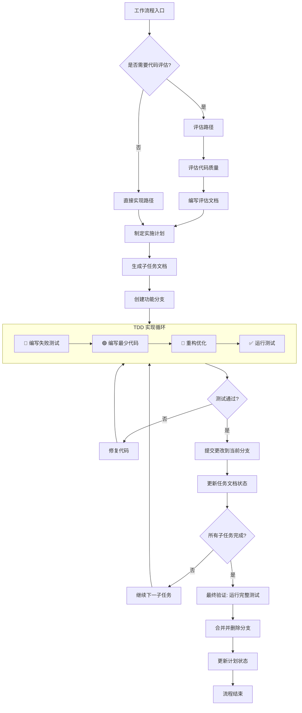

### 工作流程

#### 流程概述
本工作流程支持两种路径：**评估路径**（需要代码质量评估）和**直接实现路径**（无需评估）。流程设计遵循"TDD 强制、自动化执行、快速通道"原则。

**核心原则**：
1. 所有开发工作必须在独立的功能/修复分支上进行，严禁直接修改主分支。
2. **TDD 强制**：所有代码修改必须遵循测试驱动开发流程。

---

#### 🧪 TDD 开发原则 (MANDATORY)

> ⚠️ **测试驱动开发是本项目的强制开发方法论。所有新功能和 bug 修复都必须严格遵循，无例外。**

**核心流程**
1. **🔴 Red**：先编写失败的测试，明确期望行为。测试必须能够独立运行且初始状态为失败。
2. **🟢 Green**：编写**最少量**代码使测试通过。不做过度设计，只满足当前测试需求。
3. **🔵 Refactor**：在测试保护下优化代码结构。确保重构后所有测试仍然通过。

**TDD 禁令**
- **严禁**：在没有对应测试的情况下编写新功能代码。
- **严禁**：先写实现代码再补测试（事后补测试不是 TDD）。
- **严禁**：为了通过测试而修改测试本身（除非测试逻辑确实有误）。
- **严禁**：跳过 Refactor 阶段（技术债务的主要来源）。

**TDD 检查点**
- 每个 PR/提交必须包含对应的测试代码。
- 测试覆盖率不得因新代码而下降。
- 测试必须是**行为测试**而非**实现测试**（测试"做什么"而非"怎么做"）。

---

#### 上下文管理规则 (Context Management)

> 基于 Manus AI 的"上下文工程"理念，确保关键信息不丢失。

**1. 2-Action Rule（双操作规则）**
> 每 2 次查看/浏览/研究操作后，**立即**将关键发现写入文档。

| 操作类型 | 示例                   | 记录位置                 |
| -------- | ---------------------- | ------------------------ |
| 代码浏览 | 阅读源码、查看接口     | 计划文档的"研究发现"章节 |
| 文档阅读 | 查阅 API 文档、规范    | 计划文档的"研究发现"章节 |
| 测试运行 | 执行测试、观察输出     | 任务文档的"问题记录"章节 |
| 搜索研究 | 搜索解决方案、查阅示例 | 计划文档的"研究发现"章节 |

**2. 持久化优先原则**
```
上下文窗口 = 内存 (易失性, 有限)
文件系统 = 磁盘 (持久性, 无限)

→ 任何重要信息都应写入磁盘。
```

**3. 读写决策矩阵**

| 场景           | 操作                 | 原因                     |
| -------------- | -------------------- | ------------------------ |
| 刚写完文件     | **不读**             | 内容仍在上下文中         |
| 查看了图像/PDF | **立即写**           | 多模态信息需转为文本保存 |
| 研究返回数据   | **写入文件**         | 研究结果不会持久保留     |
| 开始新阶段     | **读取计划**         | 重新定位目标             |
| 发生错误       | **读取相关文件**     | 需要当前状态来修复       |
| 中断后恢复     | **读取所有计划文件** | 恢复工作状态             |

---

#### 评估路径（需要代码质量评估）

**阶段一：代码评估**
1. 评估代码质量
2. 编写评估文档（路径：`/docs/dev_docs/evaluation/C++_evaluation_{title}.md`）
3. 进入阶段二

**阶段二：计划制定**
4. 根据评估结果制定实施计划
5. 进入阶段三

**阶段三：任务文档生成**
6. 根据计划批量生成子任务文档
   - 路径：`/docs/dev_docs/plan/{plan_name}/task/C++_task_{task_name}.md`
   - 格式：中文 Markdown
7. 进入阶段四

**阶段四：任务实现（分支操作 + TDD）**
8. **创建功能分支**：基于当前开发分支（如 `main`）新建分支（例如：`feature/plan-{plan_name}`）
9. **TDD 循环实现子任务**：
   - 🔴 为当前子任务编写失败测试
   - 🟢 编写最少量代码使测试通过
   - 🔵 重构优化代码结构
   - ✅ 运行 `python build.py --action test` 确保所有测试通过
10. 提交子任务更改到 git（仅提交代码文件，不提交文档文件）
11. 更新任务文档状态
    - 将对应的子任务文档状态标记为"已完成"
    - 记录完成时间与相关 commit ID
12. 重复步骤 9-11 直到所有子任务完成

**阶段五：完成验收与合并**
13. **最终验证**：运行完整测试套件确保所有测试通过
14. **合并分支**：将功能分支合并回开发主分支
15. **清理分支**：删除已合并的功能分支
16. 更新计划状态为"已完成"
17. 流程结束

---

#### 直接实现路径（无需代码评估）

**阶段一：计划制定**
1. 直接制定实施计划
2. 进入阶段二

**阶段二：任务文档生成**
3. 根据计划批量生成子任务文档
   - 路径：`/docs/dev_docs/plan/{plan_name}/task/C++_task_{task_name}.md`
   - 格式：中文 Markdown
4. 进入阶段三

**阶段三：任务实现（分支操作 + TDD）**
5. **创建功能分支**：基于当前开发分支新建分支
6. **TDD 循环实现子任务**：
   - 🔴 为当前子任务编写失败测试
   - 🟢 编写最少量代码使测试通过
   - 🔵 重构优化代码结构
   - ✅ 运行 `python build.py --action test` 确保所有测试通过
7. 提交子任务更改到 git（仅提交代码文件，不提交文档文件）
8. 更新任务文档状态
   - 将对应的子任务文档状态标记为"已完成"
   - 记录完成时间与相关 commit ID
9. 重复步骤 6-8 直到所有子任务完成

**阶段四：完成验收与合并**
10. **最终验证**：运行完整测试套件确保所有测试通过
11. **合并分支**：将功能分支合并回开发主分支
12. **清理分支**：删除已合并的功能分支
13. 更新计划状态为"已完成"
14. 流程结束

---

#### 流程特性说明

**1. 双路径设计**
- 评估路径：适用于需要代码质量评估的场景，确保代码质量符合要求
- 直接实现路径：适用于简单任务或无需评估的场景，提高效率

**2. TDD 强制集成**
- 每个子任务实现必须遵循 Red-Green-Refactor 循环
- 测试通过是提交代码的前提条件
- 无测试代码不得合并

**3. 批量处理机制**
- 子任务文档支持批量生成
- 子任务按顺序自动执行

**4. 状态管理**
- 每个阶段完成后更新状态，确保流程可追溯
- 支持回滚到任意阶段，便于调整和修正

**5. 异常处理**
- 测试失败时，修复代码直到测试通过
- 支持部分完成后的继续执行，避免全量重做

**6. 版本控制与分支规范**
- **强制分支**：严禁在主分支（main/master）直接提交代码
- **分支命名**：`feature/plan-{name}` 或 `fix/task-{name}`
- **原子提交**：每个子任务完成后，提交代码更改到当前分支
- **合并清理**：任务验收后合并并删除分支，保持仓库整洁

---

#### 流程图


