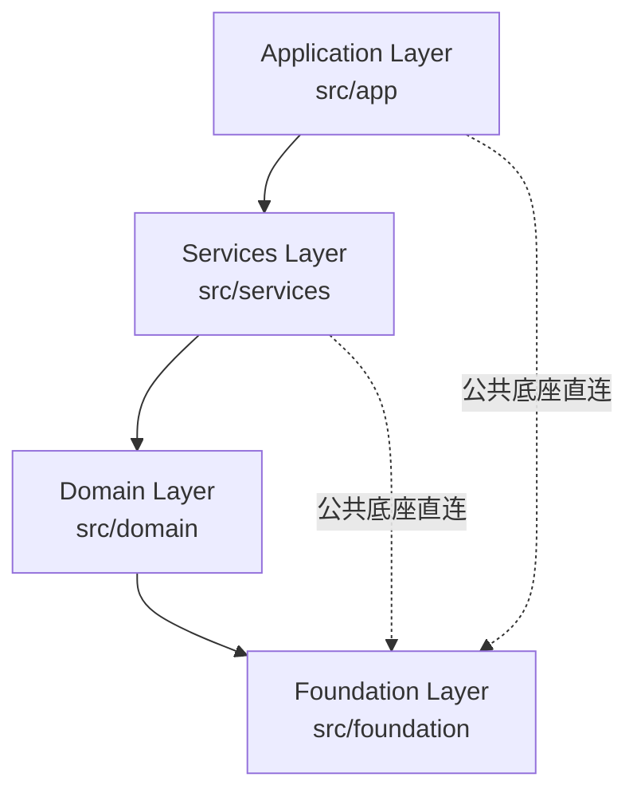

# 分层架构实现细节 (Layered Architecture Implementation)

> **文档控制信息 (Document Control)**
> - **文档标识 (Document ID)**: FFC-DEV-ZH-ARCH-LAYERS-2026
> - **当前版本 (Version)**: V2.0.0
> - **状态 (Status)**: 正式 (Official)
> - **权威性 (Authority)**: Normative
> - **所有者 (Owner)**: 王辉
> - **审核人 (Reviewer)**: 王辉
> - **最后更新 (Last Updated)**: 2026-08-14

## 修订历史记录 (Revision History)

| 版本号 | 修订日期 | 修订人 | 审核人 | 修订描述 |
| :--- | :--- | :--- | :--- | :--- |
| **V2.0.0** | 2026-08-14 | AI Agent | 王辉 | 依据 [layers_doc_assessment.md](../../evaluation/layers_doc_assessment.md) 评估结果重构：删除虚构的 Platform 层，修正为实际 **4 层结构**；修正 FFmpeg 封装归属（Foundation/media）；补全层↔目录↔CMake target 映射与每层模块清单；新增依赖落地保障说明。 |
| **V1.0.0** | 2026-08-13 | AI Agent | 王辉 | 依据文档治理规范初始化文档控制信息与修订历史。 |

---

## 1. 架构总览

FaceFusionCpp 采用严格的 **4 层单向依赖**（Application → Services → Domain → Foundation）：

> **注意**: 早期设计中的 **Platform 层（`src/platform/`）已不存在**——其职责（文件系统、线程抽象）已并入 Foundation 层 `infrastructure` 子分组。当前代码库实际为 4 个顶层目录（`src/CMakeLists.txt` 仅包含 foundation/domain/services/app 四个子目录）。

## 2. 各层详解

### 2.1 Layer 1: Application (`src/app/`) — 接入层
CMake targets: `app_facefusioncpp`（主程序）、`app_cli`、`app_version`

| 子目录 | 关键模块 | 职责 |
| :--- | :--- | :--- |
| `cli/` | `app_cli.ixx`, `system_check.ixx` | CLI11 命令行解析；`--system-check` 环境自检 |
| `config/` | `app_config.ixx`, `task_config.ixx`, `config_types.ixx` | 配置 Schema 定义与 `ErrorCode` 错误码 |
| | `config_validator.ixx`, `config_merger.ixx` | 配置校验（含 YAML path 定位）；级联合并 |
| | `parser/config_parser.ixx` | YAML 解析实现 |
| 根目录 | `face_fusion.cpp`, `version.ixx` | 程序入口；编译期版本注入 |

### 2.2 Layer 2: Services (`src/services/pipeline/`) — 业务编排层
CMake target: `services_pipeline`

| 关键模块 | 职责 |
| :--- | :--- |
| `pipeline_runner.ixx`, `runner_image.cpp`, `runner_video.cpp` | 生产者-消费者流水线编排；`ProcessVideoSegmented` 视频分段处理 |
| `checkpoint_manager.ixx` | 断点续传（`{task_id}.ckpt`，含 checksum/config_hash 校验） |
| `shutdown_handler.ixx` | 优雅停机（SIGINT/SIGTERM/CTRL_C_EVENT） |
| `metrics_collector.ixx` | 指标采集（step_latency / gpu_memory，输出 `metrics_{ts}.json`） |
| `utils.ixx` | 服务层工具 |

### 2.3 Layer 3: Domain (`src/domain/`) — AI 核心与图像编排层
CMake targets: `domain_face`, `domain_frame`, `domain_pipeline`, `domain_ai`, `domain_common`

**子域划分**：

| 子目录 | 关键模块 | 职责 |
| :--- | :--- | :--- |
| `ai/` | `model_repository.ixx` | 模型仓库（下载/定位） |
| `common/` | `common.ixx`, `common_types.ixx` | 域内共享类型 |
| `face/detector/` | `yolo.cpp`, `retina.cpp`, `scrfd.cpp` | 人脸检测（融合策略：置信度优先 + NMS） |
| `face/landmarker/` | `t2dfan.cpp`, `t68by5.cpp`, `peppawutz.cpp` | 关键点检测 |
| `face/recognizer/` | `arcface.cpp` | 人脸识别/相似度 |
| `face/swapper/` | `inswapper.cpp` | 换脸推理（归一化裁切图） |
| `face/enhancer/` | `gfp_gan.ixx`, `code_former.ixx` | 人脸增强 |
| `face/masker/` | `region_masker.ixx`, `occlusion_masker.ixx` | 遮罩（region/occlusion） |
| `face/analyser/` | `face_model_registry.cpp` | 人脸分析模型生命周期管理 |
| `face/` 根 | `face_selector.ixx`, `face_helper.ixx`, `face_store.ixx` | 人脸选择（reference/one/many）、辅助与缓存 |
| `frame/enhancer/` | `frame_enhancer.ixx` + `impl/` | 全帧增强（tile 分块推理，`create_tile_frames`/`merge_tile_frames`） |
| `pipeline/` | `pipeline_api.ixx`, `pipeline_adapters.ixx` | 流水线公共接口；适配器（Warp/Crop、色彩匹配、遮罩贴回编排） |
| | `queue.ixx`, `processor_factory.ixx`, `processor_param_registry.ixx` | 有界队列；处理器工厂；参数元数据注册表（CLI 动态生成） |

> **注意**: 图像/视频封装（OpenCV/FFmpeg）**不位于 Domain**，而归属于 Foundation `media` 子分组（见 §2.4）。

### 2.4 Layer 4: Foundation (`src/foundation/`) — 公共底座
CMake targets: `foundation_ai`, `foundation_infrastructure`, `foundation_media`

Foundation 内部按职责分为 3 个子分组：

| 子分组 | 关键模块 | 职责 |
| :--- | :--- | :--- |
| `ai/` | `inference_session.ixx`, `session_pool.ixx`, `inference_session_registry.ixx` | TensorRT / ONNX Runtime 推理引擎封装与会话池 |
| `infrastructure/` | `file_system.ixx`, `concurrent_file_system.ixx` | 跨平台文件操作与路径规范化（原 Platform 层职责） |
| | `thread_pool.ixx`, `concurrent_queue.ixx` | 线程池、有界并发队列（原 Platform 层职责） |
| | `logger.ixx`, `logger_types.ixx`, `console.ixx` | spdlog 封装日志、控制台输出 |
| | `progress.ixx`, `network.ixx`, `process.ixx`, `core_utils.ixx` | 进度回调、网络、子进程、工具（背压信号量/UUID 等） |
| `media/` | `ffmpeg.ixx`, `ffmpeg_reader.cpp`, `ffmpeg_writer.cpp`, `vision.cpp` | FFmpeg 动态库封装（读/写/重采样）、OpenCV 视觉工具 |

> **注意**: FFmpeg 以**动态库 API**（`avcodec_open2`/`av_read_frame` 等）集成，不依赖命令行工具。详见 [design.md](./design.md) 附录 A.4。

---

## 3. 层 ↔ 目录 ↔ CMake Target 映射

| 层 | 目录 | CMake Target | 依赖（仅下行） |
| :--- | :--- | :--- | :--- |
| **Application** | `src/app/` | `app_facefusioncpp`, `app_cli`, `app_version` | foundation, domain, services |
| **Services** | `src/services/` | `services_pipeline` | domain, foundation |
| **Domain** | `src/domain/` | `domain_face`, `domain_frame`, `domain_pipeline`, `domain_ai`, `domain_common` | foundation |
| **Foundation** | `src/foundation/` | `foundation_ai`, `foundation_infrastructure`, `foundation_media` | 第三方库（CUDA/ONNX/TensorRT/FFmpeg/OpenCV/spdlog/yaml-cpp 等） |

---

## 4. 依赖规则原则

1. **单向依赖 (Unidirectional)**: 上层仅依赖下层。实测依赖方向：`app → {services, domain, foundation}`、`services → {domain, foundation}`、`domain → foundation`，无反向或循环链接。
2. **公共底座直连 (Foundation Access)**: Foundation 作为公共底座，**任何上层均允许直接依赖**（App/Services 直链 `foundation_*` 属合法行为，如 `app_version` 直链 `foundation_infrastructure`）。
3. **禁止跨层跳跃 (No Layer Skipping)**: Application 严禁直接调用 Domain 的底层私有接口，业务编排必须经由 Services 层（PIMPL 隐藏内部实现，物理上杜绝）。
4. **禁止循环依赖 (No Circular Dependencies)**: 发现循环依赖时，应将公共逻辑下沉至 Foundation 层。
5. **接口优先 (Interface First)**: 模块间通过 `.ixx` 模块接口通信，隐藏内部实现（PIMPL）。
6. **落地保障 (Enforcement)**: 分层依赖通过 CMake 层级 target 设计固化——每个 target 仅 `target_link_libraries` 声明其允许的下层 target；新增依赖时保持方向，可用 `grep target_link_libraries src/*/CMakeLists.txt` 或 `cmake --graphviz` 审计。
