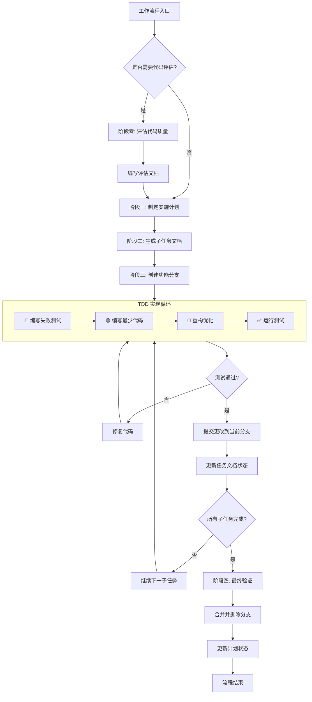

### 工作流程

#### 流程概述
本工作流程支持两种路径：**评估路径**（需要代码质量评估）和**直接实现路径**（无需评估）。两者共享相同的计划、实现和验收阶段，评估仅作为可选前置步骤。

**核心原则**：
1. 所有开发工作必须在独立的功能/修复分支上进行，严禁直接修改 `master` 或 `dev` 分支。
2. **TDD 强制**：遵循项目 TDD 开发原则（详见 [AGENTS.md](../../AGENTS.md#-tdd-开发原则-mandatory---最高优先级)），所有适用代码必须通过 TDD 流程产生。

---

#### 上下文管理规则 (Context Management)

> 基于 Manus AI 的"上下文工程"理念，确保关键信息不丢失。

**1. 2-Action Rule（双操作规则）**
> 每 2 次查看/浏览/研究操作后，**立即**将关键发现写入文档。

| 操作类型 | 示例                   | 记录位置                 |
| -------- | ---------------------- | ------------------------ |
| 代码浏览 | 阅读源码、查看接口     | 计划文档的"研究发现"章节 |
| 文档阅读 | 查阅 API 文档、规范    | 计划文档的"研究发现"章节 |
| 测试运行 | 执行测试、观察输出     | 任务文档的"问题记录"章节 |
| 搜索研究 | 搜索解决方案、查阅示例 | 计划文档的"研究发现"章节 |

**2. 持久化优先原则**
```
上下文窗口 = 内存 (易失性, 有限)
文件系统 = 磁盘 (持久性, 无限)

→ 任何重要信息都应写入磁盘。
```

**3. 读写决策矩阵**

| 场景           | 操作                 | 原因                     |
| -------------- | -------------------- | ------------------------ |
| 刚写完文件     | **不读**             | 内容仍在上下文中         |
| 查看了图像/PDF | **立即写**           | 多模态信息需转为文本保存 |
| 研究返回数据   | **写入文件**         | 研究结果不会持久保留     |
| 开始新阶段     | **读取计划**         | 重新定位目标             |
| 发生错误       | **读取相关文件**     | 需要当前状态来修复       |
| 中断后恢复     | **读取所有计划文件** | 恢复工作状态             |

---

#### 统一流程

**阶段零（可选）：代码评估**
> 仅当需要代码质量评估时执行此阶段，跳过则进入阶段一。

1. 评估代码质量
2. 编写评估文档（路径：`/docs/dev/evaluation/C++_evaluation_{title}.md`）

**阶段一：计划制定**
3. 制定实施计划（如已执行评估，则根据评估结果制定）
4. 进入阶段二

**阶段二：任务文档生成**
5. 根据计划批量生成子任务文档
   - 路径：`/docs/dev/plan/{plan_name}/task/C++_task_{task_name}.md`
   - 格式：中文 Markdown
6. 进入阶段三

**阶段三：任务实现（分支操作 + TDD）**
7. **创建功能分支**：基于 `dev` 分支新建分支（例如：`feature/plan-{plan_name}`）
8. **TDD 循环实现子任务**（详见 [AGENTS.md TDD 原则](../../AGENTS.md#-tdd-开发原则-mandatory---最高优先级)）：
   - 🔴 为当前子任务编写失败测试
   - 🟢 编写最少量代码使测试通过
   - 🔵 重构优化代码结构
   - ✅ 运行 `python build.py --action test` 确保所有测试通过
9. 提交子任务更改到 git（仅提交代码文件，不提交文档文件）
10. 更新任务文档状态
    - 将对应的子任务文档状态标记为"已完成"
    - 记录完成时间与相关 commit ID
11. 重复步骤 8-10 直到所有子任务完成

**阶段四：完成验收与合并**
12. **最终验证**：运行完整测试套件确保所有测试通过
13. **合并分支**：将功能分支合并回 `dev` 分支
14. **清理分支**：删除已合并的功能分支
15. 更新计划状态为"已完成"
16. 流程结束

---

#### 流程特性说明

**1. 评估可选**
- 评估阶段（阶段零）适用于需要代码质量评估的场景
- 简单任务或无需评估的场景可直接从阶段一开始

**2. TDD 强制集成**
- 每个子任务实现必须遵循 Red-Green-Refactor 循环（适用范围详见 [AGENTS.md](../../AGENTS.md)）
- 测试通过是提交代码的前提条件
- 无测试代码不得合并

**3. 批量处理机制**
- 子任务文档支持批量生成
- 子任务按顺序自动执行

**4. 状态管理**
- 每个阶段完成后更新状态，确保流程可追溯
- 支持回滚到任意阶段，便于调整和修正

**5. 异常处理**
- 测试失败时，修复代码直到测试通过
- 支持部分完成后的继续执行，避免全量重做

**6. 版本控制与分支规范（标准 Git Flow）**
- **长期分支**：`master`（生产/发布）+ `dev`（开发集成），严禁直接提交
- **临时分支**：
  - `feature/plan-{name}`：新功能，基于 `dev` 创建 → 合并回 `dev`
  - `fix/task-{name}`：bug 修复，基于 `dev` 创建 → 合并回 `dev`
  - `release/v{version}`：发布准备，基于 `dev` 创建 → 合并到 `master` + `dev`，打 Tag
  - `hotfix/v{version}-{desc}`：紧急修复，基于 `master` 创建 → 合并到 `master` + `dev`
- **原子提交**：每个子任务完成后，提交代码更改到当前分支
- **合并清理**：任务验收后合并并删除分支，保持仓库整洁

---

#### 流程图


