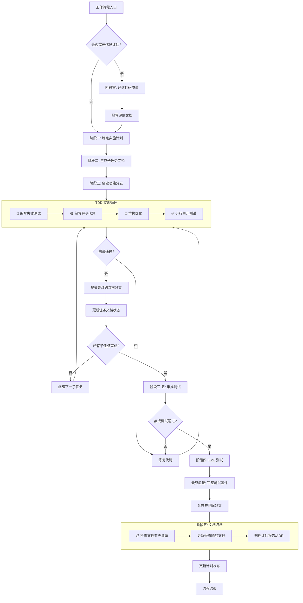

### 工作流程

#### 流程概述
本工作流程支持两种路径：**评估路径**（需要代码质量评估）和**直接实现路径**（无需评估）。两者共享相同的计划、实现和验收阶段，评估仅作为可选前置步骤。

**核心原则**：
1. 所有开发工作必须在独立的功能/修复分支上进行，严禁直接修改 `master` 或 `dev` 分支。
2. **TDD 强制**：遵循项目 TDD 开发原则（详见 [AGENTS.md](../../AGENTS.md#-tdd-开发原则-mandatory---最高优先级)），所有适用代码必须通过 TDD 流程产生。

---

#### 上下文管理规则 (Context Management)

> 基于 Manus AI 的"上下文工程"理念，确保关键信息不丢失。

**1. 2-Action Rule（双操作规则）**
> 每 2 次查看/浏览/研究操作后，**立即**将关键发现写入文档。

| 操作类型 | 示例                   | 记录位置                 |
| -------- | ---------------------- | ------------------------ |
| 代码浏览 | 阅读源码、查看接口     | 计划文档的"研究发现"章节 |
| 文档阅读 | 查阅 API 文档、规范    | 计划文档的"研究发现"章节 |
| 测试运行 | 执行测试、观察输出     | 任务文档的"问题记录"章节 |
| 搜索研究 | 搜索解决方案、查阅示例 | 计划文档的"研究发现"章节 |

**2. 持久化优先原则**
```
上下文窗口 = 内存 (易失性, 有限)
文件系统 = 磁盘 (持久性, 无限)

→ 任何重要信息都应写入磁盘。
```

**3. 读写决策矩阵**

| 场景           | 操作                 | 原因                     |
| -------------- | -------------------- | ------------------------ |
| 刚写完文件     | **不读**             | 内容仍在上下文中         |
| 查看了图像/PDF | **立即写**           | 多模态信息需转为文本保存 |
| 研究返回数据   | **写入文件**         | 研究结果不会持久保留     |
| 开始新阶段     | **读取计划**         | 重新定位目标             |
| 发生错误       | **读取相关文件**     | 需要当前状态来修复       |
| 中断后恢复     | **读取所有计划文件** | 恢复工作状态             |

---

#### 统一流程

**阶段零（可选）：代码评估**
> 仅当需要代码质量评估时执行此阶段，跳过则进入阶段一。

1. 评估代码质量
2. 编写评估文档（路径：`/docs/dev/evaluation/C++_evaluation_{title}.md`）

**阶段一：计划制定**
3. 制定实施计划（如已执行评估，则根据评估结果制定）
4. 进入阶段二

**阶段二：任务文档生成**
5. 根据计划批量生成子任务文档
   - 路径：`/docs/dev/plan/{plan_name}/task/C++_task_{task_name}.md`
   - 格式：中文 Markdown
6. 进入阶段三

**阶段三：任务实现（分支操作 + TDD）**
7. **创建功能分支**：基于 `dev` 分支新建分支（例如：`feature/plan-{plan_name}`）
8. **TDD 循环实现子任务**（详见 [AGENTS.md TDD 原则](../../AGENTS.md#-tdd-开发原则-mandatory---最高优先级)）：
   - 🔴 为当前子任务编写失败测试
   - 🟢 编写最少量代码使测试通过
   - 🔵 重构优化代码结构
   - ✅ 运行 `python build.py --action test --test-label unit` 确保单元测试通过
9. 提交子任务更改到 git
   - 代码变更：必须先通过单元测试再提交
   - 纯文档变更（`docs/` 目录、`.md` 文件）：无需运行测试，可直接提交
10. 更新任务文档状态
    - 将对应的子任务文档状态标记为"已完成"
    - 记录完成时间与相关 commit ID
11. 重复步骤 8-10 直到所有子任务完成

**TDD 失败处理协议**：

| 失败场景 | 检测方式 | 重试策略 | 回退路径 | 升级条件 |
| :--- | :--- | :--- | :--- | :--- |
| 单元测试失败 | `build.py --action test` 返回非零 | 最多重试 3 次修改 | 回退到上一个通过的 commit | 3 次失败后升级为人工介入 |
| 编译失败 | `build.py --action build` 返回非零 | 最多重试 2 次修复 | 回退到上一个编译通过的状态 | 2 次失败后检查依赖/环境 |
| 重构后测试失败 | 重构后运行测试 | 回退重构，重新尝试 | 放弃本次重构，保持原代码 | 3 次失败后跳过重构步骤 |

**3-Tries 规则**：每个子任务最多尝试 **3 次**。如果失败：
1. **STOP**：停止尝试，不要盲目试错
2. **RECORD**：记录失败原因、错误信息、已尝试的方法
3. **RESEARCH**：利用检索工具寻找替代方案
4. **ASK**：主动向用户求助

**阶段三.五：集成验证**
> 所有子任务完成后、合并前执行。验证跨模块协作无回归。

12. **运行集成测试**：`python build.py --action test --test-label integration`
13. 若集成测试失败，定位并修复问题，回到阶段三的 TDD 循环
14. 集成测试全部通过后，进入阶段四

**集成测试失败处理协议**：

| 失败场景 | 检测方式 | 处理策略 | 回退路径 | 升级条件 |
| :--- | :--- | :--- | :--- | :--- |
| 单个测试用例失败 | 测试报告显示具体失败用例 | 定位到具体模块，回到阶段三修复 | 回退到最后一次集成通过的状态 | 3 次修复失败后升级 |
| 多个测试用例失败 | 测试报告显示多个失败 | 按失败优先级逐个修复 | 回退到最后一次集成通过的状态 | 失败数 > 5 时升级 |
| 环境依赖失败 | CUDA/ONNX Runtime 不可用 | 检查环境配置，修复后重试 | 不回退代码，修复环境 | 环境无法修复时升级 |
| 超时失败 | 测试执行超过预期时间 2x | 检查是否有死锁或无限循环 | 回退到最后一次集成通过的状态 | 超时 > 10min 时升级 |

**阶段四：完成验收与合并**
15. **E2E 测试**：运行端到端测试验证完整业务流程（如适用）
    - 命令：`cd build/<preset>/bin && python3 ../../../tests/e2e/scripts/run_e2e.py`
    - 详细说明参见 `tests/e2e/README.md`
16. **最终验证**：运行完整测试套件 `python build.py --action test` 确保所有测试通过
17. **合并分支**：将功能分支合并回 `dev` 分支
18. **清理分支**：删除已合并的功能分支

**阶段五：文档归档与更新**
> 合并完成后执行。确保所有文档与代码变更保持同步。

19. **文档变更检查**（按以下清单逐项确认）：

    **📋 开发文档检查** (`docs/dev/{en,zh}/`)：

    | 文档 | 检查条件 | 路径 |
    | :--- | :--- | :--- |
    | 架构设计 | 是否新增/修改了模块、分层、接口 | `architecture/design.md` |
    | 分层结构 | 是否调整了层级依赖关系 | `architecture/layers.md` |
    | 构建指南 | 是否新增/变更了构建依赖或配置 | `guides/setup.md` |
    | 质量标准 | 是否新增/修改了代码规范 | `process/quality.md`, `process/C++_quality_standard.md` |
    | 工作流程 | 是否调整了开发流程 | `process/workflow.md` |
    | 疑难杂症 | 是否解决了新的技术问题 | `troubleshooting/README.md` |

    **📋 用户文档检查** (`docs/user/{en,zh}/`)：

    | 文档 | 检查条件 | 路径 |
    | :--- | :--- | :--- |
    | 快速上手 | 是否影响了安装/首次使用流程 | `getting_started.md` |
    | 用户指南 | 是否新增/修改了功能特性 | `user_guide.md` |
    | 配置指南 | 是否新增/修改了配置参数 | `configuration_guide.md` |
    | CLI 参考 | 是否新增/修改了命令行参数 | `cli_reference.md` |
    | 硬件指南 | 是否有新的硬件适配信息 | `hardware_guide.md` |
    | FAQ | 是否有新的常见问题 | `faq.md` |

    **📋 其他文档检查**：

    | 文档 | 检查条件 | 路径 |
    | :--- | :--- | :--- |
    | 技术决策 (ADR) | 是否做出了重大技术选型决策 | `docs/dev/zh/guides/*.md` |
    | 评估报告 | 是否完成了代码质量评估 | `docs/dev/evaluation/*.md` |
    | 实施计划 | 是否有计划状态变更 | `docs/dev/plan/*/IMPLEMENTATION_PLAN.md` |
    | 构建说明 | 是否有构建流程变更 | `docs/build.md` |

20. **更新受影响的文档**：
    - 对于每个"需要更新"的文档，执行更新并记录变更
    - 开发文档和用户文档需同步更新中英文版本（`docs/dev/zh/` 和 `docs/dev/en/`，`docs/user/zh/` 和 `docs/user/en/`）
    - 文档变更使用独立 commit，message 格式：`docs: update {文档名} for {变更原因}`

21. **归档评估报告**（如有）：
    - 将阶段零产生的评估报告保存到 `docs/dev/evaluation/`
    - 将技术决策记录 (ADR) 保存到 `docs/dev/zh/guides/`

22. 更新计划状态为"已完成"
23. 流程结束

---

#### 流程特性说明

**1. 评估可选**
- 评估阶段（阶段零）适用于需要代码质量评估的场景
- 简单任务或无需评估的场景可直接从阶段一开始

**2. TDD 强制集成**
- 每个子任务实现必须遵循 Red-Green-Refactor 循环（适用范围详见 [AGENTS.md](../../AGENTS.md)）
- 测试通过是提交代码的前提条件
- 无测试代码不得合并

**3. 批量处理机制**
- 子任务文档支持批量生成
- 子任务按顺序自动执行

**4. 状态管理**
- 每个阶段完成后更新状态，确保流程可追溯
- 支持回滚到任意阶段，便于调整和修正

**5. 异常处理**
- 测试失败时，修复代码直到测试通过
- 支持部分完成后的继续执行，避免全量重做

**6. 版本控制与分支规范（标准 Git Flow）**
- **长期分支**：`master`（生产/发布）+ `dev`（开发集成），严禁直接提交
- **临时分支**：
  - `feature/plan-{name}`：新功能，基于 `dev` 创建 → 合并回 `dev`
  - `fix/task-{name}`：bug 修复，基于 `dev` 创建 → 合并回 `dev`
  - `release/v{version}`：发布准备，基于 `dev` 创建 → 合并到 `master` + `dev`，打 Tag
  - `hotfix/v{version}-{desc}`：紧急修复，基于 `master` 创建 → 合并到 `master` + `dev`
- **原子提交**：每个子任务完成后，提交代码更改到当前分支
- **合并清理**：任务验收后合并并删除分支，保持仓库整洁

---

#### 流程图


```mermaid
graph TD
    Start[工作流程入口] --> IsEvaluationNeeded{是否需要代码评估?}

    IsEvaluationNeeded -->|是| EvalCode[阶段零: 评估代码质量]
    IsEvaluationNeeded -->|否| CreatePlan

    EvalCode --> WriteEvalDoc[编写评估文档]
    WriteEvalDoc --> CreatePlan

    CreatePlan[阶段一: 制定实施计划] --> GenTaskDocs[阶段二: 生成子任务文档]
    GenTaskDocs --> CreateBranch[阶段三: 创建功能分支]

    CreateBranch --> TDDCycle[TDD 循环]

    subgraph TDDCycle[TDD 实现循环]
        WriteTest["🔴 编写失败测试"] --> WriteCode["🟢 编写最少代码"]
        WriteCode --> Refactor["🔵 重构优化"]
        Refactor --> RunTests["✅ 运行单元测试"]
    end

    TDDCycle --> TestPass{测试通过?}
    TestPass -->|否| FixCode[修复代码]
    FixCode --> TDDCycle

    TestPass -->|是| CommitGit[提交更改到当前分支]
    CommitGit --> UpdateTaskDoc[更新任务文档状态]

    UpdateTaskDoc --> AllTasksDone{所有子任务完成?}
    AllTasksDone -->|否| NextTask[继续下一子任务]
    NextTask --> TDDCycle

    AllTasksDone -->|是| IntegrationTest[阶段三.五: 集成测试]
    IntegrationTest --> IntegPass{集成测试通过?}
    IntegPass -->|否| FixCode
    IntegPass -->|是| E2ETest[阶段四: E2E 测试]
    E2ETest --> FinalTest[最终验证: 完整测试套件]
    FinalTest --> MergeBranch[合并并删除分支]
    MergeBranch --> DocAudit[阶段五: 文档归档与更新]

    subgraph DocAudit[阶段五: 文档归档]
        CheckDocs["📋 检查文档变更清单"] --> UpdateDocs["更新受影响的文档"]
        UpdateDocs --> ArchiveReports["归档评估报告/ADR"]
    end

    DocAudit --> UpdatePlanStatus[更新计划状态]
    UpdatePlanStatus --> End[流程结束]
```
