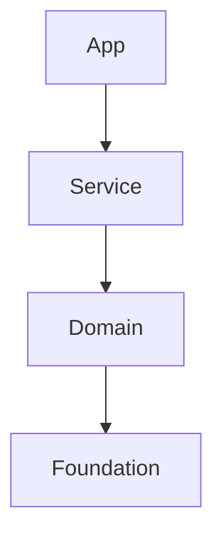

# {计划名称} 实施计划

> **标准参考**:
> *   架构与模块规范: [C++20 Modules 大型工程实践](../../C++/C++_20_模块-大型工程实践.md)
> *   质量与评估标准: [C++代码质量与评估标准指南](../C++_quality_standard.md)

## 1. 计划概述

### 1.1 目标与范围
> @brief 简述本计划要解决的核心问题和交付成果

*   **核心目标**: {目标描述}
*   **涉及模块**: {列出涉及的模块名称}

### 1.2 关键约束 (C++20 & Modules)
> @brief 确认本项目特定的技术约束，确保符合大型工程规范

*   [ ] **标准**: C++20 (MSVC/Clang/GCC 兼容)
*   [ ] **构建**: CMake + Ninja (支持并行构建)
*   [ ] **模块化**: 严格遵循 "逻辑模块(Module) != 物理库(Library)" 原则
*   [ ] **依赖**: 禁止反向依赖 (App -> Service -> Domain -> Platform -> Foundation)

---

## 2. 架构设计 (核心)

### 2.1 模块与库映射表 (Physical Layout)
> **强制要求**: 避免"一模块一Target"。请规划如何将多个逻辑模块(`.ixx`)聚合到少数几个物理库(`add_library`)中。

| 物理库 (CMake Target) | 包含的逻辑模块 (Logical Modules) | 依赖的物理库 | 说明 |
| :--- | :--- | :--- | :--- |
| `domain_order` | `domain.order`, `domain.order.types`, `domain.order.pricing` | `foundation_core` | 订单核心业务库 |
| `service_trade` | `service.trade.api`, `service.trade.workflow` | `domain_order` | 交易服务库 |

### 2.2 接口设计策略 (Module Interface)
> **BMI 优化**: 确保接口文件(`.ixx`)轻量化，实现细节放入(`.cpp`)。

*   **Public Modules**:
    *   `{module_name}`: 仅导出 {核心类/函数}
*   **Internal Modules/Partitions**:
    *   `{module_name}:impl`: 封装 {实现细节}
*   **Test Support Modules**:
    *   `test.{module_name}`: 暴露 {内部状态} 供测试使用 (严禁生产代码依赖)

### 2.3 依赖关系图 (逻辑视图)
> 使用 Mermaid 描述**逻辑模块**间的依赖关系。

---

## 3. 实施路线图

### 3.1 阶段一: {阶段名称} (原型/核心/基础)
**目标**: {简述目标，如：完成核心数据结构定义与基础编译通过}

*   [ ] **任务 1.1**: {任务描述}
*   [ ] **任务 1.2**: {任务描述}
*   [ ] **验收标准**:
    *   编译通过 (无警告)
    *   核心接口定义冻结

### 3.2 阶段二: {阶段名称} (实现/功能/测试)
**目标**: {简述目标，如：完成主要业务逻辑并添加单元测试}

*   [ ] **任务 2.1**: {任务描述}
*   [ ] **任务 2.2**: {任务描述}
*   [ ] **验收标准**:
    *   单元测试覆盖率 > {80}%
    *   通过 Clang-Tidy 检查

### 3.3 阶段三: {阶段名称} (集成/优化/交付)
**目标**: {简述目标，如：集成到主系统并进行性能优化}

*   [ ] **任务 3.1**: {任务描述}
*   [ ] **任务 3.2**: {任务描述}
*   [ ] **验收标准**:
    *   通过集成测试
    *   性能指标达标 ({具体指标})

---

## 4. 风险管理

| 风险点 | 可能性 | 影响 | 缓解措施 |
| :--- | :--- | :--- | :--- |
| **技术风险**: {如：第三方库不支持 Modules} | 高/中/低 | 阻碍编译 | 使用 Global Module Fragment 封装 |
| **性能风险**: {如：BMI 生成过慢} | 中 | 延长构建时间 | 拆分 Interface Partition，减少依赖 |
| **进度风险**: {如：需求变更} | 中 | 延期交付 | 提前冻结核心接口 |

---

## 5. 资源与依赖
*   **外部依赖**: {列出需要的第三方库或工具}
*   **前置任务**: {列出必须先完成的任务}
