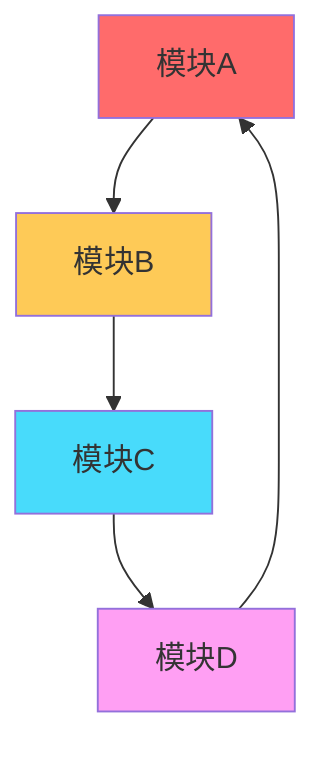
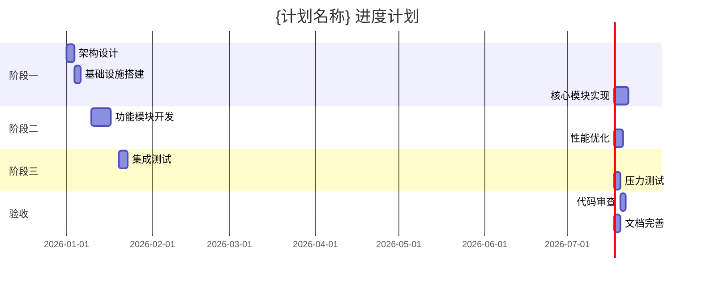
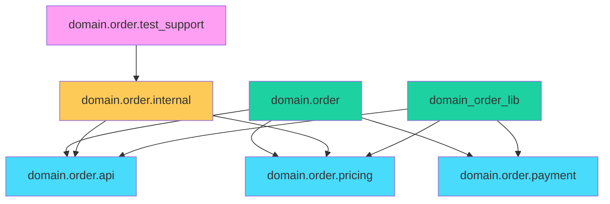
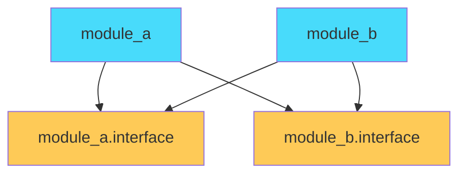

# {计划名称}计划

## 一、项目背景

### 1.1 计划目标

{描述计划的主要目标和期望达成的成果}

### 1.2 计划范围

**涉及模块**:

- {模块1} ({模块1描述})
- {模块2} ({模块2描述})
- ...

**模块架构分层**:

严格遵循 5 层架构模型，禁止跨层反向依赖：

1. **App Layer**: 最终可执行程序入口
2. **Services Layer**: 应用服务、Facade
3. **Domain Layer**: 核心业务逻辑
4. **Platform Layer**: 操作系统/编译器抽象
5. **Foundation Layer**: 基础层（日志、断言、基础算法）

**模块类型分类**:

| 模块名称 | 模块类型 | 所属层次 | 用途说明 |
|---------|---------|---------|---------|
| {模块1} | Public Module | Domain | 对外提供的核心功能模块 |
| {模块2} | Internal Module | Domain | 内部实现细节模块 |
| {模块3} | Test Support Module | Test | 测试辅助模块 |

**模块类型说明**:
- **Public Module** (`.ixx`): 对外暴露的公共接口模块，用于构建可重用库
- **Internal Module** (`.cpp`): 内部实现模块，不对外暴露，用于封装实现细节
- **Test Support Module**: 测试辅助模块，专门用于暴露内部状态给测试代码，**严禁生产代码依赖**

### 1.3 约束与假设

**技术约束**:
- **语言标准**: 必须遵循 C++20 标准。
- **模块系统**: 全面采用 C++20 Modules。
  - **Interface Units (`.ixx`)**: 仅包含 `export` 声明。
  - **Implementation Units (`.cpp`)**: 包含具体实现。
  - **Partitions**: 使用分区（如 `module:partition`）组织大型模块。
- **文件命名规范**:
  - 模块接口: `module_name.ixx` (snake_case)
  - 分区接口: `module_name-partition_name.ixx`
  - 实现文件: `module_name_impl.cpp`
- **模块架构约束 (2层模型)**:
  - **逻辑层**: 细粒度的 Modules (C++语言单元)
  - **物理层**: 聚合的 Library Targets (CMake构建单元)
  - **原则**: 1 Library Target ≈ 3-15 Modules，避免 Target 数量爆炸。
- **第三方库集成**:
  - 必须使用 **Global Module Fragment** (`module; #include ...`) 包含非 Module 的第三方头文件。
- **内存管理**: 优先使用智能指针（unique_ptr/shared_ptr），严禁裸指针。
- **并发安全**: 多线程场景必须使用适当的同步机制。

**模块依赖原则**:
- **单向依赖**: 严格遵守层级依赖（App -> Services -> Domain -> Platform -> Foundation）。
- **物理隔离**: 实现细节 (`.cpp`) 修改不应触发下游重编。
- **测试隔离**: 测试代码只能通过专门的 `Test Support Module` 访问内部状态。
- **BMI 优化**:
  - 严格分离接口与实现。
  - 在 CI 环境中利用 Ninja 的依赖扫描缓存。

**性能约束**:
- **编译时间**: 单个模块编译时间不超过 {时间}（如：5分钟）。
- **内存占用**: 运行时内存占用不超过 {大小}（如：2GB）。
- **响应时间**: 关键路径响应时间不超过 {时间}（如：100ms）。
- **吞吐量**: 系统吞吐量不低于 {指标}（如：1000 QPS）。

**前提假设**:
- {描述执行此计划所需的前提条件，如：环境已配置完成、依赖库已安装等}
- 开发环境已配置 C++20 兼容编译器（GCC 11+, Clang 12+, MSVC 19.28+）
- CMake 构建系统已正确配置
- 静态分析工具（clang-tidy, cppcheck）已安装并配置

## 二、现状分析

### 2.1 现状评估

#### 2.1.1 C++代码质量评估

| 模块     | 内存管理 | 异常安全 | 并发安全 | 模块化 | 性能优化 | 符合度   |
| -------- | -------- | -------- | -------- | ------ | -------- | -------- |
| {模块1}     | {状态}   | {状态}   | {状态}   | {状态} | {状态}   | {百分比} |
| {模块2}     | {状态}   | {状态}   | {状态}   | {状态} | {状态}   | {百分比} |
| {模块3}     | {状态}   | {状态}   | {状态}   | {状态} | {状态}   | {百分比} |

**评估标准**:
- **内存管理**: 智能指针使用率、RAII原则遵循度、内存泄漏检测结果
- **异常安全**: 异常安全保证明确性、资源清理完整性
- **并发安全**: 线程同步机制正确性、竞态条件检测结果
- **模块化**: 模块依赖复杂度、接口清晰度、耦合度
- **性能优化**: 算法复杂度、编译器优化利用率、缓存命中率

#### 2.1.2 模块依赖分析

**当前模块依赖关系**:



**依赖问题识别**:

| 问题类型 | 问题描述 | 影响范围 | 优先级 |
|---------|---------|---------|--------|
| 循环依赖 | {模块A} → {模块B} → {模块A} | {影响范围} | 高 |
| 过度耦合 | {模块A} 依赖 {模块B}、{模块C}、{模块D} | {影响范围} | 中 |
| 接口不稳定 | {模块A} 的接口频繁变更 | {影响范围} | 中 |
| 缺少抽象 | {模块A} 直接依赖 {模块B} 的实现细节 | {影响范围} | 低 |

**模块依赖治理原则**:
- **单向依赖**: 确保依赖关系始终单向，避免循环依赖
- **依赖倒置**: 高层模块不应依赖低层模块，都应依赖抽象
- **接口隔离**: 模块应通过最小接口进行交互
- **依赖深度**: 控制依赖链深度，避免过深的依赖层次

#### 2.1.3 技术债务识别

| 债务类型   | 问题描述                         | 影响范围                              | 优先级  |
| ------ | ---------------------------- | --------------------------------- | ---- |
| {内存泄漏}  | {问题描述}                         | {影响范围}                              | {高}  |
| {异常不安全}  | {问题描述}                         | {影响范围}                              | {高}  |
| {并发竞态}  | {问题描述}                         | {影响范围}                              | {高}  |
| {性能瓶颈}  | {问题描述}                         | {影响范围}                              | {中}  |
| {代码重复}  | {问题描述}                         | {影响范围}                              | {低}  |

#### 2.1.4 模块架构评估

**当前模块架构**:

| 架构层次 | 模块名称 | 职责描述 | 模块类型 | 依赖关系 |
|---------|---------|---------|---------|---------|
| 领域层 | {模块A} | {职责描述} | Public Module | {依赖列表} |
| 应用层 | {模块B} | {职责描述} | Internal Module | {依赖列表} |
| 基础层 | {模块C} | {职责描述} | Public Module | {依赖列表} |
| 测试层 | {模块D} | {职责描述} | Test Support Module | {依赖列表} |

**架构问题识别**:

| 问题类型 | 问题描述 | 影响范围 | 优先级 |
|---------|---------|---------|--------|
| 职责不清 | {模块A} 承担了多个不相关的职责 | {影响范围} | 高 |
| 层次混乱 | {模块B} 跨越了多个架构层次 | {影响范围} | 中 |
| 接口泄露 | {模块C} 暴露了内部实现细节 | {影响范围} | 中 |
| 测试耦合 | {模块D} 直接依赖被测试模块 | {影响范围} | 低 |

**模块架构优化原则**:
- **单一职责**: 每个模块只负责一个明确的功能领域
- **层次分明**: 模块应按照领域、应用、基础、测试等层次组织
- **接口稳定**: Public Module 的接口应保持稳定，避免频繁变更
- **封装完整**: Internal Module 应完全封装实现细节，不对外暴露
- **测试隔离**: Test Support Module 应提供测试所需的内部访问能力

#### 2.1.5 BMI 优化评估

**当前 BMI 生成情况**:

| 模块名称 | .ixx 文件数 | .ifc 文件大小 | 编译时间 | 优化状态 |
|---------|------------|-------------|---------|---------|
| {模块A} | {数量} | {大小} | {时间} | {状态} |
| {模块B} | {数量} | {大小} | {时间} | {状态} |
| {模块C} | {数量} | {大小} | {时间} | {状态} |

**BMI 优化问题识别**:

| 问题类型 | 问题描述 | 影响范围 | 优先级 |
|---------|---------|---------|--------|
| BMI 过大 | {模块A} 的 .ifc 文件过大（>{大小}） | {影响范围} | 高 |
| 编译缓慢 | {模块B} 的 BMI 生成时间过长（>{时间}） | {影响范围} | 中 |
| 重复生成 | {模块C} 的 BMI 被重复生成 | {影响范围} | 低 |
| 依赖过多 | {模块A} 的 BMI 依赖过多其他模块 | {影响范围} | 中 |

**BMI 优化策略**:
- **模块拆分**: 将大型模块拆分为多个小型模块，减少单个 BMI 大小
- **预编译 BMI**: 对稳定模块预编译 BMI，减少重复生成
- **依赖优化**: 减少模块间的 import 依赖，降低 BMI 传递依赖
- **增量构建**: 利用 CMake 的增量构建能力，只重新生成变更的 BMI

#### 2.1.3 架构设计评估

| 模块           | 单一职责 | 开闭原则 | 里氏替换 | 接口隔离 | 依赖倒置 | 符合度  |
| ------------ | ---- | ---- | ---- | ---- | ---- | ---- |
| {模块1}       | {状态}   | {状态}   | {状态}             | {状态}  | {状态}  | {百分比}  |
| {模块2}       | {状态}   | {状态}   | {状态}             | {状态}  | {状态}  | {百分比}  |
| {模块3}       | {状态}   | {状态}   | {状态}             | {状态}  | {状态}  | {百分比}  |

### 2.2 代码质量属性评估

#### 2.2.1 可维护性

- **优点**: {列出优点}
- **缺点**: {列出缺点}
- **改进建议**:
  - 使用 C++20 模块减少头文件依赖
  - 统一命名规范（snake_case for variables, PascalCase for classes）
  - 增加单元测试覆盖率至 {目标覆盖率}（如：80%）

#### 2.2.2 可扩展性

- **优点**: {列出优点}
- **缺点**: {列出缺点}
- **改进建议**:
  - 使用策略模式替代条件分支
  - 引入依赖注入降低耦合
  - 使用 C++20 concepts 约束模板参数

#### 2.2.3 可重用性

- **优点**: {列出优点}
- **缺点**: {列出缺点}
- **改进建议**:
  - 提取通用组件为独立模块
  - 使用模板和泛型编程提高灵活性
  - 设计清晰的接口契约

#### 2.2.4 安全性

- **优点**: {列出优点}
- **缺点**: {列出缺点}
- **改进建议**:
  - 使用智能指针防止悬垂指针
  - 使用 std::optional 处理可能缺失的值
  - 使用 std::variant 替代 union
  - 使用 constexpr 在编译时验证常量

#### 2.2.5 稳定性

- **优点**: {列出优点}
- **缺点**: {列出缺点}
- **改进建议**:
  - 增加异常处理覆盖所有错误路径
  - 使用 noexcept 标记不抛出异常的函数
  - 实现资源清理的 RAII 包装器

#### 2.2.6 性能与效率

- **优点**: {列出优点}
- **缺点**: {列出缺点}
- **改进建议**:
  - 使用移动语义减少拷贝开销
  - 使用 emplace_back 避免临时对象
  - 优化算法复杂度（如：O(n²) → O(n log n)）
  - 使用编译器优化标志（-O3, -march=native）

## 三、实施计划

### 3.1 实施原则

1. **C++最佳实践**: 严格遵循 C++ Core Guidelines 和 C++20 最佳实践
2. **RAII优先**: 所有资源通过 RAII 管理，确保异常安全和自动清理
3. **零成本抽象**: 使用模板和 constexpr 实现编译时优化，避免运行时开销
4. **明确所有权**: 使用智能指针明确资源所有权，避免共享状态
5. **异常安全**: 所有公共API提供明确的异常安全保证
6. **并发安全**: 多线程场景使用适当的同步机制，避免数据竞争
7. **性能优先**: 在保证正确性的前提下，优先考虑性能优化
8. **测试驱动**: 使用 TDD 方法，确保代码质量和可维护性

**C++20 模块实施原则**:
9. **模块化优先**: 优先使用 C++20 模块替代传统头文件，提高编译效率和封装性
10. **2层模型**: 遵循逻辑模块层和构建目标层的分离原则，**多模块聚合成单库**（1 Library ≈ 3-15 Modules）
11. **依赖单向**: 确保模块依赖关系单向，严格遵守 Domain-Driven Layering
12. **接口瘦身**: Module Interface Unit (`.ixx`) 仅声明，Implementation Unit (`.cpp`) 包含实现，避免 cascading rebuild
13. **BMI 优化**: 通过模块拆分、分区 (Partitions) 优化编译性能
14. **测试隔离**: 使用 Test Support Module (Test-only module) 实现内部状态访问，严禁生产接口暴露
15. **命名一致**: 文件名与模块名严格对应 (e.g. `module.part.ixx` -> `module.part`)

### 3.2 阶段划分

#### 阶段零: C++20 模块架构设计 (优先级: 高)

**目标**: 设计符合 C++20 模块最佳实践的项目架构，包括模块划分、依赖管理、BMI 优化策略

**状态**: {待开始/进行中/已完成}（{日期}）

**任务列表**:

1. **任务0.1: 模块架构设计**

   - [ ] 确定模块类型分类（Public Module、Internal Module、Test Support Module）
   - [ ] 设计逻辑模块层和构建目标层的映射关系（1 Library ≈ N Modules）
   - [ ] 定义模块命名规范（文件名、模块名、命名空间）
   - [ ] 确定模块接口设计原则（Global Module Fragment 使用规范）

   **技术要点**:
   - 遵循"2层模型"原则：模块是语言单元，库是构建单元
   - 模块不与库 1:1 对应，按构建需求聚合
   - 使用 **Module Partitions** (`:types`, `:impl`) 组织大型模块
   - **严禁**在 `.ixx` 中包含具体实现（Template 除外）

   **代码示例**:
   ```cpp
   // order.ixx (Primary Module Interface)
   export module domain.order;

   export import :types; // 导出分区 types
   export import :api;   // 导出分区 api

   // order_types.ixx (Module Partition Interface)
   export module domain.order:types;

   export namespace domain::order {
       struct OrderId { int value; };
   }

   // order_impl.cpp (Module Implementation Unit)
   module domain.order;

   // Global Module Fragment (用于第三方库)
   module;
   #include <fmt/core.h>

   module domain.order; // 恢复模块作用域

   namespace domain::order {
       void internal_helper() {
           fmt::print("Internal helper\n");
       }
   }
   ```

2. **任务0.2: 模块依赖设计**

   - [ ] 绘制模块依赖关系图
   - [ ] 识别并消除循环依赖
   - [ ] 确定模块依赖方向和层次
   - [ ] 定义依赖治理原则

   **技术要点**:
   - 确保依赖关系单向，禁止循环依赖
   - 公共模块不应依赖内部模块
   - 测试支持模块不应依赖被测试模块
   - 控制依赖链深度，避免过深的依赖层次

   **依赖关系示例**:
   ```mermaid
   graph TD
       A[domain.order.api] --> B[domain.order.internal]
       C[domain.order.pricing] --> A
       D[domain.order.test_support] --> B
       E[order_lib] --> A
       E --> C

       style A fill:#48dbfb
       style B fill:#feca57
       style C fill:#48dbfb
       style D fill:#ff9ff3
       style E fill:#1dd1a1
   ```

3. **任务0.3: BMI 优化策略设计**

   - [ ] 评估当前 BMI 生成情况
   - [ ] 设计模块拆分策略
   - [ ] 制定预编译 BMI 方案
   - [ ] 规划增量构建策略

   **技术要点**:
   - 将大型模块拆分为多个小型模块，减少单个 BMI 大小
   - 对稳定模块预编译 BMI，减少重复生成
   - 减少模块间的 import 依赖，降低 BMI 传递依赖
   - 利用 CMake 的增量构建能力，只重新生成变更的 BMI
   - 不要手动指定 IFC/BMI 输出目录（如 /ifcOutputDir），让 CMake 自动管理
   - CMake 会自动为不同配置（Debug/Release）和目标管理 BMI 路径，避免冲突

   **BMI 优化配置示例**:
   ```cmake
   # CMakeLists.txt
   function(add_cxx_module_library target)
       add_library(${target})

       target_compile_features(${target} PUBLIC cxx_std_20)

       if (MSVC)
           target_compile_options(${target} PRIVATE /permissive-)

       endif()
   endfunction()

   # 预编译 BMI
   add_cxx_module_library(order_lib)
   target_sources(order_lib PUBLIC
       order_export.ixx
       order_internal.ixx
       order_test_support.ixx
   )
   ```

4. **任务0.4: 测试隔离机制设计**

   - [ ] 设计测试支持模块结构
   - [ ] 定义测试隔离策略
   - [ ] 确定测试代码访问内部实现的机制
   - [ ] 制定测试模块与被测试模块的构建规则

   **技术要点**:
   - 测试代码必须通过测试支持模块访问被测试模块的内部实现
   - 禁止在 Public Module 中暴露测试专用接口
   - 测试支持模块应与被测试模块在同一个构建目标中
   - 使用友元类或命名空间内联函数提供测试访问

   **测试隔离示例**:
   ```cpp
   // order_test_support.ixx
   module domain.order.test_support;

   import domain.order.internal;

   namespace domain::order::test_support {
       // 提供测试所需的内部访问
       template<typename T>
       class TestAccessor {
       public:
           static auto& getInternalState(T& obj) {
               return obj.m_internalState;
           }
       };
   }

   // 测试代码
   #include <gtest/gtest.h>
   import domain.order.test_support;

   TEST(OrderTest, InternalState) {
       using namespace domain::order;
       Order order;
       auto& state = test_support::TestAccessor<Order>::getInternalState(order);
       // 测试内部状态
   }
   ```

**预计工作量**: {预计时间}

**实际工作量**: {实际时间}

**风险**: {低/中/高}（{风险描述}）

**完成情况**:

- {完成情况描述}
- {验证结果}
- {代码审查结果}

#### 阶段一: {阶段名称} (优先级: {高/中/低})

**目标**: {描述阶段目标}

**状态**: {待开始/进行中/已完成}（{日期}）

**任务列表**:

1. **任务1: {任务名称}**

   - [ ] {子任务1}: {描述}
   - [ ] {子任务2}: {描述}
   - [ ] {子任务3}: {描述}

   **技术要点**:
   - 使用 C++20 模块组织代码
   - 应用 RAII 管理资源
   - 使用智能指针（unique_ptr/shared_ptr）
   - 实现异常安全保证

   **代码示例**:
   ```cpp
   // RAII资源管理示例
   class ResourceGuard {
       std::unique_ptr<Resource> m_resource;
   public:
       explicit ResourceGuard(const std::string& config)
           : m_resource(std::make_unique<Resource>(config)) {}

       // 移动构造，禁止拷贝
       ResourceGuard(ResourceGuard&&) noexcept = default;
       ResourceGuard& operator=(ResourceGuard&&) noexcept = default;
       ResourceGuard(const ResourceGuard&) = delete;
       ResourceGuard& operator=(const ResourceGuard&) = delete;

       // 强异常安全保证
       void process() noexcept(false) {
           m_resource->doWork();
       }
   };
   ```

**预计工作量**: {预计时间}

**实际工作量**: {实际时间}

**风险**: {低/中/高}（{风险描述}）

**完成情况**:

- {完成情况描述}
- {验证结果}
- {代码审查结果}

#### 阶段二: {阶段名称} (优先级: {高/中/低})

**目标**: {描述阶段目标}

**任务列表**:

1. **任务2: {任务名称}**

   - [ ] {子任务1}: {描述}
   - [ ] {子任务2}: {描述}
   - [ ] {子任务3}: {描述}

   **技术要点**:
   - 使用 C++20 concepts 约束模板
   - 实现线程安全的数据结构
   - 使用 std::atomic 和 mutex 同步
   - 应用移动语义优化性能

   **代码示例**:
   ```cpp
   // 线程安全队列示例
   template<typename T>
   concept Movable = std::is_move_constructible_v<T> &&
                     std::is_move_assignable_v<T>;

   template<Movable T>
   class ThreadSafeQueue {
       std::queue<T> m_queue;
       mutable std::mutex m_mutex;
       std::condition_variable m_cv;
   public:
       void push(T value) {
           std::lock_guard<std::mutex> lock(m_mutex);
           m_queue.push(std::move(value));
           m_cv.notify_one();
       }

       std::optional<T> try_pop() {
           std::lock_guard<std::mutex> lock(m_mutex);
           if (m_queue.empty()) return std::nullopt;
           T value = std::move(m_queue.front());
           m_queue.pop();
           return value;
       }
   };
   ```

**预计工作量**: {预计时间}

**风险**: {低/中/高}（{风险描述}）

#### 阶段三: {阶段名称} (优先级: {高/中/低})

**目标**: {描述阶段目标}

**任务列表**:

1. **任务3: {任务名称}**

   - [ ] {子任务1}: {描述}
   - [ ] {子任务2}: {描述}
   - [ ] {子任务3}: {描述}

   **技术要点**:
   - 使用 constexpr 实现编译时计算
   - 应用模板元编程优化
   - 使用 std::variant 和 std::visit
   - 实现零开销抽象

   **代码示例**:
   ```cpp
   // constexpr编译时计算示例
   template<size_t N>
   constexpr auto fibonacci() {
       if constexpr (N <= 1) {
           return N;
       } else {
           return fibonacci<N-1>() + fibonacci<N-2>();
       }
   }

   // 编译时验证
   static_assert(fibonacci<10>() == 55);
   ```

**预计工作量**: {预计时间}

**风险**: {低/中/高}（{风险描述}）

### 3.3 工具使用

#### 3.3.1 构建系统 (CMake)

1. **C++20 标准配置**

   ```cmake
   set(CMAKE_CXX_STANDARD 20)
   set(CMAKE_CXX_STANDARD_REQUIRED ON)
   set(CMAKE_CXX_EXTENSIONS OFF)

   # 启用模块支持
   if(CMAKE_CXX_COMPILER_ID MATCHES "Clang|GNU")
       set(CMAKE_CXX_FLAGS "${CMAKE_CXX_FLAGS} -fmodules-ts")
   elseif(MSVC)
       set(CMAKE_CXX_FLAGS "${CMAKE_CXX_FLAGS} /std:c++20 /experimental:module")
   endif()
   ```

2. **C++20 模块库函数**

   ```cmake
   # modules.cmake
   function(add_cxx_module_library target)
       add_library(${target})

       # 启用 C++20
       target_compile_features(${target} PUBLIC cxx_std_20)

       if (MSVC)
           target_compile_options(${target} PRIVATE
               /permissive-
               /wd5050 # 忽略模块兼容性警告（如果在安全范围内）
           )
           # Release build optimizations
           if (CMAKE_BUILD_TYPE STREQUAL "Release")
                target_compile_options(${target} PRIVATE /GL)
                target_link_options(${target} PRIVATE /LTCG)
           endif()
       endif()
   endfunction()
   ```

3. **模块依赖配置 (Modern CMake)**

   ```cmake
   # 创建模块库 (物理层聚合)
   add_cxx_module_library(domain_order)

   # 添加模块源文件 (区分接口与实现)
   target_sources(domain_order
       PUBLIC
           FILE_SET cxx_modules TYPE CXX_MODULES
           BASE_DIRS ${CMAKE_CURRENT_SOURCE_DIR}
           FILES
               order.ixx       # Primary Interface
               order_types.ixx # Partition Interface
               order_api.ixx   # API Interface
       PRIVATE
           order_impl.cpp  # Implementation Unit (修改不触发重编)
   )

   # 设置库依赖
   target_link_libraries(domain_order
       PUBLIC
           foundation_core
       PRIVATE
           domain_pricing
   )
   ```

4. **MSVC 编译优化**

   ```cmake
   # MSVC 特定优化
   if(MSVC)
       # 启用严格标准合规性
       target_compile_options(${target} PRIVATE /permissive-)

       # 减少编译时间
       target_compile_options(${target} PRIVATE
           /bigobj
           /Zc:__cplusplus
       )

       # 优化警告级别
       target_compile_options(${target} PRIVATE /W4)
   endif()
   ```

5. **编译器优化**

   ```cmake
   # Release模式优化
   set(CMAKE_CXX_FLAGS_RELEASE "-O3 -DNDEBUG -march=native")

   # Debug模式调试信息
   set(CMAKE_CXX_FLAGS_DEBUG "-g -O0 -DDEBUG")

   # 启用警告
   if(CMAKE_CXX_COMPILER_ID MATCHES "Clang|GNU")
       set(CMAKE_CXX_FLAGS "${CMAKE_CXX_FLAGS} -Wall -Wextra -Wpedantic")
   elseif(MSVC)
       set(CMAKE_CXX_FLAGS "${CMAKE_CXX_FLAGS} /W4")
   endif()
   ```

6. **静态分析集成**

   ```cmake
   # clang-tidy
   find_program(CLANG_TIDY clang-tidy)
   if(CLANG_TIDY)
       set(CMAKE_CXX_CLANG_TIDY "${CLANG_TIDY}")
   endif()

   # cppcheck
   find_program(CPPCHECK cppcheck)
   if(CPPCHECK)
       set(CMAKE_CXX_CPPCHECK "${CPPCHECK}")
   endif()
   ```

7. **模块依赖可视化**

   ```cmake
   # 生成模块依赖图
   function(generate_module_dependency_graph output_file)
       set(dot_file "${CMAKE_BINARY_DIR}/module_deps.dot")
       file(WRITE ${dot_file} "digraph ModuleDependencies {\n")

       foreach(module IN LISTS MODULE_DEPENDENCIES)
           file(APPEND ${dot_file} "  \"${module}\";\n")
       endforeach()

       file(APPEND ${dot_file} "}\n")

       find_program(DOT dot)
       if(DOT)
           execute_process(
               COMMAND ${DOT} -Tpng ${dot_file} -o ${output_file}
           )
       endif()
   endfunction()
   ```

8. **CI 并行化配置**

   ```cmake
   # CI 环境下的并行化配置
   if(DEFINED ENV{CI})
       # 启用并行构建
       set(CMAKE_BUILD_PARALLEL_LEVEL 4)

       # 禁用不必要的生成步骤
       set(CMAKE_SKIP_INSTALL_ALL_DEPENDENCY ON)
   endif()
   ```

#### 3.3.2 静态分析工具

1. **clang-tidy 配置**

   ```yaml
   # .clang-tidy
   Checks: >
     -*,
     bugprone-*,
     cppcoreguidelines-*,
     modernize-*,
     performance-*,
     readability-*,
     -cppcoreguidelines-pro-bounds-pointer-arithmetic,
     -modernize-use-trailing-return-type
   WarningsAsErrors: ''
   HeaderFilterRegex: ''
   ```

2. **cppcheck 配置**

   ```bash
   cppcheck --enable=all \
            --std=c++20 \
            --inline-suppr \
            --suppress=missingIncludeSystem \
            --suppress=unusedFunction \
            --xml \
            --xml-version=2 \
            src/
   ```

#### 3.3.3 内存检测工具

1. **AddressSanitizer (ASan)**

   ```cmake
   # 启用ASan
   set(CMAKE_CXX_FLAGS "${CMAKE_CXX_FLAGS} -fsanitize=address -fno-omit-frame-pointer")
   set(CMAKE_LINKER_FLAGS "${CMAKE_LINKER_FLAGS} -fsanitize=address")
   ```

2. **Valgrind (Linux)**

   ```bash
   valgrind --leak-check=full \
            --show-leak-kinds=all \
            --track-origins=yes \
            --verbose \
            --log-file=valgrind-out.txt \
            ./your_program
   ```

3. **ThreadSanitizer (TSan)**

   ```cmake
   # 启用TSan
   set(CMAKE_CXX_FLAGS "${CMAKE_CXX_FLAGS} -fsanitize=thread")
   set(CMAKE_LINKER_FLAGS "${CMAKE_LINKER_FLAGS} -fsanitize=thread")
   ```

#### 3.3.4 性能分析工具

1. **perf (Linux)**

   ```bash
   # CPU性能分析
   perf record -g ./your_program
   perf report

   # 火焰图生成
   perf script | stackcollapse-perf.pl | flamegraph.pl > flamegraph.svg
   ```

2. **VTune (Intel)**

   ```bash
   vtune -collect hotspots -result-dir vtune_results ./your_program
   vtune -report hotspots -result-dir vtune_results
   ```

3. **Visual Studio Profiler (Windows)**

   ```cmd
   vsperfcmd /start:sample /output:profile.vsp /counter:CPU
   your_program.exe
   vsperfcmd /shutdown
   ```

### 3.4 测试策略

#### 3.4.1 单元测试 (Google Test)

- **测试框架**: Google Test + Google Mock
- **覆盖率目标**: {目标覆盖率}（如：80%）
- **测试内容**:
  - 正常路径测试
  - 边界条件测试
  - 异常路径测试
  - 并发场景测试

**测试示例**:
```cpp
#include <gtest/gtest.h>

class ResourceTest : public ::testing::Test {
protected:
    void SetUp() override {
        m_resource = std::make_unique<Resource>("config");
    }

    void TearDown() override {
        m_resource.reset();
    }

    std::unique_ptr<Resource> m_resource;
};

TEST_F(ResourceTest, Initialization) {
    ASSERT_NE(m_resource, nullptr);
    EXPECT_TRUE(m_resource->isInitialized());
}

TEST_F(ResourceTest, ExceptionSafety) {
    EXPECT_THROW(m_resource->processInvalidInput(), std::runtime_error);
    EXPECT_TRUE(m_resource->isInValidState());
}
```

#### 3.4.2 集成测试

- **测试内容**:
  - 模块间接口测试
  - 依赖注入测试
  - 端到端功能测试
  - 性能基准测试

#### 3.4.3 压力测试

- **测试内容**:
  - 高并发场景测试
  - 内存压力测试
  - 长时间运行稳定性测试
  - 极限负载测试

#### 3.4.4 静态分析测试

- **测试内容**:
  - clang-tidy 检查
  - cppcheck 检查
  - 代码风格检查
  - 代码复杂度检查

### 3.5 时间规划

#### 3.5.1 任务时间表

| 阶段  | 任务      | 预计时间 | 实际时间 | 依赖关系        | 状态    |
| --- | ------- | ---- | ---- | ----------- | ----- |
| 阶段一 | {任务1}   | {时间} | {时间} | {依赖关系}      | {状态}  |
| 阶段一 | {任务2}   | {时间} | {时间} | {依赖关系}      | {状态}  |
| 阶段二 | {任务1}   | {时间} | {时间} | {依赖关系}      | {状态}  |
| 阶段二 | {任务2}   | {时间} | {时间} | {依赖关系}      | {状态}  |
| 阶段三 | {任务1}   | {时间} | {时间} | {依赖关系}      | {状态}  |
| 阶段三 | {任务2}   | {时间} | {时间} | {依赖关系}      | {状态}  |
| 测试  | 单元测试    | {时间} | {时间} | {依赖关系}      | {状态}  |
| 测试  | 集成测试    | {时间} | {时间} | {依赖关系}      | {状态}  |
| 测试  | 压力测试    | {时间} | {时间} | {依赖关系}      | {状态}  |
| 验收  | 代码审查    | {时间} | {时间} | {依赖关系}      | {状态}  |

#### 3.5.2 进度可视化 (Mermaid)



**总计**: {总时间}
**已完成**: {已完成时间}（{百分比}%）

## 四、风险与应对

### 4.1 风险评估框架

#### 4.1.1 风险分类体系

**技术风险**:
- **模块架构风险**: 模块设计不合理、依赖关系混乱、接口不稳定
- **BMI 优化风险**: BMI 文件过大、编译时间过长、增量构建失败
- **测试隔离风险**: 测试代码污染公共接口、测试覆盖率不足、测试隔离不彻底
- **性能风险**: 编译性能不达标、运行时性能瓶颈、内存占用过高
- **兼容性风险**: 编译器兼容性问题、依赖库版本冲突、ABI 不兼容

**项目风险**:
- **进度风险**: 任务估算不准确、依赖任务延期、资源分配不足
- **资源风险**: 人力资源不足、硬件资源限制、预算超支
- **质量风险**: 代码质量不达标、测试覆盖不足、技术债务累积
- **沟通风险**: 需求理解偏差、团队协作不畅、文档不完整

**外部风险**:
- **依赖库风险**: 第三方库更新、API 变更、安全漏洞
- **环境风险**: 开发环境配置、生产环境差异、网络问题
- **人员风险**: 关键人员离职、技能不足、团队变动

#### 4.1.2 风险评估标准

**概率评估标准**:

| 概率等级 | 分数 | 描述 | 判断依据 |
|---------|------|------|---------|
| 极高 | 5 | 几乎确定发生 | 历史数据显示类似情况经常发生 |
| 高 | 4 | 很可能发生 | 存在明确的触发条件 |
| 中 | 3 | 可能发生 | 存在潜在的触发因素 |
| 低 | 2 | 不太可能发生 | 触发条件不明确或概率较小 |
| 极低 | 1 | 极不可能发生 | 几乎没有触发条件 |

**影响评估标准**:

| 影响等级 | 分数 | 描述 | 判断依据 |
|---------|------|------|---------|
| 灾难性 | 5 | 项目失败或严重延期 | 无法交付核心功能，需要大规模重构 |
| 严重 | 4 | 重大延期或成本增加 | 需要额外 50% 以上时间或资源 |
| 中等 | 3 | 中等延期或成本增加 | 需要额外 20-50% 时间或资源 |
| 轻微 | 2 | 轻微延期或成本增加 | 需要额外 5-20% 时间或资源 |
| 可忽略 | 1 | 几乎无影响 | 对项目进度和成本影响小于 5% |

**风险优先级计算**:

```
风险优先级 (RPN) = 概率分数 × 影响分数
```

| RPN 范围 | 优先级 | 应对策略 |
|---------|--------|---------|
| 20-25 | 极高 | 立即采取行动，制定详细应对计划 |
| 15-19 | 高 | 优先处理，制定应对计划 |
| 8-14 | 中 | 制定应对计划，定期监控 |
| 4-7 | 低 | 记录风险，定期检查 |
| 1-3 | 极低 | 记录风险，无需特别关注 |

#### 4.1.3 风险识别方法

**头脑风暴法**:
- 组织团队成员进行风险识别会议
- 鼓励所有成员提出可能的风险
- 记录所有风险点，不进行评价

**检查清单法**:
- 使用标准化的风险检查清单
- 逐项检查可能的风险点
- 确保不遗漏常见风险

**专家访谈法**:
- 访问领域专家和经验丰富的开发者
- 获取专业意见和经验教训
- 识别潜在的技术风险

**历史数据分析**:
- 分析类似项目的风险记录
- 识别重复出现的问题
- 学习历史经验教训

**SWOT 分析**:
- 分析项目的优势、劣势、机会、威胁
- 识别内部和外部风险
- 制定相应的应对策略

### 4.2 风险识别

#### 4.2.1 技术风险

| 风险ID | 风险描述 | 概率 | 影响 | RPN | 优先级 | 应对措施 | 责任人 | 状态 |
|--------|---------|------|------|-----|--------|---------|--------|------|
| T001 | 模块循环依赖导致编译失败 | 高 | 严重 | 16 | 高 | 设计阶段绘制依赖图，使用工具检测循环依赖 | {负责人} | 开放 |
| T002 | BMI 文件过大导致编译时间过长 | 中 | 中等 | 9 | 中 | 模块拆分，预编译 BMI，优化 import 依赖 | {负责人} | 开放 |
| T003 | 测试代码污染公共接口 | 低 | 中等 | 6 | 低 | 使用 Test Support Module，代码审查检查 | {负责人} | 开放 |
| T004 | 编译器兼容性问题导致无法编译 | 中 | 严重 | 12 | 中 | 使用标准 C++20 特性，多编译器测试 | {负责人} | 开放 |
| T005 | 内存泄漏导致运行时崩溃 | 高 | 灾难性 | 20 | 极高 | 使用智能指针，ASan 检测，代码审查 | {负责人} | 开放 |
| T006 | 数据竞争导致并发错误 | 中 | 严重 | 12 | 中 | 使用 TSan 检测，代码审查，同步机制 | {负责人} | 开放 |
| T007 | 性能不达标导致用户体验差 | 中 | 中等 | 9 | 中 | 性能分析，算法优化，编译器优化 | {负责人} | 开放 |
| T008 | 依赖库版本冲突导致构建失败 | 低 | 中等 | 6 | 低 | 版本锁定，依赖管理，兼容性测试 | {负责人} | 开放 |

#### 4.2.2 项目风险

| 风险ID | 风险描述 | 概率 | 影响 | RPN | 优先级 | 应对措施 | 责任人 | 状态 |
|--------|---------|------|------|-----|--------|---------|--------|------|
| P001 | 任务估算不准确导致延期 | 高 | 中等 | 12 | 中 | 增加缓冲时间，定期评估进度 | {负责人} | 开放 |
| P002 | 关键人员离职导致知识流失 | 低 | 严重 | 8 | 中 | 文档化知识，结对编程，代码审查 | {负责人} | 开放 |
| P003 | 资源分配不足导致进度延误 | 中 | 中等 | 9 | 中 | 提前申请资源，优先级管理 | {负责人} | 开放 |
| P004 | 需求变更导致返工 | 中 | 中等 | 9 | 中 | 需求冻结，变更管理流程 | {负责人} | 开放 |
| P005 | 技术债务累积导致维护困难 | 高 | 中等 | 12 | 中 | 定期重构，代码审查，静态分析 | {负责人} | 开放 |
| P006 | 沟通不畅导致理解偏差 | 中 | 轻微 | 6 | 低 | 定期会议，文档共享，即时通讯 | {负责人} | 开放 |

#### 4.2.3 外部风险

| 风险ID | 风险描述 | 概率 | 影响 | RPN | 优先级 | 应对措施 | 责任人 | 状态 |
|--------|---------|------|------|-----|--------|---------|--------|------|
| E001 | 第三方库更新导致 API 变更 | 低 | 中等 | 6 | 低 | 版本锁定，依赖管理，定期检查更新 | {负责人} | 开放 |
| E002 | 第三方库安全漏洞需要升级 | 低 | 严重 | 8 | 中 | 定期安全扫描，及时更新，影响评估 | {负责人} | 开放 |
| E003 | 开发环境配置不一致导致问题 | 中 | 轻微 | 6 | 低 | 环境配置脚本，容器化，文档化 | {负责人} | 开放 |
| E004 | 网络问题导致依赖下载失败 | 低 | 轻微 | 4 | 低 | 本地缓存，镜像源，离线安装包 | {负责人} | 开放 |

### 4.3 风险应对策略

#### 4.3.1 应对策略类型

**规避 (Avoid)**:
- 消除风险源，避免风险发生
- 适用于高概率、高影响的风险
- 示例：通过更好的设计避免循环依赖

**转移 (Transfer)**:
- 将风险转移给第三方
- 适用于可以外包或购买保险的风险
- 示例：使用成熟的第三方库替代自研

**减轻 (Mitigate)**:
- 降低风险发生的概率或影响
- 适用于无法完全消除的风险
- 示例：使用静态分析工具减少内存泄漏风险

**接受 (Accept)**:
- 接受风险，制定应急计划
- 适用于低概率、低影响的风险
- 示例：接受轻微的性能波动

#### 4.3.2 高优先级风险应对计划

**T005: 内存泄漏导致运行时崩溃**

- **风险等级**: 极高 (RPN: 20)
- **应对策略**: 减轻
- **具体措施**:
  1. 强制使用智能指针（unique_ptr/shared_ptr）
  2. 禁止使用裸指针管理资源
  3. 每次提交自动运行 ASan 检测
  4. 定期运行 Valgrind 进行内存检查
  5. 代码审查重点检查资源管理
  6. 编写单元测试验证资源释放
- **监控指标**: ASan 检测通过率，Valgrind 报告数
- **责任人**: {负责人}
- **完成时间**: {时间}

**T001: 模块循环依赖导致编译失败**

- **风险等级**: 高 (RPN: 16)
- **应对策略**: 规避
- **具体措施**:
  1. 设计阶段绘制模块依赖图
  2. 使用 CMake --graphviz 生成依赖图
  3. 使用工具检测循环依赖（如：depcheck）
  4. 代码审查检查依赖关系
  5. 重构消除循环依赖
  6. 使用依赖注入打破循环依赖
- **监控指标**: 循环依赖数量，依赖图清晰度
- **责任人**: {负责人}
- **完成时间**: {时间}

**T004: 编译器兼容性问题导致无法编译**

- **风险等级**: 中 (RPN: 12)
- **应对策略**: 减轻
- **具体措施**:
  1. 使用标准 C++20 特性，避免编译器扩展
  2. 在多个编译器上测试（GCC、Clang、MSVC）
  3. 使用 CI/CD 在多平台上自动构建
  4. 避免使用实验性特性
  5. 编写编译器兼容性测试
  6. 使用预处理器宏处理编译器差异
- **监控指标**: 编译通过率，编译器兼容性测试通过率
- **责任人**: {负责人}
- **完成时间**: {时间}

#### 4.3.3 风险应对模板

**风险应对计划模板**:

```
风险ID: {风险ID}
风险描述: {风险描述}
风险等级: {极高/高/中/低} (RPN: {数值})
应对策略: {规避/转移/减轻/接受}

具体措施:
1. {措施1}
   - 执行人: {执行人}
   - 完成时间: {时间}
   - 验证方法: {方法}
2. {措施2}
   - 执行人: {执行人}
   - 完成时间: {时间}
   - 验证方法: {方法}
3. {措施3}
   - 执行人: {执行人}
   - 完成时间: {时间}
   - 验证方法: {方法}

监控指标:
- {指标1}: {目标值}
- {指标2}: {目标值}
- {指标3}: {目标值}

应急计划:
- {应急措施1}
- {应急措施2}
- {应急措施3}

责任人: {责任人}
状态: {开放/进行中/已关闭}
更新时间: {时间}
```

### 4.4 风险监控与预警

#### 4.4.1 风险监控机制

**定期风险评估**:
- 每周进行一次风险评估会议
- 更新风险状态和 RPN 值
- 识别新风险，关闭已解决的风险
- 记录风险应对措施的效果

**风险指标监控**:
- 监控关键风险指标的变化
- 设置预警阈值
- 自动化风险检测工具
- 定期生成风险报告

**风险状态跟踪**:
- 记录每个风险的状态变化
- 跟踪风险应对措施的执行情况
- 评估风险应对措施的效果
- 更新风险优先级

#### 4.4.2 风险预警机制

**预警级别**:

| 预警级别 | 触发条件 | 响应时间 | 响应措施 |
|---------|---------|---------|---------|
| 红色 | RPN ≥ 20 或风险已发生 | 立即 | 立即召开应急会议，启动应急计划 |
| 橙色 | RPN ≥ 15 或风险即将发生 | 24小时内 | 召开紧急会议，制定应对计划 |
| 黄色 | RPN ≥ 10 或风险指标恶化 | 3天内 | 更新风险应对计划，加强监控 |
| 绿色 | RPN < 10 | 正常监控 | 定期监控，无需特别关注 |

**预警通知**:
- 通过邮件、即时通讯工具发送预警
- 通知相关责任人和项目经理
- 记录预警时间和处理情况
- 跟踪预警处理结果

#### 4.4.3 风险报告

**周报内容**:
- 本周新增风险
- 本周关闭风险
- 风险状态变化
- 风险应对措施执行情况
- 下周风险关注重点

**月报内容**:
- 风险趋势分析
- 高优先级风险汇总
- 风险应对效果评估
- 风险管理改进建议
- 下月风险管理计划

**报告模板**:

```
# 风险管理报告

报告周期: {开始日期} - {结束日期}
报告人: {报告人}
报告日期: {日期}

## 1. 风险概览

- 总风险数: {数量}
- 新增风险: {数量}
- 关闭风险: {数量}
- 高优先级风险: {数量}
- 中优先级风险: {数量}
- 低优先级风险: {数量}

## 2. 风险状态变化

| 风险ID | 风险描述 | 原状态 | 新状态 | 变化原因 |
|--------|---------|--------|--------|---------|
| {ID} | {描述} | {状态} | {状态} | {原因} |

## 3. 高优先级风险

| 风险ID | 风险描述 | RPN | 优先级 | 应对措施 | 状态 |
|--------|---------|-----|--------|---------|------|
| {ID} | {描述} | {数值} | {优先级} | {措施} | {状态} |

## 4. 风险应对效果评估

| 风险ID | 应对措施 | 效果评估 | 改进建议 |
|--------|---------|---------|---------|
| {ID} | {措施} | {评估} | {建议} |

## 5. 下周重点关注

1. {风险1}
2. {风险2}
3. {风险3}

## 6. 风险管理改进建议

{改进建议}
```

### 4.5 回滚计划

#### 4.5.1 版本控制策略

**分支策略**:
- `main`: 稳定分支，只接受经过测试的合并
- `develop`: 开发分支，日常开发在此分支进行
- `feature/*`: 功能分支，从 develop 分出，完成后合并回 develop
- `hotfix/*`: 紧急修复分支，从 main 分出，完成后合并回 main 和 develop
- `release/*`: 发布分支，从 develop 分出，用于发布准备

**标签管理**:
- 每个阶段完成后打标签（如：v1.0.0-phase1）
- 每次发布打版本标签（如：v1.0.0）
- 重要里程碑打里程碑标签（如：v1.0.0-milestone1）

#### 4.5.2 回滚触发条件

**立即回滚**:
- 生产环境出现严重 bug 导致服务不可用
- 数据丢失或损坏
- 安全漏洞被利用
- 性能严重下降（如：响应时间增加 10 倍以上）

**评估后回滚**:
- 功能不完整或不符合需求
- 性能下降但服务仍可用
- 用户体验明显下降
- 出现非关键 bug

#### 4.5.3 回滚流程

**回滚步骤**:

1. **确认回滚需求**
   - 评估问题严重程度
   - 确认回滚的必要性和可行性
   - 获得项目经理和相关负责人批准

2. **准备回滚**
   - 确定回滚目标版本
   - 备份当前版本数据
   - 通知相关团队成员
   - 准备回滚环境

3. **执行回滚**
   - 停止当前版本服务
   - 恢复目标版本代码
   - 恢复目标版本数据
   - 启动目标版本服务
   - 验证服务正常运行

4. **回滚后验证**
   - 验证核心功能正常
   - 验证数据完整性
   - 验证性能指标
   - 验证用户体验

5. **回滚后处理**
   - 记录回滚原因和过程
   - 分析问题根本原因
   - 制定修复计划
   - 更新风险管理计划

**回滚命令示例**:

```bash
# 回滚到上一个稳定标签
git checkout v1.0.0-phase1

# 使用 git revert 回滚特定提交
git revert <commit-hash>

# 回滚到上一个提交
git reset --hard HEAD~1

# 回滚并强制推送（谨慎使用）
git reset --hard <commit-hash>
git push --force origin main
```

### 4.6 质量保证措施

#### 4.6.1 代码审查

**审查流程**:
1. 开发者提交 Pull Request
2. 自动化测试运行
3. 至少一人进行代码审查
4. 审查通过后合并代码
5. 合并后运行完整测试套件

**审查检查清单**:
- [ ] 代码符合 C++20 标准和项目规范
- [ ] 模块设计合理，依赖关系清晰
- [ ] 使用智能指针，无内存泄漏风险
- [ ] 异常安全保证明确
- [ ] 并发安全机制正确
- [ ] 性能优化合理
- [ ] 测试覆盖充分
- [ ] 文档完整准确
- [ ] 命名规范统一
- [ ] 代码可读性好

#### 4.6.2 自动化测试

**CI/CD 流水线**:
- 每次提交自动运行单元测试
- 每次合并自动运行集成测试
- 每日自动运行完整测试套件
- 发布前自动运行性能测试
- 定期运行内存检测和线程检测

**测试覆盖率要求**:
- 单元测试覆盖率 ≥ 80%
- 关键模块覆盖率 ≥ 90%
- 集成测试覆盖所有主要功能
- 性能测试覆盖所有关键路径

#### 4.6.3 静态分析

**静态分析工具**:
- **Clang-Tidy**: 检查代码质量和潜在问题
- **Cppcheck**: 检测内存泄漏、未初始化变量等
- **Include-What-You-Use**: 检查头文件依赖
- **编译器警告**: 启用所有编译器警告

**静态分析流程**:
- 每次提交自动运行静态分析
- 新增代码零警告
- 现有代码逐步消除警告
- 定期审查静态分析报告

#### 4.6.4 性能监控

**监控指标**:
- 编译时间：单个模块编译时间 ≤ 5 分钟
- 内存占用：运行时内存占用 ≤ 2GB
- 响应时间：关键路径响应时间 ≤ 100ms
- 吞吐量：系统吞吐量 ≥ 1000 QPS
- CPU 利用率：CPU 利用率 ≤ 80%

**监控工具**:
- **编译性能**: 编译时间统计，BMI 生成时间统计
- **运行时性能**: perf, Visual Studio Profiler
- **内存使用**: Valgrind, AddressSanitizer
- **并发性能**: ThreadSanitizer, Helgrind

#### 4.6.5 内存检测

**检测工具**:
- **AddressSanitizer (ASan)**: 检测内存泄漏、越界访问等
- **Valgrind Memcheck**: 检测内存泄漏、未初始化内存等
- **LeakSanitizer**: 专门检测内存泄漏

**检测流程**:
- 每次提交自动运行 ASan 检测
- 每周运行一次 Valgrind 检测
- 发布前运行完整的内存检测
- 记录和跟踪所有内存问题

**内存安全标准**:
- ASan 检测零错误
- Valgrind 检测零内存泄漏
- 无未初始化内存访问
- 无越界内存访问
- 无悬垂指针

## 五、成功标准

### 5.1 代码质量标准

- **代码覆盖率**: 单元测试覆盖率 ≥ {目标覆盖率}（如：80%）
- **静态分析**: 无严重警告，警告数量 ≤ {数量}（如：10）
- **代码审查**: 所有代码经过审查，审查通过率 = 100%
- **内存安全**: ASan 和 Valgrind 检测无内存泄漏
- **并发安全**: TSan 检测无数据竞争

### 5.2 性能标准

- **编译时间**: 单个模块编译时间 ≤ {时间}（如：5分钟）
- **内存占用**: 运行时内存占用 ≤ {大小}（如：2GB）
- **响应时间**: 关键路径响应时间 ≤ {时间}（如：100ms）
- **吞吐量**: 系统吞吐量 ≥ {指标}（如：1000 QPS）
- **CPU利用率**: CPU利用率 ≤ {百分比}（如：80%）

### 5.3 功能标准

- **功能完整性**: 所有计划功能实现并测试通过
- **异常处理**: 所有错误路径有适当的异常处理
- **资源清理**: 所有资源通过 RAII 正确清理
- **文档完整性**: 所有公共 API 有完整的 Doxygen 文档

### 5.4 可维护性标准

- **代码复杂度**: 圈复杂度 ≤ {数值}（如：10）
- **模块耦合度**: 模块间依赖清晰，耦合度低
- **命名规范**: 符合 C++ 命名规范
- **注释质量**: 所有公共 API 有完整的文档注释

## 六、实际案例参考

### 6.1 模块架构设计案例

#### 案例1: 领域模块分层架构

**场景描述**: 设计一个订单处理系统的模块架构，包含订单管理、定价、支付等核心功能。

**模块设计**:

```cpp
// domain/order/order.ixx (Primary Module Interface)
export module domain.order;

// 聚合导出
export import :api;
export import :pricing;
export import :payment;

// domain/order/order_api.ixx (Interface Partition)
export module domain.order:api;

import domain.common; // 引用其他模块

namespace domain::order {
    export struct OrderRequest {
        std::string productId;
        int quantity;
    };

    export class OrderManager {
    public:
        void processed(const OrderRequest& req);
    };
}

// domain/order/order_impl.cpp (Implementation Unit)
module domain.order;

// Global Module Fragment (第三方库依赖)
module;
#include <vector>
#include <algorithm>

module domain.order; // 恢复模块环境

import foundation.logger;

namespace domain::order {
    void OrderManager::processed(const OrderRequest& req) {
        // 实现细节...
        foundation::log("Processing order");
    }
}

// domain/order/order_test_support.ixx (Test Support Module)
export module domain.order.test_support;

export import domain.order; // 重新导出主模块以方便测试

namespace domain::order::test_support {
    // 仅在测试构建中存在的辅助工具
    export void resetInternalState();
}
```

**CMake 配置**:

```cmake
# CMakeLists.txt
function(add_cxx_module_library target)
    add_library(${target})

    target_compile_features(${target} PUBLIC cxx_std_20)

    if (MSVC)
        target_compile_options(${target} PRIVATE /permissive-)

        target_compile_options(${target} PRIVATE /bigobj)
    endif()
endfunction()

# 领域模块库
add_cxx_module_library(domain_order_lib)
target_sources(domain_order_lib PUBLIC
    domain/order/order_export.ixx
    domain/order/order_api.ixx
    domain/order/order_internal.ixx
    domain/order/order_test_support.ixx
)

target_link_libraries(domain_order_lib
    PUBLIC
        domain_common_lib
    PRIVATE
        domain_pricing_lib
        domain_payment_lib
)
```

**模块依赖关系图**:



#### 案例2: 基础设施模块设计

**场景描述**: 设计日志、配置、异常处理等基础设施模块。

**模块设计**:

```cpp
// infrastructure/logger/logger_export.ixx
export module infrastructure.logger;

export import infrastructure.logger.core;
export import infrastructure.logger.formatters;
export import infrastructure.logger.sinks;

namespace infrastructure::logger {
    export class Logger {
    public:
        static Logger& getInstance();
        void log(LogLevel level, const std::string& message);
        void setLevel(LogLevel level);
    };
}

// infrastructure/logger/logger_core.ixx
export module infrastructure.logger.core;

export import infrastructure.logger.types;

namespace infrastructure::logger::core {
    export class LogRecord {
        LogLevel m_level;
        std::string m_message;
        std::chrono::system_clock::time_point m_timestamp;
    public:
        LogRecord(LogLevel level, std::string message);
        const std::string& format() const;
    };

    export class LoggerCore {
        std::vector<std::unique_ptr<LogSink>> m_sinks;
        LogLevel m_level{LogLevel::Info};
    public:
        void addSink(std::unique_ptr<LogSink> sink);
        void log(const LogRecord& record);
    };
}

// infrastructure/logger/logger_test_support.ixx
module infrastructure.logger.test_support;

import infrastructure.logger.core;

namespace infrastructure::logger::test_support {
    class TestLogSink : public LogSink {
        std::vector<LogRecord> m_records;
    public:
        void write(const LogRecord& record) override;
        const std::vector<LogRecord>& getRecords() const;
        void clear();
    };
}
```

### 6.2 模块依赖管理案例

#### 案例1: 消除循环依赖

**问题描述**: 模块 A 依赖模块 B，模块 B 又依赖模块 A，形成循环依赖。

**原始代码**:

```cpp
// module_a.ixx
export module module_a;

import module_b;

export class A {
    std::shared_ptr<B> m_b;
public:
    void doSomething();
};

// module_b.ixx
export module module_b;

import module_a;

export class B {
    std::shared_ptr<A> m_a;
public:
    void doSomethingElse();
};
```

**解决方案**: 引入接口模块，打破循环依赖。

```cpp
// module_a_interface.ixx
export module module_a.interface;

export class IA {
public:
    virtual ~IA() = default;
    virtual void doSomething() = 0;
};

// module_b_interface.ixx
export module module_b.interface;

export class IB {
public:
    virtual ~IB() = default;
    virtual void doSomethingElse() = 0;
};

// module_a.ixx
export module module_a;

import module_a.interface;
import module_b.interface;

export class A : public IA {
    std::shared_ptr<IB> m_b;
public:
    void doSomething() override;
};

// module_b.ixx
export module module_b;

import module_a.interface;
import module_b.interface;

export class B : public IB {
    std::shared_ptr<IA> m_a;
public:
    void doSomethingElse() override;
};
```

**依赖关系图**:



#### 案例2: 依赖倒置原则应用

**场景描述**: 高层模块不应依赖低层模块，都应依赖抽象。

**原始代码**:

```cpp
// order_service.ixx
export module order_service;

import database;

export class OrderService {
    Database m_db;
public:
    void saveOrder(const Order& order);
};

// database.ixx
export module database;

export class Database {
public:
    void executeQuery(const std::string& query);
};
```

**改进后代码**:

```cpp
// order_repository_interface.ixx
export module order_repository.interface;

export class IOrderRepository {
public:
    virtual ~IOrderRepository() = default;
    virtual void save(const Order& order) = 0;
    virtual std::optional<Order> findById(OrderId id) = 0;
};

// order_service.ixx
export module order_service;

import order_repository.interface;

export class OrderService {
    std::shared_ptr<IOrderRepository> m_repository;
public:
    explicit OrderService(std::shared_ptr<IOrderRepository> repository);
    void saveOrder(const Order& order);
};

// database_order_repository.ixx
export module database_order_repository;

import order_repository.interface;
import database;

export class DatabaseOrderRepository : public IOrderRepository {
    Database m_db;
public:
    void save(const Order& order) override;
    std::optional<Order> findById(OrderId id) override;
};
```

### 6.3 BMI 优化案例

#### 案例1: 模块拆分优化

**问题描述**: 大型模块的 BMI 文件过大（>50MB），导致编译时间过长。

**原始代码**:

```cpp
// large_module.ixx (单一模块，包含所有功能)
export module large_module;

export import large_module.feature1;
export import large_module.feature2;
export import large_module.feature3;
export import large_module.feature4;
export import large_module.feature5;

export class LargeModule {
    // 包含大量功能
};
```

**优化后代码**:

```cpp
// large_module_export.ixx (聚合模块)
export module large_module;

export import large_module.feature1;
export import large_module.feature2;
export import large_module.feature3;
export import large_module.feature4;
export import large_module.feature5;

// large_module_feature1.ixx (独立功能模块)
export module large_module.feature1;

export class Feature1 {
public:
    void doWork();
};

// large_module_feature2.ixx (独立功能模块)
export module large_module.feature2;

export class Feature2 {
public:
    void doWork();
};
```

**CMake 配置优化**:

```cmake
# 原始配置
add_cxx_module_library(large_module_lib)
target_sources(large_module_lib PUBLIC
    large_module.ixx
)

# 优化后配置
add_cxx_module_library(large_module_lib)
target_sources(large_module_lib PUBLIC
    large_module_export.ixx
    large_module_feature1.ixx
    large_module_feature2.ixx
    large_module_feature3.ixx
    large_module_feature4.ixx
    large_module_feature5.ixx
)

# 预编译稳定模块
add_custom_command(
    TARGET large_module_lib PRE_BUILD
    COMMAND ${CMAKE_COMMAND} -E echo "Precompiling BMI for large_module..."
)
```

#### 案例2: 预编译 BMI 策略

**问题描述**: 稳定的基础模块每次都重新生成 BMI，浪费编译时间。

**解决方案**: 对稳定模块预编译 BMI 并缓存。

```cmake
# cmake/modules/bmi_cache.cmake
function(precompile_bmi target source_file)
    get_filename_component(module_name ${source_file} NAME_WE)
    set(bmi_file ${CMAKE_BINARY_DIR}/ifc/${module_name}.ifc)

    add_custom_command(
        OUTPUT ${bmi_file}
        COMMAND ${CMAKE_CXX_COMPILER}
            /std:c++20
            /permissive-

            /c ${source_file}
            /Fo${CMAKE_CURRENT_BINARY_DIR}/${module_name}.obj
        DEPENDS ${source_file}
        COMMENT "Precompiling BMI for ${module_name}"
    )

    add_custom_target(
        ${target}_bmi ALL
        DEPENDS ${bmi_file}
    )
endfunction()

# 使用预编译 BMI
add_cxx_module_library(common_types_lib)
target_sources(common_types_lib PUBLIC
    common/types.ixx
)

precompile_bmi(common_types_lib common/types.ixx)
add_dependencies(common_types_lib common_types_lib_bmi)
```

### 6.4 测试隔离案例

#### 案例1: 测试支持模块实现

**场景描述**: 需要测试 Order 类的内部状态，但不希望在公共 API 中暴露测试接口。

**实现代码**:

```cpp
// order.ixx (Primary Module Interface)
export module domain.order;

// 声明友元（如果有必要，或者通过专门的 Test Accessor 接口）
namespace domain::order {
    class Order {
        // ...
        friend class TestAccessor;
    };
}

// order_test_support.ixx (Test Support Module)
export module domain.order.test_support;

export import domain.order;

namespace domain::order::test_support {
    // 提供对 Order 内部状态的访问 (仅在测试构建中编译)
    export class TestAccessor {
    public:
        static auto& getStatus(Order& obj) { return obj.m_status; }
        static void setTotalAmount(Order& obj, double amt) { obj.m_totalAmount = amt; }
    };

    export Order createTestOrder() {
        // Factory method for testing
        return Order(OrderId("TEST-001"));
    }
}

// order_test.cpp (测试代码)
#include <gtest/gtest.h>
import order;
import order.test_support;

TEST(OrderTest, InternalStateAccess) {
    using namespace order;
    using namespace order::test_support;

    Order order = TestHelper::createTestOrder();

    // 通过 TestAccessor 访问内部状态
    auto& status = TestAccessor<Order>::getStatus(order);
    EXPECT_EQ(status, OrderStatus::Pending);

    auto& items = TestAccessor<Order>::getItems(order);
    EXPECT_TRUE(items.empty());
}

TEST(OrderTest, SetInternalState) {
    using namespace order;
    using namespace order::test_support;

    Order order = TestHelper::createTestOrder();
    TestHelper::setInternalState(order, OrderStatus::Confirmed, 100.0);

    auto& status = TestAccessor<Order>::getStatus(order);
    EXPECT_EQ(status, OrderStatus::Confirmed);

    auto& amount = TestAccessor<Order>::getTotalAmount(order);
    EXPECT_DOUBLE_EQ(amount, 100.0);
}
```

#### 案例2: 测试隔离的 CMake 配置

```cmake
# CMakeLists.txt
# 1. 定义生产库
add_cxx_module_library(domain_order)
target_sources(domain_order PUBLIC
    FILE_SET cxx_modules TYPE CXX_MODULES FILES
        order.ixx
    PRIVATE
        order_impl.cpp
)

# 2. 定义测试支持库 (依赖生产库)
add_cxx_module_library(domain_order_test_support)
target_sources(domain_order_test_support PUBLIC
    FILE_SET cxx_modules TYPE CXX_MODULES FILES
        order_test_support.ixx
)
target_link_libraries(domain_order_test_support PUBLIC domain_order)

# 3. 定义单元测试可执行文件
add_executable(order_tests test_order.cpp)
target_link_libraries(order_tests
    PRIVATE
        domain_order_test_support # 引入测试支持
        GTest::gtest_main
)
```

### 6.5 性能优化案例

#### 案例1: 移动语义优化

**问题描述**: 大量对象拷贝导致性能瓶颈。

**原始代码**:

```cpp
// data_processor.ixx
export module data_processor;

export class DataProcessor {
    std::vector<Data> m_data;
public:
    void processData(std::vector<Data> data) {
        m_data = data;  // 拷贝
    }

    std::vector<Data> getData() const {
        return m_data;  // 拷贝
    }
};
```

**优化后代码**:

```cpp
// data_processor.ixx
export module data_processor;

export class DataProcessor {
    std::vector<Data> m_data;
public:
    void processData(std::vector<Data> data) {
        m_data = std::move(data);  // 移动
    }

    std::vector<Data> getData() && {
        return std::move(m_data);  // 移动
    }

    const std::vector<Data>& getData() const& {
        return m_data;  // 引用
    }
};
```

#### 案例2: 编译时优化

**问题描述**: 运行时计算可以移到编译时。

**原始代码**:

```cpp
// config.ixx
export module config;

export class Config {
    std::unordered_map<std::string, int> m_values;
public:
    Config() {
        m_values["max_connections"] = 100;
        m_values["timeout_ms"] = 5000;
        m_values["buffer_size"] = 4096;
    }

    int getValue(const std::string& key) const {
        return m_values.at(key);
    }
};
```

**优化后代码**:

```cpp
// config.ixx
export module config;

export class Config {
    static constexpr int MAX_CONNECTIONS = 100;
    static constexpr int TIMEOUT_MS = 5000;
    static constexpr int BUFFER_SIZE = 4096;

    static constexpr int getValue(std::string_view key) {
        if (key == "max_connections") return MAX_CONNECTIONS;
        if (key == "timeout_ms") return TIMEOUT_MS;
        if (key == "buffer_size") return BUFFER_SIZE;
        return 0;
    }
};
```

### 6.6 并发安全案例

#### 案例1: 线程安全队列

**实现代码**:

```cpp
// concurrent_queue.ixx
export module concurrent_queue;

import <queue>;
import <mutex>;
import <condition_variable>;
import <optional>;

export template<typename T>
class ConcurrentQueue {
    std::queue<T> m_queue;
    mutable std::mutex m_mutex;
    std::condition_variable m_cv;
    bool m_shutdown{false};

public:
    void push(T value) {
        {
            std::lock_guard<std::mutex> lock(m_mutex);
            m_queue.push(std::move(value));
        }
        m_cv.notify_one();
    }

    std::optional<T> try_pop() {
        std::lock_guard<std::mutex> lock(m_mutex);
        if (m_queue.empty()) return std::nullopt;
        T value = std::move(m_queue.front());
        m_queue.pop();
        return value;
    }

    T pop() {
        std::unique_lock<std::mutex> lock(m_mutex);
        m_cv.wait(lock, [this] { return !m_queue.empty() || m_shutdown; });
        if (m_shutdown && m_queue.empty()) {
            throw std::runtime_error("Queue is shutdown");
        }
        T value = std::move(m_queue.front());
        m_queue.pop();
        return value;
    }

    void shutdown() {
        {
            std::lock_guard<std::mutex> lock(m_mutex);
            m_shutdown = true;
        }
        m_cv.notify_all();
    }
};
```

#### 案例2: 无锁原子操作

**实现代码**:

```cpp
// atomic_counter.ixx
export module atomic_counter;

import <atomic>;

export class AtomicCounter {
    std::atomic<uint64_t> m_value{0};

public:
    uint64_t increment() {
        return m_value.fetch_add(1, std::memory_order_relaxed) + 1;
    }

    uint64_t get() const noexcept {
        return m_value.load(std::memory_order_relaxed);
    }

    void reset() noexcept {
        m_value.store(0, std::memory_order_relaxed);
    }
};
```

### 6.7 异常安全案例

#### 案例1: 强异常安全保证

**实现代码**:

```cpp
// transaction.ixx
export module transaction;

export class Transaction {
    std::vector<std::function<void()>> m_rollbackActions;

public:
    template<typename Action>
    void addRollbackAction(Action action) {
        m_rollbackActions.push_back(std::move(action));
    }

    void commit() {
        m_rollbackActions.clear();
    }

    void rollback() noexcept {
        for (auto& action : m_rollbackActions) {
            try {
                action();
            } catch (...) {
                // 忽略回滚中的异常
            }
        }
        m_rollbackActions.clear();
    }

    ~Transaction() noexcept {
        if (!m_rollbackActions.empty()) {
            rollback();
        }
    }
};

export template<typename Func>
auto executeWithTransaction(Func func) {
    Transaction tx;
    try {
        auto result = func(tx);
        tx.commit();
        return result;
    } catch (...) {
        tx.rollback();
        throw;
    }
}
```

### 6.8 内存管理案例

#### 案例1: RAII 资源管理

**实现代码**:

```cpp
// resource_guard.ixx
export module resource_guard;

export template<typename Resource, typename Deleter>
class ResourceGuard {
    Resource m_resource;
    Deleter m_deleter;

public:
    explicit ResourceGuard(Resource resource, Deleter deleter)
        : m_resource(std::move(resource))
        , m_deleter(std::move(deleter)) {}

    ~ResourceGuard() noexcept {
        m_deleter(m_resource);
    }

    ResourceGuard(const ResourceGuard&) = delete;
    ResourceGuard& operator=(const ResourceGuard&) = delete;

    ResourceGuard(ResourceGuard&& other) noexcept
        : m_resource(std::move(other.m_resource))
        , m_deleter(std::move(other.m_deleter)) {
        other.m_resource = nullptr;
    }

    ResourceGuard& operator=(ResourceGuard&& other) noexcept {
        if (this != &other) {
            m_deleter(m_resource);
            m_resource = std::move(other.m_resource);
            m_deleter = std::move(other.m_deleter);
            other.m_resource = nullptr;
        }
        return *this;
    }

    Resource get() const noexcept { return m_resource; }
    Resource release() noexcept {
        Resource temp = m_resource;
        m_resource = nullptr;
        return temp;
    }
};

export template<typename Resource>
auto makeResourceGuard(Resource resource, auto (*deleter)(Resource)) {
    return ResourceGuard<Resource, decltype(deleter)>(
        std::move(resource), deleter
    );
}
```

## 七、用户意见

### 6.1 待确认事项

1. {确认事项1}? **{确认状态}**
2. {确认事项2}? **{确认状态}**
3. {确认事项3}? **{确认状态}**
4. {确认事项4}? **{确认状态}**

### 6.2 用户反馈

**确认事项**:

1. {反馈1}
2. {反馈2}
3. {反馈3}
4. {反馈4}

**状态**: {用户确认状态}

## 七、附录

### 7.1 C++20 最佳实践参考

- **C++ Core Guidelines**: https://isocpp.github.io/CppCoreGuidelines/CppCoreGuidelines
- **Modern C++ Features**: https://en.cppreference.com/w/cpp/20
- **Effective Modern C++**: Scott Meyers

### 7.2 工具链配置

- **编译器**: GCC 11+ / Clang 12+ / MSVC 19.28+
- **构建系统**: CMake 3.20+
- **测试框架**: Google Test 1.12+
- **静态分析**: clang-tidy 13+, cppcheck 2.8+
- **内存检测**: AddressSanitizer, Valgrind, ThreadSanitizer
- **性能分析**: perf, VTune, Visual Studio Profiler

### 7.3 代码审查清单

- [ ] 代码符合 C++20 标准
- [ ] 使用智能指针管理资源
- [ ] 提供明确的异常安全保证
- [ ] 多线程场景使用适当的同步机制
- [ ] 遵循 RAII 原则
- [ ] 包含完整的 Doxygen 注释
- [ ] 通过所有单元测试
- [ ] 通过静态分析检查
- [ ] 无内存泄漏（ASan/Valgrind 检测）
- [ ] 无数据竞争（TSan 检测）
- [ ] 性能满足要求
- [ ] 代码复杂度合理

---

**文档版本**: v{版本号}
**创建日期**: {创建日期}
**最后更新**: {更新日期}
**负责人**: {负责人}
**审核人**: {审核人}
