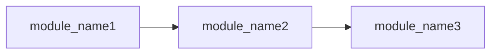

# {任务名称} - C++详细实施计划

## 一、任务概述

### 1.1 任务目标

{描述任务的主要目标和期望达成的成果}

### 1.2 任务范围

**涉及模块**:

**涉及模块**:

- {模块1} ({模块1描述})
- {模块2} ({模块2描述})
- {模块3} ({模块3描述})
- ...

**模块架构分层**:

1. **App Layer**: 最终可执行程序
2. **Services Layer**: 应用服务
3. **Domain Layer**: 核心业务
4. **Platform Layer**: 抽象层
5. **Foundation Layer**: 基础层

**模块类型**:
- **Public**: `.ixx` (Export)
- **Internal**: `.cpp` (Implementation)
- **Test Support**: `.ixx` (Test-only export)

**架构约束**:
- **2层模型**: 逻辑模块 (Language) vs 物理库 (Build). 1 Library ≈ 3-15 Modules.
- **依赖单向**: 严禁反向依赖 (e.g. Domain -> App).


**涉及文件**:

- {文件1} (.ixx / .cpp)
- {文件2} (.ixx / .cpp)
- {文件3} (.ixx / .cpp)
- ...

**C++标准版本**: {C++20}

**模块架构模式**: {2层模型 / 单模块单库}

**构建目标**: {domain_order / foundation_core / ...}

### 1.3 任务优先级

**优先级**: {高/中/低}
**预计工作量**: {预计时间}
**风险等级**: {低/中/高}（{风险描述}）

## 二、技术环境与依赖

### 2.1 开发环境

| 环境项 | 要求 | 当前状态 |
|--------|------|----------|
| 编译器 | {GCC/Clang/MSVC} {版本} | {状态} |
| CMake | {版本} | {状态} |
| C++标准 | {C++20} | {状态} |
| 构建类型 | {Debug/Release/RelWithDebInfo} | {状态} |
| 静态分析工具 | {clang-tidy/cppcheck} | {状态} |
| 生成器 | {Ninja/Visual Studio} | {状态} |

### 2.2 模块依赖关系

**模块依赖图**:



**依赖说明**:

- {模块1} 依赖 {模块2}: {依赖原因}
- {模块2} 依赖 {模块3}: {依赖原因}

**依赖规则检查**:

- [ ] 模块依赖单向，无循环依赖
- [ ] 遵循分层架构原则（只向下依赖）
- [ ] 测试模块不进入生产代码
- [ ] 生产模块不依赖 test_support

### 2.3 第三方依赖

| 库名称 | 版本 | 用途 | 许可证 |
|--------|------|------|--------|
| {依赖1} | {版本} | {用途} | {许可证} |
| {依赖2} | {版本} | {用途} | {许可证} |

### 2.4 构建配置

**编译选项**:
```cmake
CMAKE_CXX_STANDARD=20
CMAKE_CXX_STANDARD_REQUIRED=ON
CMAKE_CXX_EXTENSIONS=OFF
CMAKE_BUILD_TYPE={Debug/Release}
```

**编译器标志**:
```cmake
# Debug模式
CMAKE_CXX_FLAGS_DEBUG="-g -O0 -Wall -Wextra -Wpedantic"

# Release模式
CMAKE_CXX_FLAGS_RELEASE="-O3 -DNDEBUG"
```

**CMake 模块配置**:
```cmake
# 多模块单库配置
add_cxx_module_library({target_name})

target_sources({target_name}
    PUBLIC
        FILE_SET cxx_modules TYPE CXX_MODULES
        BASE_DIRS ${CMAKE_CURRENT_SOURCE_DIR}
        FILES
            {module}.ixx
            {module}_part.ixx
    PRIVATE
        {module}_impl.cpp
)

target_link_libraries({target_name} PUBLIC {dependency})
```

**MSVC 特定配置**:
```cmake
if (MSVC)
    target_compile_options({target_name} PRIVATE
        /permissive-
        /wd5050
    )
    if (CMAKE_BUILD_TYPE STREQUAL "Release")
        target_compile_options({target_name} PRIVATE /GL)
        target_link_options({target_name} PRIVATE /LTCG)
    endif()
endif()
```

## 三、任务分解

### 3.1 模块实现规范

#### 3.1.1 Public Module（公共模块）

**定义**: 对外提供稳定 API 的模块，位于 `src/**`。

**实现规范** (`.ixx`):

```cpp
/**
 * @module {module_name}
 */
export module {module_name};

// 导出依赖
export import :api; // 优先使用分区

// 实现细节不应包含在此，仅允许模板或 inline 函数
export void public_api();
```

**Global Module Fragment (第三方库)**:

```cpp
module;
#include <vector> // 外部非模块头文件
export module {module_name};
// ...
```

#### 3.1.2 Module Partition (模块分区)

**定义**: 大型模块的子部件。

```cpp
// 接口分区
export module {module_name}:api;

export namespace {namespace} {
    struct Data {};
}
```

#### 3.1.3 Internal Implementation Unit (内部实现单元)

**定义**: 包含具体实现的 `.cpp` 文件。

**实现规范** (`.cpp`):

```cpp
module {module_name};     // 主模块实现
// 或者
module {module_name}:impl; // 实现分区

import <iostream>; // 引用标准库

void public_api() {
    std::cout << "Impl" << std::endl; // 修改此处不触发下游重编
}
```

#### 3.1.4 Test Support Module（测试支持模块）

**定义**: 测试专用导出模块。

**实现规范**:

```cpp
export module {module_name}.test_support;

export import {module_name}; // 导出主模块

namespace {namespace}::test {
    export void reset_internal_state();
}
```

### 3.2 测试隔离策略

#### 3.2.1 单元测试结构

**目录结构**:

```text
tests/unit/{domain}/{module}/
├── test_{module}.cpp
└── CMakeLists.txt
```

**通过友元访问内部状态**:

```cpp
// 在 Test Support Module 中
namespace {namespace}::test {
    // 只有测试模块能访问
    void access_internal() {
        // ...
    }
}
```

**测试代码示例**:

```cpp
import {module_name};
import {module_name}.test_support;

#include <gtest/gtest.h>

TEST(ClassName, TestMethodName) {
    // Arrange
    auto obj = {namespace}::test::create_test_obj(); // 使用 Test Support 工厂

    // Act
    auto result = obj.method();

    // Assert
    EXPECT_EQ(result, expected_value);
}
```

**CMake 配置**:

```cmake
find_package(GTest REQUIRED)

add_executable({module}_tests test_{module}.cpp)

target_link_libraries({module}_tests
    PRIVATE
        {module_name}
        test_{module}_api
        GTest::gtest
        GTest::gtest_main
)

add_test(NAME {module}_tests COMMAND {module}_tests)
```

**测试覆盖要求**:
- [ ] 正常路径测试
- [ ] 边界条件测试
- [ ] 异常情况测试
- [ ] 性能基准测试（如适用）
- [ ] 线程安全测试（如适用）

#### 3.2.2 集成测试结构

**目录结构**:

```text
tests/integration/{feature}/
├── test_{feature}.cpp
└── CMakeLists.txt
```

**测试代码示例**:

```cpp
import {module1};
import {module2};
import {module3};

#include <gtest/gtest.h>

TEST(FeatureIntegration, TestWorkflow) {
    // 测试多个模块协同工作的场景
}
```

#### 3.2.3 测试隔离原则

**规则**:
1. 测试代码使用 `.cpp` 文件，不污染模块接口
2. 测试模块（test_support）只被测试 import
3. 生产代码不依赖测试模块
4. 每个模块有独立的测试可执行文件
5. 测试辅助函数放在 Test Support Module 中

### 3.3 编译优化策略

#### 3.3.1 BMI (.ifc) 优化

**减少接口文件大小**:

```cpp
// 好的设计：接口文件只包含声明
export module domain.order;

import foundation.core;

export struct Order {
    int id;
    int amount;
};

export void validate_order(Order& order);

// 实现放在 .cpp 文件
```

```cpp
// 不好的设计：接口文件包含实现
export module domain.order;

import foundation.core;
#include <stdexcept>  // 不应该在接口文件中

export struct Order {
    int id;
    int amount;
};

export void validate_order(Order& order) {
    if (order.id <= 0) {
        throw std::invalid_argument("Invalid order ID");  // 实现不应该在接口中
    }
}
```

**控制依赖深度**:

```cpp
// 好的设计：通过 facade 模块隔离依赖
export module foundation.services;

import foundation.core;
import foundation.logging;
import foundation.config;

export class ServiceFacade {
public:
    static void log(const std::string& msg);
    static Config get_config();
};

export module domain.order;

import foundation.core;
import foundation.services;  // 只依赖 facade

export struct Order { ... };
```

#### 3.3.2 MSVC 编译优化

**编译器选项**:

```cmake
if (MSVC)
    # 启用 C++20 模块支持
    add_compile_options(/std:c++20 /permissive-)

    # 性能优化选项
    add_compile_options(/bigobj)  # 支持大对象文件
    add_compile_options(/Zc:__cplusplus)  # 正确的 __cplusplus 宏

    # BMI 优化选项
    add_compile_options(/ifcOutputDir ${CMAKE_BINARY_DIR}/ifc)
endif()
```

**Release 模式优化**:

```cmake
if (MSVC AND CMAKE_BUILD_TYPE STREQUAL "Release")
    add_compile_options(/O2 /GL)  # 最大优化
    add_link_options(/LTCG)  # 链接时代码生成
endif()
```

**Debug 模式配置**:

```cmake
if (MSVC AND CMAKE_BUILD_TYPE STREQUAL "Debug")
    add_compile_options(/Od /Zi)  # 禁用优化，生成调试信息
    add_compile_options(/RTC1)  # 运行时错误检查
endif()
```

#### 3.3.3 并行构建优化

**使用 Ninja 生成器**:

```powershell
cmake -S . -B build -G Ninja -DCMAKE_BUILD_TYPE=Debug
```

**控制并行度**:

```powershell
# 使用所有 CPU 核心
cmake --build build -j

# 使用指定数量的核心
cmake --build build -j 4
```

### 3.4 主任务1：{主任务名称}

#### 3.4.1 子任务1.1：{子任务名称}

**目标**: {描述子任务目标}

**技术要求**:
- C++标准: {C++20}
- 异常安全级别: {基本保证/强保证/不抛出保证}
- 线程安全要求: {是/否}

**操作步骤**:

1. **前置检查**

   - [ ] 检查C++编译器版本是否满足要求
   - [ ] 验证依赖库是否正确安装
   - [ ] 确认代码风格配置（.clang-format）
   - [ ] 检查静态分析工具配置（.clang-tidy）

2. **代码实现**

   ```cpp
   /**
    * @brief {函数/类简要描述}
    * @tparam T {模板参数说明}
    * @param {参数名} {参数说明}
    * @return {返回值说明}
    * @throws {异常类型} {异常说明}
    * @note {重要说明}
    * @warning {警告说明}
    */
   template<typename T>
   ReturnType function_name(Parameter param) {
       // 实现代码
   }
   ```

   **实现要点**:
   - 使用RAII管理资源
   - 优先使用智能指针（unique_ptr/shared_ptr）
   - 遵循Rule of Zero/Five/Three
   - 使用constexpr和const正确性
   - 应用移动语义减少拷贝

3. **代码审查检查项**

   - [ ] 内存管理：使用智能指针，无裸指针
   - [ ] 异常安全：提供适当的异常保证
   - [ ] 资源管理：所有资源通过RAII管理
   - [ ] 线程安全：并发场景使用适当的同步机制
   - [ ] 性能：避免不必要的拷贝，使用移动语义
   - [ ] 现代特性：合理使用C++20特性（concepts, ranges等）
   - [ ] 代码风格：符合项目编码规范
   - [ ] 文档注释：完整的Doxygen注释

4. **单元测试**

   ```cpp
   #include <gtest/gtest.h>

   TEST(ClassName, TestMethodName) {
       // Arrange
       ClassName obj;

       // Act
       auto result = obj.method();

       // Assert
       EXPECT_EQ(result, expected_value);
   }
   ```

   **测试覆盖要求**:
   - [ ] 正常路径测试
   - [ ] 边界条件测试
   - [ ] 异常情况测试
   - [ ] 性能基准测试（如适用）

5. **验证检查**

   - [ ] 编译通过（无警告）
   - [ ] 静态分析通过（clang-tidy）
   - [ ] 单元测试全部通过
   - [ ] 内存泄漏检测通过（Valgrind/ASan）
   - [ ] 线程安全检测通过（TSan，如适用）
   - [ ] 性能指标符合要求（如适用）

**交付物标准**:

- [ ] 源代码文件（.cpp/.ixx）
- [ ] 头文件（.h/.hpp）
- [ ] 单元测试文件（*_test.cpp）
- [ ] Doxygen文档
- [ ] 代码审查报告
- [ ] 性能测试报告（如适用）

**质量要求**:

- 代码覆盖率: {>80%}
- 圈复杂度: {<10}
- 静态分析: {0 errors, 0 warnings}
- 内存泄漏: {0 leaks}
- 性能: {符合性能指标}

**预计时间**: {预计时间}

**实际执行情况**:

- **开始时间**: {开始日期}
- **结束时间**: {结束日期}
- **实际耗时**: {实际时间}

**成果详情**:

- {成果描述1}
- {成果描述2}
- {成果描述3}

**依赖关系**: {依赖关系描述}

---

#### 3.4.2 子任务1.2：{子任务名称}

**目标**: {描述子任务目标}

**技术要求**:
- C++标准: {C++20}
- 异常安全级别: {基本保证/强保证/不抛出保证}
- 线程安全要求: {是/否}

**操作步骤**:

1. **前置检查**

   - [ ] 检查C++编译器版本是否满足要求
   - [ ] 验证依赖库是否正确安装
   - [ ] 确认代码风格配置（.clang-format）
   - [ ] 检查静态分析工具配置（.clang-tidy）

2. **代码实现**

   ```cpp
   /**
    * @brief {函数/类简要描述}
    * @tparam T {模板参数说明}
    * @param {参数名} {参数说明}
    * @return {返回值说明}
    * @throws {异常类型} {异常说明}
    * @note {重要说明}
    * @warning {警告说明}
    */
   template<typename T>
   ReturnType function_name(Parameter param) {
       // 实现代码
   }
   ```

   **实现要点**:
   - 使用RAII管理资源
   - 优先使用智能指针（unique_ptr/shared_ptr）
   - 遵循Rule of Zero/Five/Three
   - 使用constexpr和const正确性
   - 应用移动语义减少拷贝

3. **代码审查检查项**

   - [ ] 内存管理：使用智能指针，无裸指针
   - [ ] 异常安全：提供适当的异常保证
   - [ ] 资源管理：所有资源通过RAII管理
   - [ ] 线程安全：并发场景使用适当的同步机制
   - [ ] 性能：避免不必要的拷贝，使用移动语义
   - [ ] 现代特性：合理使用C++20特性（concepts, ranges等）
   - [ ] 代码风格：符合项目编码规范
   - [ ] 文档注释：完整的Doxygen注释

4. **单元测试**

   ```cpp
   #include <gtest/gtest.h>

   TEST(ClassName, TestMethodName) {
       // Arrange
       ClassName obj;

       // Act
       auto result = obj.method();

       // Assert
       EXPECT_EQ(result, expected_value);
   }
   ```

   **测试覆盖要求**:
   - [ ] 正常路径测试
   - [ ] 边界条件测试
   - [ ] 异常情况测试
   - [ ] 性能基准测试（如适用）

5. **验证检查**

   - [ ] 编译通过（无警告）
   - [ ] 静态分析通过（clang-tidy）
   - [ ] 单元测试全部通过
   - [ ] 内存泄漏检测通过（Valgrind/ASan）
   - [ ] 线程安全检测通过（TSan，如适用）
   - [ ] 性能指标符合要求（如适用）

**交付物标准**:

- [ ] 源代码文件（.cpp/.ixx）
- [ ] 头文件（.h/.hpp）
- [ ] 单元测试文件（*_test.cpp）
- [ ] Doxygen文档
- [ ] 代码审查报告
- [ ] 性能测试报告（如适用）

**质量要求**:

- 代码覆盖率: {>80%}
- 圈复杂度: {<10}
- 静态分析: {0 errors, 0 warnings}
- 内存泄漏: {0 leaks}
- 性能: {符合性能指标}

**预计时间**: {预计时间}

**实际执行情况**:

- **开始时间**: {开始日期}
- **结束时间**: {结束日期}
- **实际耗时**: {实际时间}

**成果详情**:

- {成果描述1}
- {成果描述2}
- {成果描述3}

**依赖关系**: {依赖关系描述}

---

### 3.5 主任务2：{主任务名称}

#### 3.5.1 子任务2.1：{子任务名称}

**目标**: {描述子任务目标}

**技术要求**:
- C++标准: {C++20}
- 异常安全级别: {基本保证/强保证/不抛出保证}
- 线程安全要求: {是/否}

**操作步骤**:

1. **前置检查**

   - [ ] 检查C++编译器版本是否满足要求
   - [ ] 验证依赖库是否正确安装
   - [ ] 确认代码风格配置（.clang-format）
   - [ ] 检查静态分析工具配置（.clang-tidy）

2. **代码实现**

   ```cpp
   /**
    * @brief {函数/类简要描述}
    * @tparam T {模板参数说明}
    * @param {参数名} {参数说明}
    * @return {返回值说明}
    * @throws {异常类型} {异常说明}
    * @note {重要说明}
    * @warning {警告说明}
    */
   template<typename T>
   ReturnType function_name(Parameter param) {
       // 实现代码
   }
   ```

   **实现要点**:
   - 使用RAII管理资源
   - 优先使用智能指针（unique_ptr/shared_ptr）
   - 遵循Rule of Zero/Five/Three
   - 使用constexpr和const正确性
   - 应用移动语义减少拷贝

3. **代码审查检查项**

   - [ ] 内存管理：使用智能指针，无裸指针
   - [ ] 异常安全：提供适当的异常保证
   - [ ] 资源管理：所有资源通过RAII管理
   - [ ] 线程安全：并发场景使用适当的同步机制
   - [ ] 性能：避免不必要的拷贝，使用移动语义
   - [ ] 现代特性：合理使用C++20特性（concepts, ranges等）
   - [ ] 代码风格：符合项目编码规范
   - [ ] 文档注释：完整的Doxygen注释

4. **单元测试**

   ```cpp
   #include <gtest/gtest.h>

   TEST(ClassName, TestMethodName) {
       // Arrange
       ClassName obj;

       // Act
       auto result = obj.method();

       // Assert
       EXPECT_EQ(result, expected_value);
   }
   ```

   **测试覆盖要求**:
   - [ ] 正常路径测试
   - [ ] 边界条件测试
   - [ ] 异常情况测试
   - [ ] 性能基准测试（如适用）

5. **验证检查**

   - [ ] 编译通过（无警告）
   - [ ] 静态分析通过（clang-tidy）
   - [ ] 单元测试全部通过
   - [ ] 内存泄漏检测通过（Valgrind/ASan）
   - [ ] 线程安全检测通过（TSan，如适用）
   - [ ] 性能指标符合要求（如适用）

**交付物标准**:

- [ ] 源代码文件（.cpp/.ixx）
- [ ] 头文件（.h/.hpp）
- [ ] 单元测试文件（*_test.cpp）
- [ ] Doxygen文档
- [ ] 代码审查报告
- [ ] 性能测试报告（如适用）

**质量要求**:

- 代码覆盖率: {>80%}
- 圈复杂度: {<10}
- 静态分析: {0 errors, 0 warnings}
- 内存泄漏: {0 leaks}
- 性能: {符合性能指标}

**预计时间**: {预计时间}

**实际执行情况**:

- **开始时间**: {开始日期}
- **结束时间**: {结束日期}
- **实际耗时**: {实际时间}

**成果详情**:

- {成果描述1}
- {成果描述2}
- {成果描述3}

**依赖关系**: {依赖关系描述}

---

#### 3.5.2 子任务2.2：{子任务名称}

**目标**: {描述子任务目标}

**技术要求**:
- C++标准: {C++20}
- 异常安全级别: {基本保证/强保证/不抛出保证}
- 线程安全要求: {是/否}

**操作步骤**:

1. **前置检查**

   - [ ] 检查C++编译器版本是否满足要求
   - [ ] 验证依赖库是否正确安装
   - [ ] 确认代码风格配置（.clang-format）
   - [ ] 检查静态分析工具配置（.clang-tidy）

2. **代码实现**

   ```cpp
   /**
    * @brief {函数/类简要描述}
    * @tparam T {模板参数说明}
    * @param {参数名} {参数说明}
    * @return {返回值说明}
    * @throws {异常类型} {异常说明}
    * @note {重要说明}
    * @warning {警告说明}
    */
   template<typename T>
   ReturnType function_name(Parameter param) {
       // 实现代码
   }
   ```

   **实现要点**:
   - 使用RAII管理资源
   - 优先使用智能指针（unique_ptr/shared_ptr）
   - 遵循Rule of Zero/Five/Three
   - 使用constexpr和const正确性
   - 应用移动语义减少拷贝

3. **代码审查检查项**

   - [ ] 内存管理：使用智能指针，无裸指针
   - [ ] 异常安全：提供适当的异常保证
   - [ ] 资源管理：所有资源通过RAII管理
   - [ ] 线程安全：并发场景使用适当的同步机制
   - [ ] 性能：避免不必要的拷贝，使用移动语义
   - [ ] 现代特性：合理使用C++20特性（concepts, ranges等）
   - [ ] 代码风格：符合项目编码规范
   - [ ] 文档注释：完整的Doxygen注释

4. **单元测试**

   ```cpp
   #include <gtest/gtest.h>

   TEST(ClassName, TestMethodName) {
       // Arrange
       ClassName obj;

       // Act
       auto result = obj.method();

       // Assert
       EXPECT_EQ(result, expected_value);
   }
   ```

   **测试覆盖要求**:
   - [ ] 正常路径测试
   - [ ] 边界条件测试
   - [ ] 异常情况测试
   - [ ] 性能基准测试（如适用）

5. **验证检查**

   - [ ] 编译通过（无警告）
   - [ ] 静态分析通过（clang-tidy）
   - [ ] 单元测试全部通过
   - [ ] 内存泄漏检测通过（Valgrind/ASan）
   - [ ] 线程安全检测通过（TSan，如适用）
   - [ ] 性能指标符合要求（如适用）

**交付物标准**:

- [ ] 源代码文件（.cpp/.ixx）
- [ ] 头文件（.h/.hpp）
- [ ] 单元测试文件（*_test.cpp）
- [ ] Doxygen文档
- [ ] 代码审查报告
- [ ] 性能测试报告（如适用）

**质量要求**:

- 代码覆盖率: {>80%}
- 圈复杂度: {<10}
- 静态分析: {0 errors, 0 warnings}
- 内存泄漏: {0 leaks}
- 性能: {符合性能指标}

**预计时间**: {预计时间}

**实际执行情况**:

- **开始时间**: {开始日期}
- **结束时间**: {结束日期}
- **实际耗时**: {实际时间}

**成果详情**:

- {成果描述1}
- {成果描述2}
- {成果描述3}

**依赖关系**: {依赖关系描述}

---

### 3.6 主任务3：{主任务名称}

#### 3.6.1 子任务3.1：{子任务名称}

**目标**: {描述子任务目标}

**技术要求**:
- C++标准: {C++20}
- 异常安全级别: {基本保证/强保证/不抛出保证}
- 线程安全要求: {是/否}

**操作步骤**:

1. **前置检查**

   - [ ] 检查C++编译器版本是否满足要求
   - [ ] 验证依赖库是否正确安装
   - [ ] 确认代码风格配置（.clang-format）
   - [ ] 检查静态分析工具配置（.clang-tidy）

2. **代码实现**

   ```cpp
   /**
    * @brief {函数/类简要描述}
    * @tparam T {模板参数说明}
    * @param {参数名} {参数说明}
    * @return {返回值说明}
    * @throws {异常类型} {异常说明}
    * @note {重要说明}
    * @warning {警告说明}
    */
   template<typename T>
   ReturnType function_name(Parameter param) {
       // 实现代码
   }
   ```

   **实现要点**:
   - 使用RAII管理资源
   - 优先使用智能指针（unique_ptr/shared_ptr）
   - 遵循Rule of Zero/Five/Three
   - 使用constexpr和const正确性
   - 应用移动语义减少拷贝

3. **代码审查检查项**

   - [ ] 内存管理：使用智能指针，无裸指针
   - [ ] 异常安全：提供适当的异常保证
   - [ ] 资源管理：所有资源通过RAII管理
   - [ ] 线程安全：并发场景使用适当的同步机制
   - [ ] 性能：避免不必要的拷贝，使用移动语义
   - [ ] 现代特性：合理使用C++20特性（concepts, ranges等）
   - [ ] 代码风格：符合项目编码规范
   - [ ] 文档注释：完整的Doxygen注释

4. **单元测试**

   ```cpp
   #include <gtest/gtest.h>

   TEST(ClassName, TestMethodName) {
       // Arrange
       ClassName obj;

       // Act
       auto result = obj.method();

       // Assert
       EXPECT_EQ(result, expected_value);
   }
   ```

   **测试覆盖要求**:
   - [ ] 正常路径测试
   - [ ] 边界条件测试
   - [ ] 异常情况测试
   - [ ] 性能基准测试（如适用）

5. **验证检查**

   - [ ] 编译通过（无警告）
   - [ ] 静态分析通过（clang-tidy）
   - [ ] 单元测试全部通过
   - [ ] 内存泄漏检测通过（Valgrind/ASan）
   - [ ] 线程安全检测通过（TSan，如适用）
   - [ ] 性能指标符合要求（如适用）

**交付物标准**:

- [ ] 源代码文件（.cpp/.ixx）
- [ ] 头文件（.h/.hpp）
- [ ] 单元测试文件（*_test.cpp）
- [ ] Doxygen文档
- [ ] 代码审查报告
- [ ] 性能测试报告（如适用）

**质量要求**:

- 代码覆盖率: {>80%}
- 圈复杂度: {<10}
- 静态分析: {0 errors, 0 warnings}
- 内存泄漏: {0 leaks}
- 性能: {符合性能指标}

**预计时间**: {预计时间}

**实际执行情况**:

- **开始时间**: {开始日期}
- **结束时间**: {结束日期}
- **实际耗时**: {实际时间}

**成果详情**:

- {成果描述1}
- {成果描述2}
- {成果描述3}

**依赖关系**: {依赖关系描述}

---

#### 3.6.2 子任务3.2：{子任务名称}

**目标**: {描述子任务目标}

**技术要求**:
- C++标准: {C++20}
- 异常安全级别: {基本保证/强保证/不抛出保证}
- 线程安全要求: {是/否}

**操作步骤**:

1. **前置检查**

   - [ ] 检查C++编译器版本是否满足要求
   - [ ] 验证依赖库是否正确安装
   - [ ] 确认代码风格配置（.clang-format）
   - [ ] 检查静态分析工具配置（.clang-tidy）

2. **代码实现**

   ```cpp
   /**
    * @brief {函数/类简要描述}
    * @tparam T {模板参数说明}
    * @param {参数名} {参数说明}
    * @return {返回值说明}
    * @throws {异常类型} {异常说明}
    * @note {重要说明}
    * @warning {警告说明}
    */
   template<typename T>
   ReturnType function_name(Parameter param) {
       // 实现代码
   }
   ```

   **实现要点**:
   - 使用RAII管理资源
   - 优先使用智能指针（unique_ptr/shared_ptr）
   - 遵循Rule of Zero/Five/Three
   - 使用constexpr和const正确性
   - 应用移动语义减少拷贝

3. **代码审查检查项**

   - [ ] 内存管理：使用智能指针，无裸指针
   - [ ] 异常安全：提供适当的异常保证
   - [ ] 资源管理：所有资源通过RAII管理
   - [ ] 线程安全：并发场景使用适当的同步机制
   - [ ] 性能：避免不必要的拷贝，使用移动语义
   - [ ] 现代特性：合理使用C++20特性（concepts, ranges等）
   - [ ] 代码风格：符合项目编码规范
   - [ ] 文档注释：完整的Doxygen注释

4. **单元测试**

   ```cpp
   #include <gtest/gtest.h>

   TEST(ClassName, TestMethodName) {
       // Arrange
       ClassName obj;

       // Act
       auto result = obj.method();

       // Assert
       EXPECT_EQ(result, expected_value);
   }
   ```

   **测试覆盖要求**:
   - [ ] 正常路径测试
   - [ ] 边界条件测试
   - [ ] 异常情况测试
   - [ ] 性能基准测试（如适用）

5. **验证检查**

   - [ ] 编译通过（无警告）
   - [ ] 静态分析通过（clang-tidy）
   - [ ] 单元测试全部通过
   - [ ] 内存泄漏检测通过（Valgrind/ASan）
   - [ ] 线程安全检测通过（TSan，如适用）
   - [ ] 性能指标符合要求（如适用）

**交付物标准**:

- [ ] 源代码文件（.cpp/.ixx）
- [ ] 头文件（.h/.hpp）
- [ ] 单元测试文件（*_test.cpp）
- [ ] Doxygen文档
- [ ] 代码审查报告
- [ ] 性能测试报告（如适用）

**质量要求**:

- 代码覆盖率: {>80%}
- 圈复杂度: {<10}
- 静态分析: {0 errors, 0 warnings}
- 内存泄漏: {0 leaks}
- 性能: {符合性能指标}

**预计时间**: {预计时间}

**实际执行情况**:

- **开始时间**: {开始日期}
- **结束时间**: {结束日期}
- **实际耗时**: {实际时间}

**成果详情**:

- {成果描述1}
- {成果描述2}
- {成果描述3}

**依赖关系**: {依赖关系描述}

---

## 四、任务依赖关系图 (Mermaid)

```mermaid
graph TD
    T1[主任务1: {主任务名称}] --> T1_1[子任务1.1: {子任务名称}]
    T1 --> T1_2[子任务1.2: {子任务名称}]
    T1_1 --> T2[主任务2: {主任务名称}]
    T1_2 --> T2
    T2 --> T2_1[子任务2.1: {子任务名称}]
    T2 --> T2_2[子任务2.2: {子任务名称}]
    T2_1 --> T3[主任务3: {主任务名称}]
    T2_2 --> T3
    T3 --> T3_1[子任务3.1: {子任务名称}]
    T3 --> T3_2[子任务3.2: {子任务名称}]
```

**模块依赖关系**:

```mermaid
graph LR
    module1[{module1}] --> module2[{module2}]
    module2 --> module3[{module3}]
    test_module1[test.{module1}] -.-> module1
    test_module2[test.{module2}] -.-> module2
```

**依赖说明**:

- {模块1} 依赖 {模块2}: {依赖原因}
- {模块2} 依赖 {模块3}: {依赖原因}
- 测试模块依赖生产模块: {测试依赖说明}

**依赖规则检查**:

- [ ] 模块依赖单向，无循环依赖
- [ ] 遵循分层架构原则（只向下依赖）
- [ ] 测试模块不进入生产代码
- [ ] 生产模块不依赖 test_support

## 五、时间规划

| 主任务   | 子任务    | 预计时间 | 实际时间 | 状态    |
| ----- | ------ | ---- | ---- | ----- |
| 主任务1  | 子任务1.1 | {时间} | {时间} | {状态}  |
| 主任务1  | 子任务1.2 | {时间} | {时间} | {状态}  |
| 主任务2  | 子任务2.1 | {时间} | {时间} | {状态}  |
| 主任务2  | 子任务2.2 | {时间} | {时间} | {状态}  |
| 主任务3  | 子任务3.1 | {时间} | {时间} | {状态}  |
| 主任务3  | 子任务3.2 | {时间} | {时间} | {状态}  |
| **总计** | -      | {总时间} | {总时间} | {状态}  |

## 六、C++代码质量检查清单

### 6.1 模块设计与实现

- [ ] **模块类型正确**: Public Module / Internal Module / Test Support Module 分类正确
- [ ] **模块命名规范**: 文件名使用 snake_case，与模块名称一致
- [ ] **命名空间一致**: 命名空间与模块名称一致
- [ ] **接口隔离**: Public Module 只导出公共 API，不导出实现细节
- [ ] **实现分离**: 复杂实现逻辑移到 `.cpp` 文件
- [ ] **依赖控制**: 避免在接口中 `export import` 大型头文件
- [ ] **模块聚合**: 使用 Export Module 作为对外统一入口
- [ ] **依赖单向**: 模块依赖单向，无循环依赖
- [ ] **分层架构**: 遵循分层架构原则（只向下依赖）
- [ ] **测试隔离**: 测试模块不进入生产代码，生产模块不依赖 test_support

### 6.2 BMI (.ifc) 优化

- [ ] **接口文件大小**: 接口文件只包含声明，不包含实现
- [ ] **依赖深度**: 控制模块依赖深度，避免级联增长
- [ ] **Facade 模式**: 使用 facade 模块隔离底层依赖
- [ ] **避免重导出**: 避免在接口中 `export import` 大型头文件
- [ ] **增量构建**: 修改单个模块只需重新生成对应的 `.ifc`

### 6.3 测试隔离与覆盖

- [ ] **测试文件格式**: 测试代码使用 `.cpp` 文件，不污染模块接口
- [ ] **测试模块隔离**: Test Support Module 只被测试 import
- [ ] **测试独立性**: 每个模块有独立的测试可执行文件
- [ ] **测试覆盖**: 正常路径、边界条件、异常情况测试完整
- [ ] **测试辅助**: 测试辅助函数放在 Test Support Module 中
- [ ] **集成测试**: 多模块协同工作的集成测试完整

### 6.4 内存管理与资源安全

- [ ] **智能指针使用**: 优先使用unique_ptr/shared_ptr，避免裸指针
- [ ] **RAII原则**: 所有资源通过RAII管理，确保异常安全
- [ ] **内存泄漏检测**: 通过Valgrind/ASan检测无内存泄漏
- [ ] **移动语义优化**: 合理使用移动语义减少拷贝开销
- [ ] **资源所有权**: 明确资源所有权，避免悬垂指针

### 6.5 异常安全

- [ ] **基本保证**: 操作失败时保持对象有效状态，无资源泄漏
- [ ] **强保证**: 操作失败时回滚到操作前状态
- [ ] **不抛出保证**: 使用noexcept标记不抛出异常的函数
- [ ] **异常规范**: 使用异常类型层次结构，避免捕获通用异常
- [ ] **资源清理**: 使用RAII确保异常时资源正确释放

### 6.6 线程安全

- [ ] **线程安全设计**: 明确接口的线程安全保证
- [ ] **同步机制**: 使用适当的同步原语（mutex, atomic等）
- [ ] **锁优化**: 最小化临界区，避免死锁
- [ ] **数据竞争**: 通过ThreadSanitizer检测无数据竞争
- [ ] **无锁算法**: 考虑使用无锁数据结构提高性能

### 6.4 模板与泛型编程

- [ ] **Concepts约束**: 使用C++20 concepts约束模板参数
- [ ] **SFINAE应用**: 合理使用SFINAE实现类型特性
- [ ] **constexpr**: 尽可能使用constexpr实现编译时计算
- [ ] **类型推导**: 合理使用auto和decltype
- [ ] **模板元编程**: 避免过度复杂的模板元编程

### 6.5 现代C++特性应用

- [ ] **结构化绑定**: 使用结构化绑定简化代码
- [ ] **if初始化**: 使用if初始化语句提高可读性
- [ ] **std::optional**: 使用optional表示可能不存在的值
- [ ] **std::variant**: 使用variant实现类型安全的联合体
- [ ] **std::string_view**: 使用string_view避免字符串拷贝
- [ ] **Ranges**: 使用Ranges库简化范围操作

### 6.7 性能与优化

- [ ] **算法复杂度**: 选择合适的算法和数据结构
- [ ] **编译器优化**: 理解编译器优化级别和影响
- [ ] **缓存友好**: 优化数据布局提高缓存命中率
- [ ] **内联决策**: 合理使用inline关键字
- [ ] **零开销抽象**: 确保抽象不带来运行时开销

### 6.7 代码规范与可维护性

- [ ] **命名规范**: 使用有意义的命名，遵循项目规范
- [ ] **代码格式**: 使用clang-format统一代码格式
- [ ] **注释文档**: 完整的Doxygen注释
- [ ] **函数长度**: 单个函数不超过50行
- [ ] **类职责**: 单一职责原则，避免上帝类
- [ ] **模块化**: 合理划分模块，减少耦合

## 七、风险评估与应对

### 7.1 风险识别

| 风险         | 概率  | 影响  | 应对措施             |
| ---------- | --- | --- | ---------------- |
| {风险1}     | {高/中/低} | {高/中/低} | {应对措施}          |
| {风险2}     | {高/中/低} | {高/中/低} | {应对措施}          |
| {风险3}     | {高/中/低} | {高/中/低} | {应对措施}          |

### 7.2 回滚计划

1. **版本控制**: 使用Git进行版本管理，每个子任务完成后提交
2. **快速回滚**: 保留稳定的构建版本，可快速回退到上一个稳定版本
3. **分支策略**: 使用feature分支开发，通过PR合并到主分支

## 八、成功标准

### 8.1 功能标准

- {功能标准1}
- {功能标准2}
- {功能标准3}

### 8.2 性能标准

- {性能标准1}
- {性能标准2}
- {性能标准3}

### 8.3 质量标准

- 代码覆盖率: {>80%}
- 静态分析: {0 errors, 0 warnings}
- 内存泄漏: {0 leaks}
- 线程安全: {无数据竞争}

## 九、质量保证

### 9.1 代码审查

**审查流程**:
1. 提交Pull Request
2. 至少2名开发者审查
3. 通过CI/CD检查
4. 解决所有审查意见
5. 合并到主分支

**审查检查项**:
- 代码符合编码规范
- 逻辑正确性
- 异常安全性
- 线程安全性
- 性能考虑
- 文档完整性

### 9.2 单元测试

**测试框架**: {Google Test/Catch2}

**测试覆盖**:
- 行覆盖率: {>80%}
- 分支覆盖率: {>70%}
- 函数覆盖率: {100%}

**测试类型**:
- 单元测试
- 集成测试
- 性能测试
- 压力测试

### 9.3 静态分析

**工具**:
- clang-tidy: 代码风格和常见错误
- cppcheck: 深度静态分析
- Valgrind: 内存泄漏检测
- AddressSanitizer: 内存错误检测
- ThreadSanitizer: 线程安全检测

**分析流程**:
1. 每次提交自动运行静态分析
2. 生成分析报告
3. 修复所有错误和警告
4. 代码审查时检查分析结果

## 十、用户意见与确认

### 10.1 待确认事项
1. {确认事项1}? **{确认状态}**
2. {确认事项2}? **{确认状态}**

### 10.2 用户反馈记录
- **反馈点**: {反馈内容描述}
- **处理建议**: {处理措施}
- **当前状态**: {已处理/待处理}

---

## 十一、执行总结

### 11.1 任务完成度概览
- **总体状态**: {待开始/进行中/已完成}
- **完成日期**: {完成日期}
- **工作量评估**: 预计 {预计时间}，实际 {实际时间} (偏差: {偏差百分比}%)

### 11.2 关键成果与验证结果
- **[主任务1]**: {完成内容简述} | **验证**: {通过/未通过}
- **[主任务2]**: {完成内容简述} | **验证**: {通过/未通过}

### 11.3 核心问题与解决方案
| 问题           | 原因分析         | 解决方案         | 状态       |
| ------------ | ------------ | ------------ | -------- |
| {问题1}        | {原因描述}       | {方案描述}       | {已解决}    |

### 11.4 改进建议与后续计划
1. **经验法则**: {总结一条可复用的经验}
2. **优化建议**: {针对未来类似任务的改进点}
3. **后续计划**: {下一步的具体动作}

---

## 附录A：C++开发最佳实践

### A.1 C++20 模块最佳实践

#### A.1.1 模块设计原则

**单一职责原则**:
- 每个模块应具有单一明确的职责
- 模块名称应清晰反映其功能
- 避免创建过于庞大的模块

**接口隔离原则**:
- Public Module 只导出必要的公共 API
- 将实现细节放在 Internal Module 中
- 使用 Export Module 作为对外统一入口

**依赖倒置原则**:
- 高层模块不应依赖低层模块，都应依赖抽象
- 通过接口模块定义抽象契约
- 具体实现模块实现这些契约

#### A.1.2 模块命名规范

**文件命名**:
- 模块接口文件: `{module_name}.ixx` (MSVC) 或 `{module_name}.cppm` (GCC/Clang)
- 模块实现文件: `{module_name}.cpp`
- 使用 snake_case 命名，与模块名称一致

**模块命名**:
- Public Module: `domain.feature` (例如: `domain.order`)
- Internal Module: `domain.feature.internal` (例如: `domain.order.internal`)
- Test Support Module: `test.domain.feature` (例如: `test.domain.order`)
- Export Module: `domain` (例如: `domain`)

**命名空间命名**:
- 命名空间名称与模块名称一致
- 使用 snake_case 命名
- 避免深层嵌套命名空间

#### A.1.3 模块依赖管理

**依赖规则**:
- 模块依赖必须单向，避免循环依赖
- 遵循分层架构原则（只向下依赖）
- 测试模块不进入生产代码
- 生产模块不依赖 test_support

**依赖可视化**:
- 使用 Mermaid 图表展示模块依赖关系
- 定期检查依赖关系，避免不必要的依赖
- 使用工具分析依赖深度和复杂度

**依赖优化**:
- 使用 Facade 模式隔离底层依赖
- 控制模块依赖深度，避免级联增长
- 避免在接口中 `export import` 大型头文件

#### A.1.4 BMI (.ifc) 优化策略

**接口文件优化**:
- 接口文件只包含声明，不包含实现
- 将复杂实现逻辑移到 `.cpp` 文件
- 避免在接口中 `export import` 大型头文件

**增量构建优化**:
- 修改单个模块只需重新生成对应的 `.ifc`
- 使用 CMake 的 FILE_SET 功能管理模块
- 配置 MSVC 的 `/ifcOutputDir` 选项

**编译性能优化**:
- 使用多模块单库配置，减少编译目标数量
- 配置 MSVC 的 `/bigobj` 选项支持大对象文件
- 使用 C++20 的模块特性减少头文件包含

#### A.1.5 测试隔离策略

**测试文件结构**:
```text
tests/unit/{domain}/{module}/
├── test_{module}.cpp
└── CMakeLists.txt
```

**测试模块隔离**:
- Test Support Module 只被测试 import
- 测试代码使用 `.cpp` 文件，不污染模块接口
- 每个模块有独立的测试可执行文件

**测试覆盖**:
- 正常路径、边界条件、异常情况测试完整
- 测试辅助函数放在 Test Support Module 中
- 多模块协同工作的集成测试完整

### A.2 内存管理

**推荐做法**:
```cpp
// 使用unique_ptr管理独占所有权
std::unique_ptr<Resource> ptr = std::make_unique<Resource>();

// 使用shared_ptr管理共享所有权
std::shared_ptr<Resource> ptr = std::make_shared<Resource>();

// 使用RAII包装器
class FileHandle {
    std::FILE* m_file;
public:
    explicit FileHandle(const char* filename)
        : m_file(std::fopen(filename, "r")) {
        if (!m_file) throw std::runtime_error("Failed to open file");
    }
    ~FileHandle() { if (m_file) std::fclose(m_file); }
    // 禁止拷贝，允许移动
    FileHandle(const FileHandle&) = delete;
    FileHandle& operator=(const FileHandle&) = delete;
    FileHandle(FileHandle&& other) noexcept : m_file(other.m_file) {
        other.m_file = nullptr;
    }
};
```

### A.3 异常安全

**强异常保证示例**:
```cpp
class Vector {
    T* m_data;
    size_t m_size;
    size_t m_capacity;
public:
    void push_back(const T& value) {
        if (m_size == m_capacity) {
            // 先分配新内存，不修改当前状态
            size_t new_capacity = m_capacity * 2;
            T* new_data = static_cast<T*>(::operator new(new_capacity * sizeof(T)));

            // 移动现有元素
            for (size_t i = 0; i < m_size; ++i) {
                try {
                    new (new_data + i) T(std::move(m_data[i]));
                } catch (...) {
                    // 析构已构造的元素
                    for (size_t j = 0; j < i; ++j) {
                        (new_data + j)->~T();
                    }
                    ::operator delete(new_data);
                    throw; // 重新抛出异常
                }
            }

            // 析构旧元素
            for (size_t i = 0; i < m_size; ++i) {
                m_data[i].~T();
            }
            ::operator delete(m_data);

            // 更新状态
            m_data = new_data;
            m_capacity = new_capacity;
        }

        // 构造新元素
        new (m_data + m_size) T(value);
        ++m_size;
    }
};
```

### A.4 并发安全

**线程安全队列示例**:
```cpp
template<typename T>
class ThreadSafeQueue {
    std::queue<T> m_queue;
    mutable std::mutex m_mutex;
    std::condition_variable m_cond;
public:
    void push(T value) {
        std::lock_guard<std::mutex> lock(m_mutex);
        m_queue.push(std::move(value));
        m_cond.notify_one();
    }

    T pop() {
        std::unique_lock<std::mutex> lock(m_mutex);
        m_cond.wait(lock, [this] { return !m_queue.empty(); });
        T value = std::move(m_queue.front());
        m_queue.pop();
        return value;
    }

    bool try_pop(T& value) {
        std::lock_guard<std::mutex> lock(m_mutex);
        if (m_queue.empty()) return false;
        value = std::move(m_queue.front());
        m_queue.pop();
        return true;
    }
};
```

### A.5 现代C++特性

**使用concepts约束模板**:
```cpp
template<typename T>
concept Integral = std::is_integral_v<T>;

template<Integral T>
T add(T a, T b) {
    return a + b;
}

// 或者使用requires
template<typename T>
requires std::is_integral_v<T>
T multiply(T a, T b) {
    return a * b;
}
```

**使用std::optional**:
```cpp
std::optional<int> parse_int(const std::string& str) {
    try {
        return std::stoi(str);
    } catch (const std::exception&) {
        return std::nullopt;
    }
}

// 使用
auto result = parse_int("123");
if (result) {
    std::cout << *result << std::endl;
}
```

**使用结构化绑定**:
```cpp
std::map<int, std::string> m = {{1, "one"}, {2, "two"}};

for (const auto& [key, value] : m) {
    std::cout << key << ": " << value << std::endl;
}

// 返回多个值
auto [min, max] = std::minmax({1, 2, 3, 4, 5});
```

---

**文档版本**: v{版本号}
**创建日期**: {创建日期}
**最后更新**: {更新日期}
**负责人**: {负责人}
**审核人**: {审核人}
