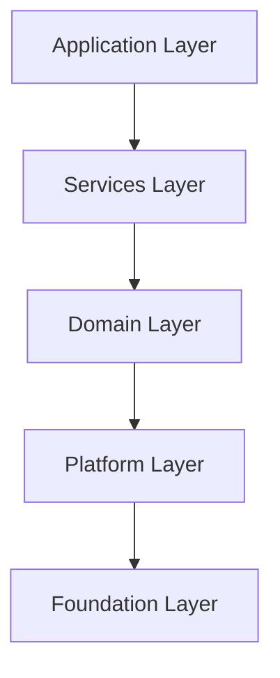

# 应用层架构设计说明书 (Application Layer Architecture Design Specification)

> **文档状态**: 正式 (Official)
> **版本**: V2.2
> **最后更新**: 2026-01-27
> **适用范围**: FaceFusionCpp 应用层开发与维护

## 1. 引言 (Introduction)

### 1.1 目的 (Purpose)
本文档旨在规范 FaceFusionCpp 项目应用层 (Application Layer) 的架构设计、配置管理规范及核心业务流程。本文档作为应用层开发的最高指导原则，明确了静态环境与动态作业的边界，规定了工程化实现的约束条件，以确保系统的高可用性、可维护性及扩展性。

### 1.2 架构原则 (Architecture Principles)
本设计严格遵循项目定义的 **5层分层架构 (5-Layered Architecture)** 原则：

*   **依赖单向性**: 上层仅依赖下层，严禁反向依赖。
*   **模块化**: 子系统间通过定义的接口交互，实现高内聚低耦合。

---

## 2. 核心架构设计 (Core Architecture Design)

### 2.1 关注点分离 (Separation of Concerns)
为实现系统配置的解耦，将配置域严格划分为 **静态环境基础设施** 与 **动态业务流水线**。

| 维度         | App Config (应用配置)    | Task Config (任务配置)        |
| :----------- | :----------------------- | :---------------------------- |
| **定位**     | 运行时环境与基础设施定义 | 具体业务处理逻辑定义          |
| **文件**     | [App Config](#31-基础设施配置-app-configuration) | [Task Config](#32-业务流水线配置-task-configuration) |
| **生命周期** | 进程级 (Global Static)   | 任务级 (Task-Scoped Dynamic)  |
| **可变性**   | 启动时加载，运行时不可变 | 每次任务执行时加载，高度灵活  |
| **包含内容** | 日志、模型路径、资源限制 | Pipeline 步骤、输入输出、参数 |

### 2.2 运行模式 (Execution Modes)
系统设计支持多种运行模式，底层核心逻辑（`RunPipeline`接口）保持一致，仅在接入层有所区分。

*   **命令行接口 (CLI Mode)** [Current Focus]
    *   通过命令行参数 (`--config`) 注入任务配置。
    *   适用于批处理、脚本自动化场景。
*   **服务化接口 (Server Mode)** [Future Roadmap]
    *   通过 HTTP/RPC 接收动态配置负载。
    *   适用于即时服务、Web 后端集成场景。
    *   设计要求：CLI 与 Server 模式除 "配置加载器" 与 "进度回调" 外，必须完全复用底层逻辑。

---

## 3. 详细设计规范 (Detailed Design Specifications)

### 3.1 应用配置 (App Configuration)

采用分层架构设计，确保配置的可读性与逻辑性。
*   **设计约束**: 必须显式定义所有关键路径与资源限额，禁止在代码中硬编码环境相关路径。
*   **参考实现**:

```yaml
# Schema Version
config_version: "1.0"

# 推理基础设施 (Inference Infrastructure)
inference:
  # 显卡/计算设备分配
  # 扩展预留: 未来可支持 device_ids: [0, 1] 实现多卡并行推理
  device_id: 0
  # 引擎缓存策略
  engine_cache:
    enable: true
    path: "./.cache/tensorrt" # 相对路径
  # 默认推理后端优先级 (Multiselect & Priority)
  default_providers:
    - tensorrt
    - cuda
    - cpu

# 资源与性能 (Resources & Performance)
resource:
  # 内存策略 (strict/tolerant)
  # strict: 严格模式 (On-Demand). 处理器仅在执行时创建，用完即销毁。适合低显存环境。
  # tolerant: 宽容模式 (Cached). 处理器在启动时预加载并常驻内存。适合高频任务或高显存环境。
  memory_strategy: "strict"

# 日志与调试 (System Logging)
logging:
  # 支持级别: trace, debug, info, warn, error
  level: "info"
  # 日志存储目录 (注意: 文件名固定为 app.log 或程序指定，不可配置，仅目录可配)
  directory: "./logs"
  rotation: "daily"

# 模型管理 (Model Management)
models:
  # 模型基础目录
  path: "./assets/models"
  # 下载策略:
  # force: 无论模型是否存在都强制下载
  # skip: 模型不存在时跳过下载，从 model_repository 返回空路径，后续加载模型报错退出程序
  # auto: 模型不存在时自动下载 (默认)
  download_strategy: "auto"

# 临时文件管理 (Temp File Management)
temp_directory: "./temp"

```

### 3.2 任务配置 (Task Configuration)

基于 **Pipeline Pattern** 设计，由有序的 **Steps** 组成。
*   **Step 自包含性**: 每个 Step 包含完整的输入参数 (`params`)，不依赖全局隐式状态。
*   **链式处理 (Chain Processing)**: 无论执行顺序 (Sequential/Batch)，流水线均为链式处理 (S1结果 -> S2输入 -> S3)，而非原始帧独立处理。
*   **参考实现**:

```yaml
# Schema Version
config_version: "1.0"

# 任务元数据 (Task Metadata)
task_info:
  # 唯一任务标识 (Runtime Unique ID)
  # 格式: [a-zA-Z0-9_]
  # 策略: 若为空由程序生成；若指定且冲突则拒绝任务。
  id: "task_default_001"
  description: "Face swap and enhancement pipeline"
  # 是否启用独立任务日志 (Optional)
  # 若启用，将在日志目录生成 {task_id}.log
  enable_logging: true
  # 是否启用断点续处理 (Optional)
  enable_resume: false

# 输入输出 (I/O)
io:
  # 输入源列表 (支持多源)
  # 注意: 源目前仅支持图片文件 [png, jpg, bmp]
  # 可输入文件路径或目录路径；若为目录，自动扫描并添加目录下所有支持的图片文件
  source_paths:
    - "D:/projects/faceFusionCpp/data/source_face.jpg" # 强制绝对路径

  # 目标列表
  # 支持图片、视频、目录混合输入
  # 可输入文件路径或目录路径；若为目录，自动扫描并添加目录下所有支持的媒体文件
  target_paths:
    - "D:/projects/faceFusionCpp/data/target_video.mp4" # 强制绝对路径

  # 输出配置
  output:
    path: "D:/projects/faceFusionCpp/data/output/" # 强制绝对路径
    prefix: "result_"
    subfix: "_v1"

    # 格式配置
    image_format: "png"      # [png, jpg, bmp]
    video_encoder: "libx264" # [libx264, libx265, h264_nvenc, ...]
    video_quality: 80        # [0-100]
    # 输出文件冲突策略: overwrite, rename, error
    conflict_policy: "error"
    # 音频处理策略: copy, skip
    # copy: 保留原视频音轨并合并到输出 (默认)
    # skip: 跳过音频，输出静音视频
    audio_policy: "copy"

# 资源控制 (Resource Control)
resource:
  # 任务并发线程数 (Thread count for this specific task)
  # 0: Auto (默认为机器最大线程数的一半 / 50% of CPU Cores)
  thread_count: 0
  # 处理顺序策略:
  # sequential: 顺序模式 (默认). 每一帧/图一次性经过流水线中所有处理器。
  #             优势: 低延迟，内存占用小 (仅需存当前帧).
  #             劣势: 频繁切换模型可能导致 VRAM 碎片或上下文切换开销 (若 strict 模式).
  # batch: 批处理模式. 全量帧通过 Processor A 后再进入 Processor B.
  #        优势: 极大降低显存峰值 (可配合 strict 模式卸载模型)，最大化 GPU 吞吐量.
  #        劣势: 需要巨大的中间存储空间 (RAM/Disk)，首帧延迟高.
  execution_order: "sequential"

  # 批处理中间存储策略 (仅 execution_order=batch 时有效)
  # memory: 存入 RAM. 速度快，但长视频易 OOM.
  # disk: 存入临时磁盘文件. 速度较慢 (IO瓶颈)，但支持无限长视频.
  batch_buffer_mode: "memory"
  # 注意:
  # 无论执行顺序如何，流水线均为链式处理 (S1结果 -> S2输入 -> S3)，而非原始帧独立处理模式。
  # 视频分段处理 (Optional)
  # 0: 不分段，整个视频一次性处理
  # >0: 按指定秒数分段处理，最后合并输出为单个文件
  segment_duration_seconds: 0

# 人脸分析配置 (Shared Analysis Config)
# 若多个步骤共享检测结果，可在此统一定义
face_analysis:
  face_detector:
    # Models: [retinaface, scrfd, yoloface]
    models: ["yoloface", "retinaface", "scrfd"] # 融合策略
    score_threshold: 0.5
  face_landmarker:
    # Models: [2dfan4, peppa_wutz, face_landmarker_68_5]
    model: "2dfan4"
  face_recognizer:
    # 人脸识别/相似度匹配 (用于 reference 模式)
    # Models: [arcface_w600k_r50]
    model: "arcface_w600k_r50"
    # 相似度阈值: 低于此值认为不是同一人，跳过处理
    # Range: [0.0, 1.0] (越高越严格)
    similarity_threshold: 0.6
  face_masker:
    # 多遮罩融合策略 (Mask Fusion)
    # Face Occluder Models: [xseg_1, xseg_2]
    # Face Parser Models: [bisenet_resnet_18, bisenet_resnet_34]
    types: ["box", "occlusion", "region"]
    # Supported Regions: [skin, left-eyebrow, right-eyebrow, left-eye, right-eye,
    #                     eye-glasses, left-ear, right-ear, earring, nose, mouth,
    #                     upper-lip, lower-lip, neck, necklace, cloth, hair, hat]
    # Default: "all" (if not specified or empty)
    region: ["face", "eyes"] # 遮罩区域
    # 融合逻辑: 将由代码内部实现最佳遮罩计算

# 处理流水线 (Processing Pipeline)
# 有序定义处理步骤
#
# Supported Processors & Parameters:
#
# 1. face_swapper
#    - Models: [inswapper_128, inswapper_128_fp16]
#    - Params:
#        face_selector_mode: [reference, one, many] (default: many)
#        reference_face_path: "path/to/face.jpg" (required if mode=reference)
#          - 只有当图/帧中检测到与此参考图片中人脸相似的人脸时，才对该相似人脸进行处理
#          - 若参考图片中无人脸，则此图/帧跳过当前 Step
#
# 2. face_enhancer
#    - Models: [codeformer, gfpgan_1.2, gfpgan_1.3, gfpgan_1.4]
#    - Params:
#        blend_factor: 0.0 - 1.0 (default: 0.8)
#        face_selector_mode: [reference, one, many] (default: many)
#        reference_face_path: "path/to/face.jpg" (required if mode=reference)
#          - 同上：仅处理与参考人脸相似的人脸
#
# 3. expression_restorer
#    - Models: [live_portrait] (internally uses: feature_extractor, motion_extractor, generator)
#    - Params:
#        restore_factor: 0.0 - 1.0 (default: 0.8)
#        face_selector_mode: [reference, one, many] (default: many)
#        reference_face_path: "path/to/face.jpg" (required if mode=reference)
#          - 同上：仅处理与参考人脸相似的人脸
#
# 4. frame_enhancer
#    - Models: [real_esrgan_x2, real_esrgan_x2_fp16, real_esrgan_x4, real_esrgan_x4_fp16,
#               real_esrgan_x8, real_esrgan_x8_fp16, real_hatgan_x4]
#    - Params:
#        enhance_factor: 0.0 - 1.0 (default: 0.8)
#
# 注意: 支持多个同类型 Step (如两个 face_enhancer)，每个 Step 的 name 和 params 可不同

pipeline:
  - step: "face_swapper"
    name: "swap_main_face" # Step 别名
    enabled: true
    params:
      model: "inswapper_128_fp16"
      face_selector_mode: "reference"
      reference_face_path: "D:/ref_face.jpg" # 绝对路径

  - step: "face_enhancer"
    name: "enhance_face"
    enabled: true
    params:
      model: "codeformer"
      blend_factor: 0.8
      face_selector_mode: "many"
      reference_face_path: "D:/ref_face.jpg" # 绝对路径

  - step: "expression_restorer"
    enabled: false
    params:
      model: "live_portrait"
      restore_factor: 0.8
      face_selector_mode: "many"
      reference_face_path: "D:/ref_face.jpg" # 绝对路径

  - step: "frame_enhancer"
    enabled: false
    params:
      model: "real_esrgan_x4"
      enhance_factor: 1.0

```

---

## 4. 核心业务处理逻辑 (Core Business Logic)

### 4.1 处理器 (Processor)

系统通过标准化的 **Processor** 接口实现具体的图像/视频处理能力。

#### 4.1.1 换脸处理器 (Face Swapper)
*   **功能**: 将源人脸 (Source) 特征映射至目标图像 (Target) 的人脸区域。
*   **算法逻辑**:
    1.  **特征提取**: 提取 Source 序列所有帧的人脸特征，计算 **平均特征向量 (Average Embedding)** 以消除单帧质量波动。
    2.  **特征映射**: 将平均特征注入 Target 人脸区域。
    3.  **后处理 (Post-Processing)**:
        *   **色彩匹配 (Color Matching)**: 统一光影色调。
        *   **边缘融合 (Edge Blending)**: 羽化边缘，消除边界伪影。

#### 4.1.2 人脸增强处理器 (Face Enhancer)
*   **功能**: 对目标图像的人脸区域进行超分辨率重建。
*   **输入约束**: 仅依赖 `target_paths`，忽略 `source_paths`。
*   **后处理**: 应用边缘融合以确增强区域与背景的自然过渡。

#### 4.1.3 表情还原处理器 (Expression Restorer)
*   **功能**: 将当前帧 (Current Frame) 的人脸表情重置为原始目标帧 (Original Target Frame) 的表情。
*   **逻辑**: `Result = Restore(CurrentFrame, OriginalTargetFrame.Expression)`
*   **应用场景**: 消除换脸过程中的表情不协调，强制保留原始视频的目标人物神态与口型。

#### 4.1.4 全帧增强处理器 (Frame Enhancer)
*   **功能**: 对全画幅进行超分辨率处理。
*   **适用性**: 提升整体画质，处理背景与非人脸区域。

### 4.2 流水线 (Pipeline)
*   **核心功能**: 顺序组织并串行执行多组处理器，实现复杂的多阶段图像/视频增强逻辑。
*   **架构设计**:
    *   **拓扑结构**: 采用 **线性链式 (Linear Chain)** 结构。
    *   **解耦机制**: 处理器间通过 **线程安全有界队列 (Thread-Safe Bounded Queues)** 进行物理解耦。
    *   **处理流**: 每个 Processor 节点仅负责从其 **输入队列 (Input Queue)** 消费数据，处理完成后推送到其 **输出队列 (Output Queue)**。
*   **设计优势**: 节点无需感知流水线的上下文，支持高度并发的任务流水化处理 (Pipelining)，最大化硬件吞吐量。
*   **逻辑示意**:


#### 4.2.1 流水线策略 (Pipeline Strategy)
*   **顺序模式 (Sequential)** (Default/Latency Oriented):
    *   **逻辑**: `Frame_1 -> [P1->P2->P3] -> Output`
    *   **适用**: 实时流处理，能够容纳同时加载多个模型到显存的高配机器。
    *   **优点**: 极低的首帧延迟，内存开销最小 (In-flight frames 极少)。
*   **批处理模式 (Batch)** (Throughput/VRAM Oriented):
    *   **逻辑**: `All_Frames -> P1 -> Buffer(Disk/RAM) -> P2 -> Output`
    *   **适用**: 显存受限设备 (低显存跑大模型)，或离线大批量处理。
    *   **优点**: 结合 `memory_strategy: strict` 可实现"单模型显存占用"，极大降低硬件门槛。
    *   **代价**: 需要较大的内存或磁盘空间存储中间结果 (`Frames * Resolution * Bytes`)。
---

## 5. 工程化约束与最佳实践 (Engineering Constraints)

为确保代码达到工业级交付标准，必须严格遵守以下工程规范。

### 5.1 路径解析规范 (Path Resolution Criteria)
*   **App Config**: 所有路径视为 **相对路径**，基准目录为 **程序安装根目录 (App Root)**。
*   **Task Config**: 所有 I/O 路径 (Source/Target/Output) 必须强制转换为 **绝对路径 (Absolute Path)**。
    *   *Rationale*: 消除不同运行模式 (CLI/Server) 下 Current Working Directory (CWD) 不一致导致的路径歧义。

### 5.2 进度与遥测解耦 (Progress & Telemetry Decoupling)
*   **IOC 原则**: 核心 Pipeline 逻辑 **严禁** 直接操作 stdout/stderr。
*   **回调机制**: 必须通过 `std::function<void(TaskProgress)>` 注入状态回调。
    *   CLI 实现：更新 tqdm 风格控制台进度条。
    *   Server 实现：推送 WebSocket 消息。

### 5.3 错误处理与恢复 (Error Handling & Recovery)
*   **非致命错误策略**:
    *   **检测失败 (No Face Detected)**: 记录 WARN 日志，**跳过** 当前帧/Step，严禁抛出异常导致进程崩溃。
    *   **Batch 容错**: 单帧失败不影响 Batch 中其他帧的处理。
*   **致命错误**: 资源耗尽、模型文件缺失、I/O 权限拒绝等，应立即中断并上报。

### 5.4 版本控制 (Versioning Strategy)
*   **配置协议版本**: YAML 根节点必须包含 `config_version` (e.g., "1.0")。
*   **加载校验**: 启动时校验主版本号，不兼容版本必须明确报错拒绝加载。

### 5.5 元数据管理 (Metadata Management)
*   **编译期注入**: App Name, Version, Build Time 等信息通过 CMake 生成 `version.h`。
*   **单一事实来源 (SSOT)**: 严禁在配置文件中手动维护版本号，`main` 函数启动 banner 必须读取编译宏。

### 5.6 优雅停机 (Graceful Shutdown)
*   **信号处理**: 响应 `SIGINT` / `SIGTERM`。
*   **停机序列**:
    1.  **停止接收**: 关闭 Input Gate，拒绝新帧进入 Pipeline。
    2.  **清空队列**: 等待 In-Flight 任务（GPU 中正在推理的帧）完成，防止数据损坏。
    3.  **资源释放**: 显式释放 GPU 上下文与句柄。
    4.  **超时强制**: 设置最大等待时间 (e.g., 5s)，超时后强制 kill。

### 5.7 资源并发与流控 (Concurrency & Flow Control)
*   **线程安全**: `ResourceManager` 必须实现线程安全，支持多线程并发访问模型实例。
*   **自适应背压 (Adaptive Backpressure)**:
    *   实现 **动态有界队列**，容量 `= min(HardLimit, (AvailableRAM - SafetyMargin) / FrameSize)`。
    *   防止生产者 (CPU Decode) 速度远大于消费者 (GPU Inference) 导致的 OOM。
    *   需封装跨平台内存查询 API (Windows/Linux)。

### 5.8 断点续传 (Checkpointing)
*   **机制**: 长任务定期写入 `checkpoints/{task_id}.ckpt`。
*   **恢复**: 重启时检测 checkpoint，跳过已完成的 Frames/Segments。

### 5.9 视频分段处理 (Segmentation Strategy)
*   **大文件处理**: 支持按 `duration` 切分长视频。
*   **关键帧对齐**: 切分点对齐 Keyframe 以避免编码瑕疵。
*   **合并**: 所有 Segment 处理完成后，自动合并并清理临时分段文件。

---

## 6. 实施路线图 (Implementation Roadmap)

1.  **Schema Definition**: 定义 C++ Structs 与 YAML 的严格映射关系。
2.  **Infrastructure**: 集成 `yaml-cpp`，实现配置加载器与校验器。
3.  **Core Pipeline**: 实现基于工厂模式的 Processor 创建与 Pipeline 调度器。
4.  **Resilience**: 实现断点续传与自适应内存流控。
5.  **Optimization**: 引入多线程预取与 CUDA Stream 优化。

---

## 7. 附录 (Appendix)

### 7.1 术语表 (Glossary)
*   **Embedding**: 人脸特征向量 (512-d).
*   **Inswapper**: 换脸模型核心网络.
*   **GFPGAN/CodeFormer**: 常用人脸增强网络.

### 7.2 未来规划 (Future Work)
*   **水印隐写**: 支持在输出视频中嵌入不可见版权水印。
*   **Live Mode**: 支持摄像头实时流处理 (RTSP/Webcam)。
