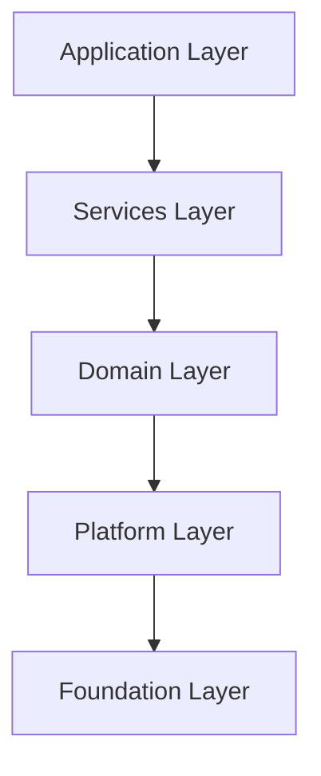

# 应用层架构设计说明书 (Application Layer Architecture Design Specification)

> **文档标识**: FACE-FUSION-APP-ARCH
> **密级**: 内部公开 (Internal Public)
> **状态**: 正式 (Official)
> **最后更新**: 2026-01-27

## 版本历史 (Version History)

| 版本 | 日期       | 修改人   | 说明                                      |
| :--- | :--------- | :------- | :---------------------------------------- |
| V1.0 | 2025-10-01 | ArchTeam | 初始版本                                  |
| V2.0 | 2026-01-15 | ArchTeam | 重构为 C++20 模块化架构                   |
| V2.3 | 2026-01-27 | ArchTeam | 新增命令行接口 (CLI) 设计; 优化工程化规范 |

---

## 1. 引言 (Introduction)

### 1.1 目的 (Purpose)
本文档旨在规范 **FaceFusionCpp** 项目应用层 (Application Layer) 的架构设计、配置管理规范及核心业务流程。作为应用层开发的最高指导原则，本文档明确了静态环境与动态作业的边界，规定了工程化实现的约束条件，以确保系统的高可用性、可维护性及扩展性。

### 1.2 架构原则 (Architecture Principles)
本设计严格遵循项目定义的 **5层分层架构 (5-Layered Architecture)**：



*   **依赖单向性 (Unidirectional Dependency)**: 上层仅依赖下层，严禁反向依赖或跨层跳跃调用。
*   **模块化 (Modularity)**: 基于 **C++20 Modules** (`.ixx` / `.cppm`) 构建，强制物理隔离接口与实现，子系统间仅通过明确定义的接口交互。

---

## 2. 核心架构设计 (Core Architecture Design)

### 2.1 关注点分离 (Separation of Concerns)
为实现系统配置的高内聚低耦合，将配置域严格划分为 **静态环境基础设施** 与 **动态业务流水线**。

| 维度         | **App Config (应用配置)**                        | **Task Config (任务配置)**                           |
| :----------- | :----------------------------------------------- | :--------------------------------------------------- |
| **定位**     | 运行时环境与基础设施定义                         | 具体业务处理逻辑定义                                 |
| **引用**     | [3.1 应用配置](#31-应用配置-app-configuration)   | [3.2 任务配置](#32-任务配置-task-configuration)      |
| **生命周期** | 进程级 (Global Static)                           | 任务级 (Task-Scoped Dynamic)                         |
| **可变性**   | 启动时加载，运行时不可变                         | 每次任务执行时动态加载                               |
| **典型内容** | 日志级别、模型仓库路径、硬件资源限额             | Pipeline 步骤拓扑、输入输出路径、算法参数            |

### 2.2 运行模式 (Execution Modes)
系统设计支持多种运行模式，底层核心逻辑（`RunPipeline` 接口）保持一致，仅在接入层（Access Layer）有所区分。

*   **命令行接口 (CLI Mode)** (Current Focus)
    *   通过命令行参数 (`--config`) 注入任务配置。
    *   适用于离线批处理、CICD 脚本自动化场景。
*   **服务化接口 (Server Mode)** (Future Roadmap)
    *   通过 HTTP/RPC 接收动态配置负载。
    *   适用于即时推理服务、Web 后端集成场景。
    *   **设计约束**: CLI 与 Server 模式除 "配置加载器" 与 "进度回调" 外，必须完全复用底层业务逻辑。

---

## 3. 详细设计规范 (Detailed Design Specifications)

### 3.1 应用配置 (App Configuration)
采用分层架构设计，确保配置的可读性与逻辑性。
*   **配置级联**: 遵循优先级 `Task Config > User Config > System Default`。
*   **硬编码禁令**: 必须显式定义所有关键路径与资源限额，禁止在代码中硬编码环境相关路径。

**Schema 参考**:
```yaml
# Schema Version
config_version: "1.0"

# 推理基础设施 (Inference Infrastructure)
inference:
  # 显卡/计算设备分配
  # 扩展预留: 未来可支持 device_ids: [0, 1]
  device_id: 0
  # 引擎缓存策略
  engine_cache:
    enable: true
    path: "./.cache/tensorrt" # 相对程序根目录
  # 默认推理后端优先级
  default_providers:
    - tensorrt
    - cuda
    - cpu

# 资源与性能 (Resources & Performance)
resource:
  # 内存策略 (strict/tolerant)
  # strict: 严格模式 (On-Demand with LRU).
  #         行为: 处理器仅在执行期间(run)持有模型资源。一旦完成当前分配的任务，尝试释放底层推理引擎资源。
  #               *优化*: 引入 Session Cache / LRU 机制，保留最近使用的 Engine Context，避免频繁加载/卸载造成的性能抖动，仅在显存压力大或超时未复用时真正释放。
  #         场景: 配合 execution_order: batch 使用效果最佳，可极大降低峰值显存。
  # tolerant: 宽容模式 (Cached).
  #         行为: 所有模型在系统启动时预加载，并常驻内存/显存，直到程序退出。
  #         场景: 适合高频实时任务或显存充足环境，避免模型重复加载开销。
  memory_strategy: "strict"

# 日志与调试 (System Logging)
logging:
  # 支持级别: trace, debug, info, warn, error
  level: "info"
  # 日志存储目录 (注意: 文件名固定为 app.log 或程序指定，不可配置，仅目录可配)
  directory: "./logs"
  # 日志存储目录 (注意: 文件名固定为 app.log 或程序指定，不可配置，仅目录可配)
  directory: "./logs"
  rotation: "daily"

# 可观测性 (Observability)
metrics:
  enable: true
  # 追踪每个 Step 的耗时分布 (Avg, P99)
  step_latency: true
  # 记录 GPU 显存变化曲线
  gpu_memory: true
  # 输出报告文件 (json)
  report_path: "./logs/metrics_{timestamp}.json"

# 模型管理 (Model Management)
models:
  # 模型基础目录
  path: "./assets/models"
  # 下载策略:
  # force: 无论模型是否存在都强制下载
  # skip: 模型不存在时跳过下载，从 model_repository 返回空路径，后续加载模型报错退出程序
  # auto: 模型不存在时自动下载 (默认)
  download_strategy: "auto"

# 临时文件管理 (Temp File Management)
temp_directory: "./temp"

# 默认任务配置 (Default Task Settings)
# 若 Task Config 中未指定，则回退使用此处的默认值
# 需要按照task_config.yaml的格式
default_task_settings:
  io:
    output:
      video_encoder: "libx264"
      video_quality: 80
      output_prefix: "result_"
      conflict_policy: "error"
      audio_policy: "copy"
```

### 3.2 任务配置 (Task Configuration)

基于 **Pipeline Pattern** 设计，由有序的 **Steps** 组成。
*   **Step 自包含性**: 每个 Step 包含完整的输入参数 (`params`)，不依赖全局隐式状态。
*   **链式处理 (Chain Processing)**: 无论执行顺序 (Sequential/Batch)，流水线均为链式处理 (S1结果 -> S2输入 -> S3)，而非原始帧独立处理。
*   **参考实现**:

**Schema 参考**:
```yaml
# Schema Version
config_version: "1.0"

# 任务元数据 (Task Metadata)
task_info:
  # 唯一任务标识 (Runtime Unique ID)
  # 格式: [a-zA-Z0-9_]
  # 策略: 若为空由程序生成；若指定且冲突则拒绝任务。
  id: "task_default_001"
  description: "Face swap and enhancement pipeline"
  # 是否启用独立任务日志 (Optional)
  # 若启用，将在日志目录生成 {task_id}.log
  enable_logging: true
  # 是否启用断点续处理 (Optional)
  enable_resume: false

# 输入输出 (I/O)
io:
  # 输入源列表 (支持多源)
  # 注意: 源目前仅支持图片文件 [png, jpg, bmp]
  # 可输入文件路径或目录路径；若为目录，自动扫描并添加目录下所有支持的图片文件
  source_paths:
    - "D:/projects/faceFusionCpp/data/source_face.jpg"

  # 目标列表
  # 支持图片、视频、目录混合输入
  # 可输入文件路径或目录路径；若为目录，自动扫描并添加目录下所有支持的媒体文件
  target_paths:
    - "D:/projects/faceFusionCpp/data/target_video.mp4"

  # 输出配置
  output:
    path: "D:/projects/faceFusionCpp/data/output/" # 强制绝对路径
    prefix: "result_"
    subfix: "_v1"

    # 格式配置
    image_format: "png"      # [png, jpg, bmp]
    video_encoder: "libx264" # [libx264, libx265, h264_nvenc, ...]
    video_quality: 80        # [0-100]
    # 输出文件冲突策略: overwrite, rename, error
    conflict_policy: "error"
    # 音频处理策略: copy, skip
    # copy: 保留原视频音轨并合并到输出 (默认)
    # skip: 跳过音频，输出静音视频
    audio_policy: "copy"

# 资源控制 (Resource Control)
resource:
  # 任务并发线程数 (Thread count for this specific task)
  # 0: Auto (默认为机器最大线程数的一半 / 50% of CPU Cores)
  thread_count: 0
  # 队列最大容量 (Max Buffer Size per Pipeline Step)
  # 控制每个步骤的输入/输出队列上限，防止内存溢出 (OOM)。
  # 策略: 实际容量 = min(max_queue_size, AvailableRAM / FrameSize)
  # 默认: 20 (1080p RGBA ~160MB/Queue; 4 queues ~640MB Total)
  max_queue_size: 20
  # 处理顺序策略:
  # sequential: 顺序模式 (默认). 每一帧/图一次性经过流水线中所有处理器。
  #             优势: 低延迟，内存占用小 (仅需存当前帧).
  #             劣势: 频繁切换模型可能导致 VRAM 碎片或上下文切换开销 (若 strict 模式).
  # batch: 批处理模式. 全量帧 (或分块) 通过 Processor A 后再进入 Processor B.
  #        优势: 极大降低显存峰值 (可配合 strict 模式卸载模型)，最大化 GPU 吞吐量.
  #        劣势: 需要巨大的中间存储空间 (RAM/Disk)，首帧延迟高.
  #        *警告*: 处理长视频时极易导致 OOM 或磁盘爆炸。强烈建议配合 `segment_duration_seconds` 使用，或由系统自动分块 (Chunked Batch)。
  execution_order: "sequential"

  # 批处理中间存储策略 (仅 execution_order=batch 时有效)
  # memory: 存入 RAM. 速度快，但长视频易 OOM.
  # disk: 存入临时磁盘文件. 速度较慢 (IO瓶颈)，但支持无限长视频.
  batch_buffer_mode: "memory"
  # 注意:
  # 无论执行顺序如何，流水线均为链式处理 (S1结果 -> S2输入 -> S3)，而非原始帧独立处理模式。
  # 视频分段处理 (Optional)
  # 0: 不分段，整个视频一次性处理
  # >0: 按指定秒数分段处理，最后合并输出为单个文件
  segment_duration_seconds: 0

# 人脸分析配置 (Shared Analysis Config)
# 若多个步骤共享检测结果，可在此统一定义
face_analysis:
  face_detector:
    # Models: [retinaface, scrfd, yoloface]
    models: ["yoloface", "retinaface", "scrfd"] # 融合策略: 置信度越高越优先（采用 NMS 策略进行融合）
    score_threshold: 0.5
  face_landmarker:
    # Models: [2dfan4, peppa_wutz, face_landmarker_68_5]
    model: "2dfan4"
  face_recognizer:
    # 人脸识别/相似度匹配
    # Models: [arcface_w600k_r50]
    model: "arcface_w600k_r50"
    # 相似度阈值: 低于此值认为不是同一人，跳过处理
    # Range: [0.0, 1.0] (越高越严格)
    similarity_threshold: 0.6
  face_masker:
    # 多遮罩融合策略 (Mask Fusion)
    # Face Occluder Models: [xseg_1, xseg_2]
    # Face Parser Models: [bisenet_resnet_18, bisenet_resnet_34]
    types: ["box", "occlusion", "region"]
    # Supported Regions: [skin, left-eyebrow, right-eyebrow, left-eye, right-eye,
    #                     eye-glasses, left-ear, right-ear, earring, nose, mouth,
    #                     upper-lip, lower-lip, neck, necklace, cloth, hair, hat]
    # Default: "all" (if not specified or empty)
    region: ["face", "eyes"] # 遮罩区域
    # 融合逻辑: 将由代码内部实现最佳遮罩计算

# 处理流水线 (Processing Pipeline)
# 有序定义处理步骤
#
# Supported Processors & Parameters:
#
# 1. face_swapper
#    - Models: [inswapper_128, inswapper_128_fp16]
#    - Params:
#        face_selector_mode: [reference, one, many] (default: many)
#        reference_face_path: "path/to/face.jpg" (required if mode=reference)
#          - 只有当图/帧中检测到与此参考图片中人脸相似的人脸时，才对该相似人脸进行处理
#          - 若参考图片中无人脸，则此图/帧透传 (Pass-through)，即直接输出原始帧，不进行处理
#
# 2. face_enhancer
#    - Models: [codeformer, gfpgan_1.2, gfpgan_1.3, gfpgan_1.4]
#    - Params:
#        blend_factor: 0.0 - 1.0 (default: 0.8)
#        face_selector_mode: [reference, one, many] (default: many)
#        reference_face_path: "path/to/face.jpg" (required if mode=reference)
#          - 同上：仅处理与参考人脸相似的人脸
#
# 3. expression_restorer
#    - Models: [live_portrait] (internally uses: feature_extractor, motion_extractor, generator)
#    - Params:
#        restore_factor: 0.0 - 1.0 (default: 0.8)
#        face_selector_mode: [reference, one, many] (default: many)
#        reference_face_path: "path/to/face.jpg" (required if mode=reference)
#          - 同上：仅处理与参考人脸相似的人脸
#
# 4. frame_enhancer
#    - Models: [real_esrgan_x2, real_esrgan_x2_fp16, real_esrgan_x4, real_esrgan_x4_fp16,
#               real_esrgan_x8, real_esrgan_x8_fp16, real_hatgan_x4]
#    - Params:
#        enhance_factor: 0.0 - 1.0 (default: 0.8)
#
# 注意: 支持多个同类型 Step (如两个 face_enhancer)，每个 Step 的 name 和 params 可不同
# 注意：name 是可选的，如果name 不存在，则默认为 step 的类型+下划线+索引
# 注意：params 是可选的，如果params 不存在则使用全局参数或默认参数，如果全局参数也不存在，则使用默认参数

global_pipeline_step_params: # 全局 Step 参数, 仅当 Step 没有显式定义时才生效
  face_selector_mode: "many"
  reference_face_path: "D:/ref_face.jpg"

pipeline:
  - step: "face_swapper"
    name: "main_swap"
    enabled: true
    params:
      model: "inswapper_128_fp16"
      face_selector_mode: "reference"
      reference_face_path: "D:/ref_face.jpg"

  - step: "face_enhancer"
    name: "post_enhancement"
    enabled: true
    params:
      model: "codeformer"
      blend_factor: 0.8
      face_selector_mode: "many"
      reference_face_path: "D:/ref_face.jpg" # 绝对路径

  - step: "expression_restorer"
    name: "main_expression_restorer"
    enabled: false
    params:
      model: "live_portrait"
      restore_factor: 0.8
      face_selector_mode: "many"
      reference_face_path: "D:/ref_face.jpg" # 绝对路径

  - step: "frame_enhancer"
    name: "main_frame_enhancer"
    enabled: false
    params:
      model: "real_esrgan_x4"
      enhance_factor: 1.0

```


---

### 3.3 命令行接口 (Command Line Interface)
本设计旨在平衡生产环境的配置管理需求与开发调试的便捷性。

#### 3.3.1 设计原则
*   **配置优先 (Configuration First)**: 生产环境应始终通过 `-c/--config` 加载完整 YAML，确保可复现性。
*   **参数覆盖 (CLI Override)**: 命令行显式参数优先级高于配置文件（例如在 Config 中定义了输出路径，但 CLI 又指定了 `-o`，则以 CLI 为准）。
*   **快捷模式 (Quick Run)**: 支持仅通过 CLI 参数 (`-s`, `-t`) 启动默认流水线，无需预先编写 YAML。

#### 3.3.2 命令结构
`FaceFusionCpp.exe [GLOBAL_OPTIONS] [TASK_OPTIONS] [PROCESSOR_FLAGS]`

#### 3.3.3 参数规格

| 类别     | 参数 (Short/Long)       | 类型    | 描述                           |
| :------- | :---------------------- | :------ | :----------------------------- |
| **全局** | `-h`, `--help`          | Flag    | 显示帮助与用法                 |
|          | `-v`, `--version`       | Flag    | 显示构建版本信息               |
|          | `-c`, `--config`        | Path    | **(核心)** 载入任务配置文件    |
|          | `--log-level`           | String  | 覆盖日志级别                   |
|          | `--system-check`        | Flag    | 执行环境完整性自检             |

---

## 4. 核心业务处理逻辑 (Core Business Logic)

### 4.1 处理器 (Processor)

系统通过标准化的 **Processor** 接口实现具体的图像/视频处理能力。
*   **C++20 Concepts**: 使用 `concept Processor` 在编译期约束插件接口（如 `process()`, `InputType`, `OutputType`），替代纯虚函数运行时多态，提升类型安全与内联优化机会。

#### 4.1.1 换脸处理器 (Face Swapper)
*   **功能**: 将源人脸 (Source) 特征映射至目标图像 (Target) 的人脸区域。
*   **算法逻辑**:
    1.  **特征提取**: 提取 Source 序列所有帧的人脸特征，计算 **平均特征向量 (Average Embedding)** 以消除单帧质量波动。
    2.  **特征映射**: 将平均特征注入 Target 人脸区域。
    3.  **后处理 (Post-Processing)**:
        *   **色彩匹配 (Color Matching)**: 统一光影色调。
        *   **边缘融合 (Edge Blending)**: 羽化边缘，消除边界伪影。

#### 4.1.2 人脸增强处理器 (Face Enhancer)
*   **功能**: 对目标图像的人脸区域进行超分辨率重建。
*   **输入约束**: 仅依赖 `target_paths`，忽略 `source_paths`。
*   **后处理**: 应用边缘融合以确增强区域与背景的自然过渡。

#### 4.1.3 表情还原处理器 (Expression Restorer)
*   **功能**: 将当前帧 (Current Frame) 的人脸表情重置为原始目标帧 (Original Target Frame) 的表情。
*   **逻辑**: `Result = Restore(CurrentFrame, OriginalTargetFrame.Expression)`
*   **应用场景**: 消除换脸过程中的表情不协调，强制保留原始视频的目标人物神态与口型。

#### 4.1.4 全帧增强处理器 (Frame Enhancer)
*   **功能**: 对全画幅进行超分辨率处理。
*   **适用性**: 提升整体画质，处理背景与非人脸区域。

### 4.2 流水线 (Pipeline)
*   **核心功能**: 顺序组织并串行执行多组处理器，实现复杂的多阶段图像/视频增强逻辑。
*   **架构设计**:
    *   **拓扑结构**: 采用 **线性链式 (Linear Chain)** 结构。
    *   **解耦机制**: 处理器间通过 **线程安全有界队列 (Thread-Safe Bounded Queues)** 进行物理解耦。
    *   **处理流**: 每个 Processor 节点仅负责从其 **输入队列 (Input Queue)** 消费数据，处理完成后推送到其 **输出队列 (Output Queue)**。
*   **设计优势**: 节点无需感知流水线的上下文，支持高度并发的任务流水化处理 (Pipelining)，最大化硬件吞吐量。
*   **逻辑示意**:


#### 4.2.1 流水线策略 (Pipeline Strategy)
*   **顺序模式 (Sequential)** (Default/Latency Oriented):
    *   **逻辑**: `Frame_1 -> [P1->P2->P3] -> Output`
    *   **适用**: 实时流处理，能够容纳同时加载多个模型到显存的高配机器。
    *   **优点**: 极低的首帧延迟，内存开销最小 (In-flight frames 极少)。
*   **批处理模式 (Batch)** (Throughput/VRAM Oriented):
    *   **逻辑**: `All_Frames -> P1 -> Buffer(Disk/RAM) -> P2 -> Output`
    *   **适用**: 显存受限设备 (低显存跑大模型)，或离线大批量处理。
    *   **优点**: 结合 `memory_strategy: strict` 可实现"单模型显存占用"，极大降低硬件门槛。
    *   **代价**: 需要较大的内存或磁盘空间存储中间结果 (`Frames * Resolution * Bytes`)。
---

## 5. 工程化约束与最佳实践 (Engineering Constraints)

为确保代码达到工业级交付标准，必须严格遵守以下工程规范。

### 5.1 路径解析规范 (Path Resolution Criteria)
*   **App Config**: 所有路径视为 **相对路径**，基准目录为 **程序安装根目录 (App Root)**。
*   **Task Config**: 所有 I/O 路径 (Source/Target/Output) 必须强制转换为 **绝对路径 (Absolute Path)**。
    *   *Rationale*: 消除不同运行模式 (CLI/Server) 下 Current Working Directory (CWD) 不一致导致的路径歧义。

### 5.2 进度与遥测解耦 (Progress & Telemetry Decoupling)
*   **IOC 原则**: 核心 Pipeline 逻辑 **严禁** 直接操作 stdout/stderr。
*   **回调机制**: 必须通过 `std::function<void(TaskProgress)>` 注入状态回调。
    *   CLI 实现：更新 tqdm 风格控制台进度条。
    *   Server 实现：推送 WebSocket 消息。

### 5.3 错误处理与恢复 (Error Handling & Recovery)
*   **非致命错误策略**:
    *   **检测失败 (No Face Detected)**: 记录 WARN 日志，**透传 (Pass-through)** 当前帧，即保留原始图像直接送入输出队列，保持音画同步，严禁抛出异常或直接丢帧。
    *   **Batch 容错**: 单帧失败不影响 Batch 中其他帧的处理。
*   **致命错误**: 资源耗尽、模型文件缺失、I/O 权限拒绝等，应立即中断并上报。

### 5.4 版本控制 (Versioning Strategy)
*   **配置协议版本**: YAML 根节点必须包含 `config_version` (e.g., "1.0")。
*   **加载校验**: 启动时校验主版本号，不兼容版本必须明确报错拒绝加载。

### 5.5 元数据管理 (Metadata Management)
*   **编译期注入**: App Name, Version, Build Time 等信息通过 CMake 生成 `version.ixx`。
*   **单一事实来源 (SSOT)**: 严禁在配置文件中手动维护版本号，`main` 函数启动 banner 必须读取编译宏。

### 5.6 优雅停机 (Graceful Shutdown)
*   **信号处理**: 响应 `SIGINT` / `SIGTERM`。
*   **停机序列**:
    1.  **停止接收**: 关闭 Input Gate，拒绝新帧进入 Pipeline。
    2.  **清空队列**: 等待 In-Flight 任务（GPU 中正在推理的帧）完成，防止数据损坏。
    3.  **资源释放**: 显式释放 GPU 上下文与句柄。
    4.  **超时强制**: 设置最大等待时间 (e.g., 5s)，超时后强制 kill。

### 5.7 资源并发与流控 (Concurrency & Flow Control)
*   **线程安全**: `ResourceManager` 必须实现线程安全，支持多线程并发访问模型实例。
*   **自适应背压 (Adaptive Backpressure)**:
    *   **基于配额 (Quota-based)**: 用户配置明确的 `resource.max_memory_usage` (e.g. 4GB)。
    *   **流控机制**: 使用信号量 (`std::counting_semaphore`) 维护全局内存配额。
    *   防止生产者 (CPU Decode) 速度远大于消费者 (GPU Inference) 导致的 OOM，避免依赖 OS 动态内存查询带来的不稳定性。
*   **队列生命周期管理 (Queue Lifecycle Management)**:
    *   必须实现 **显式关闭 (Explicit Shutdown)** 机制，防止消费者线程空转或死锁。
    *   **Shutdown 语义**: 标记队列"不再接受新输入" (`push` 返回失败)，但允许继续消费剩余数据。
    *   **退出条件**: 当 `State == Shutdown` 且 `Count == 0` 时，消费者收到结束信号（如 `pop` 返回 false）。
    *   **信号传递 (Propagation)**: 前级处理器的结束信号应自动触发下一级输入队列的 Shutdown，实现流水线的多米诺式自然闭合。

### 5.8 数据序列化 (Data Serialization)
*   **技术选型**: **FlatBuffers** (Google)。
*   **决策依据**:
    *   **Zero-Copy**: 支持直接对内存映射文件 (mmap) 进行读取而无需反序列化解析步，对于高频 IO 的 Batch 模式至关重要。
    *   **二进制效率**: 相比 JSON (需 Base64 编码，体积膨胀 ~33%)，FlatBuffers 紧凑且无编解码 CPU 开销。
    *   **强类型模式**: 通过 `.fbs` Schema 保证 C++ 结构的内存布局稳定性。
*   **实现策略**:
    *   使用 **C++20 `std::span`** 管理二进制视图，避免不必要的内存拷贝。
    *   定义 `FramePacket` Schema，包含 `Metadata` (Dims, Timestamp) 与 `Payload` (Raw Pixel Bytes / Tensor Data)。
    *   结合 `batch_buffer_mode: disk` 使用内存映射 (Memory Mapped File) 读写，减少系统调用开销。

### 5.9 断点续传 (Checkpointing)
*   **机制**: 长任务定期写入 `checkpoints/{task_id}.ckpt`。
*   **恢复**: 重启时检测 checkpoint，跳过已完成的 Frames/Segments。

### 5.10 视频分段处理 (Segmentation Strategy)
*   **大文件处理**: 支持按 `duration` 切分长视频。
*   **关键帧对齐**: 切分点对齐 Keyframe 以避免编码瑕疵。
*   **合并**: 所有 Segment 处理完成后，自动合并并清理临时分段文件。

---

## 6. 实施路线图 (Implementation Roadmap)

本路线图采用 **自底向上 (Bottom-Up)** 策略，分四个阶段推进：

### Phase 1: 基座与设施 (Foundation & Infrastructure)
*   **C++20 模块化**: 定义 `Core`, `App`, `Pipeline` 等核心 `.ixx` 接口与 Concept 约束。
*   **基础设施**: 集成 `yaml-cpp` 配置系统、`spdlog` 日志后端及基于信号量的流控配额管理。

### Phase 2: 核心引擎 (Core Engine)
*   **数据流**: 定义 `FramePacket.fbs` (FlatBuffers) 及其零拷贝视图 (`std::span`)。
*   **调度器**: 实现支持 Shutdown 语义的线程安全队列与串行流水线调度逻辑。

### Phase 3: 业务实现 (Business Implementation)
*   **模型管理**: 实现线程安全的 `ResourceManager`，对接 TensorRT/ONNX Runtime。
*   **处理器**: 开发 `FaceSwapper` (Inswapper), `FaceEnhancer` (CodeFormer) 及透传逻辑。

### Phase 4: 交付与增强 (Delivery & Enhancement)
*   **优化**: 实现 Strict 模式显存 LRU 缓存与 Batch 模式分块处理。
*   **集成**: 完成 CLI 参数解析、进度条回调对接，并执行全流程 E2E 测试。

---