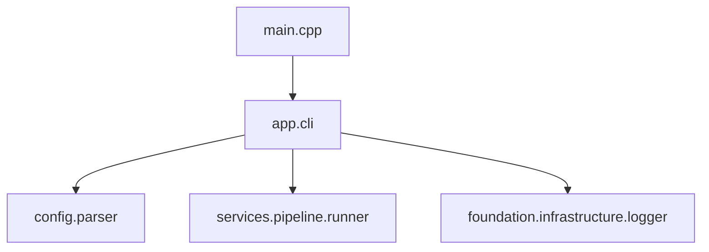

<!-- AI_CONTEXT
你是一名高级 C++ 架构师。
你的目标是设计一个可扩展且严格遵循项目工程指南的 C++20 模块系统。
在填写此模板时，你必须根据项目的“元规则”验证每一个决定。
-->

# P3: 命令行接口 (CLI) 实施计划

> **标准参考 & 跨文档链接**:
> *   架构与模块规范: [C++20 Modules 大型工程实践](../../C++/C++_20_模块-大型工程实践.md)
> *   质量与评估标准: [C++代码质量与评估标准指南](../C++_quality_standard.md)
> *   相关任务单: 见各阶段的 "对应 Task" 链接
> *   评估报告: [链接至对应评估](../evaluation/C++_evaluation_p3_cli_implementation.md) (计划完成后创建)

## 0. 计划前验证 (AI Agent 自检)
> **指令**: 在编写本计划其余部分之前，列出你已阅读和分析的具体文件，以确保本计划基于事实。

*   [x] 我已阅读 `docs/dev_docs/design.md` (CLI 规范)。
*   [x] 我已阅读 `src/app/config/parser` (Config Parser 实现)。
*   [x] 我已阅读 `src/services/pipeline/pipeline_runner.ixx` (API 接口)。
*   [x] 我已确认建议的模块名称不与现有的冲突。

## 1. 计划概述

### 1.1 目标与范围
> @brief 实现 `FaceFusionCpp` 的命令行入口，使其成为可独立运行的视频处理工具。

*   **核心目标**: 
    1.  实现 `main.cpp` 参数解析 (Help, Version, Config Path)。
    2.  集成 `config_parser` 解析 YAML 配置。
    3.  连接 `PipelineRunner` 执行任务。
    4.  实现优雅停机 (Ctrl+C) 和控制台进度显示。
*   **涉及模块**: 
    *   `app.cli` (新建)
    *   `config.parser`
    *   `services.pipeline`

### 1.2 关键约束 (C++20 & Modules)
> @brief 确认本项目特定的技术约束，确保符合大型工程规范

*   [x] **标准**: C++20 (MSVC/Clang/GCC 兼容)
*   [x] **构建**: CMake + Ninja (支持并行构建)
*   [x] **模块化**: CLI 逻辑应封装在 `app.cli` 模块中，`main.cpp` 仅作极简入口。
*   [x] **依赖**: CLI 位于最上层，依赖 Service 和 Config 层。
*   [x] **验证**: 我已阅读 `docs/C++/C++_20_modules_practice_guide.md` 并将在设计中应用。

---

## 2. 架构设计 (核心)

### 2.1 模块与库映射表 (Physical Layout)

| 物理库 (CMake Target) | 包含的逻辑模块 (Logical Modules) | 依赖的物理库 | 理由 (Reasoning) |
| :--- | :--- | :--- | :--- |
| `app_cli` | `app.cli` | `services_pipeline`, `config_parser` | 封装 CLI 交互逻辑，与 main 分离，便于测试。 |
| `FaceFusionCpp` (Exe) | `main` | `app_cli` | 最终可执行文件，极其轻量。 |

### 2.2 接口设计策略 (Module Interface)

*   **Public Modules**:
    *   `app.cli`: 导出 `App` 类，提供 `run(int argc, char** argv)` 接口。
*   **Internal Implementation**:
    *   参数解析 (Argv parsing)
    *   信号处理 (Signal Handling)
    *   进度条渲染 (Progress Bar)

### 2.3 依赖关系图 (逻辑视图)

---

## 3. 实施路线图

### 3.1 阶段一: 基础框架与参数解析
**目标**: 实现 `FaceFusionCpp.exe --help/--version` 和配置加载验证。

*   [ ] **任务 1.1**: 创建 `app.cli` 模块和 `App` 类框架。 → 对应 Task: [plan/p3_cli/task/C++_task_cli_skeleton.md](./plan/p3_cli/task/C++_task_cli_skeleton.md)
*   [ ] **任务 1.2**: 实现简单的命令行参数解析 (支持 `-c/--config`, `-h/--help`)。 → 对应 Task: [plan/p3_cli/task/C++_task_arg_parsing.md](./plan/p3_cli/task/C++_task_arg_parsing.md)
*   [ ] **验收标准**:
    *   运行 `FaceFusionCpp.exe -h` 输出帮助信息。
    *   运行 `FaceFusionCpp.exe -c config.yaml` 能成功调用 ConfigParser 并打印摘要。

### 3.2 阶段二: Pipeline 集成与运行
**目标**: 串联 `PipelineRunner`，实现真正的视频处理。

*   [ ] **任务 2.1**: 在 CLI 中实例化 `PipelineRunner` 并执行 `Run()`。 → 对应 Task: [plan/p3_cli/task/C++_task_runner_integration.md](./plan/p3_cli/task/C++_task_runner_integration.md)
*   [ ] **任务 2.2**: 实现控制台进度回调 (简单的文本进度条)。 → 对应 Task: [plan/p3_cli/task/C++_task_progress_bar.md](./plan/p3_cli/task/C++_task_progress_bar.md)
*   [ ] **验收标准**:
    *   能通过 CLI 命令成功运行 Benchmark 任务。
    *   控制台实时显示进度 FPS。

### 3.3 阶段三: 健壮性与优雅停机
**目标**: 处理异常情况和用户中断。

*   [ ] **任务 3.1**: 实现信号处理 (Ctrl+C)，调用 `PipelineRunner::Cancel()`。 → 对应 Task: [plan/p3_cli/task/C++_task_graceful_shutdown.md](./plan/p3_cli/task/C++_task_graceful_shutdown.md)
*   [ ] **任务 3.2**: 完善错误处理，捕获异常并输出友好的错误信息。 → 对应 Task: [plan/p3_cli/task/C++_task_error_handling.md](./plan/p3_cli/task/C++_task_error_handling.md)
*   [ ] **验收标准**:
    *   运行中按 Ctrl+C 能安全退出，不崩溃，不损坏输出文件 (尽力而为)。

---

## 4. 风险管理

| 风险点 | 可能性 | 影响 | 缓解措施 |
| :--- | :--- | :--- | :--- |
| **路径解析歧义** | 中 | 找不到配置文件/模型 | 严格遵循 Design 5.1 规范，强制绝对路径转换。 |
| **OpenCV 日志干扰** | 高 | 污染控制台输出 | 设置 `OPENCV_LOG_LEVEL` 或重定向 stderr。 |
| **Ctrl+C 死锁** | 中 | 进程无法退出 | 确保 `ThreadSafeQueue` 响应 shutdown 信号。 |

## 5. 资源与依赖
*   **依赖**: `cxxopts` (可选，或手写简单解析), `indicators` (可选，用于进度条，vcpkg 已有)
*   **工具**: PowerShell / Bash 用于集成测试。
