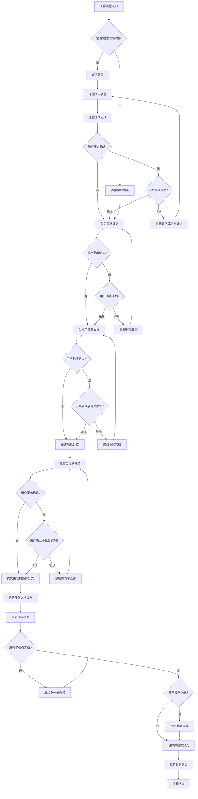

### 工作流程

#### 流程概述
本工作流程支持两种路径：**评估路径**（需要代码质量评估）和**直接实现路径**（无需评估）。流程设计遵循"批量确认、并行处理、快速通道"原则，并支持根据用户意愿灵活调整确认机制。

**核心原则**：所有开发工作必须在独立的功能/修复分支上进行，严禁直接修改主分支。

---

#### 上下文管理规则 (Context Management)

> 基于 Manus AI 的"上下文工程"理念，确保关键信息不丢失。

**1. 2-Action Rule（双操作规则）**
> 每 2 次查看/浏览/研究操作后，**立即**将关键发现写入文档。

| 操作类型 | 示例                   | 记录位置                 |
| -------- | ---------------------- | ------------------------ |
| 代码浏览 | 阅读源码、查看接口     | 计划文档的"研究发现"章节 |
| 文档阅读 | 查阅 API 文档、规范    | 计划文档的"研究发现"章节 |
| 测试运行 | 执行测试、观察输出     | 任务文档的"问题记录"章节 |
| 搜索研究 | 搜索解决方案、查阅示例 | 计划文档的"研究发现"章节 |

**2. 持久化优先原则**
```
上下文窗口 = 内存 (易失性, 有限)
文件系统 = 磁盘 (持久性, 无限)

→ 任何重要信息都应写入磁盘。
```

**3. 读写决策矩阵**

| 场景           | 操作                 | 原因                     |
| -------------- | -------------------- | ------------------------ |
| 刚写完文件     | **不读**             | 内容仍在上下文中         |
| 查看了图像/PDF | **立即写**           | 多模态信息需转为文本保存 |
| 研究返回数据   | **写入文件**         | 研究结果不会持久保留     |
| 开始新阶段     | **读取计划**         | 重新定位目标             |
| 发生错误       | **读取相关文件**     | 需要当前状态来修复       |
| 中断后恢复     | **读取所有计划文件** | 恢复工作状态             |

---

#### 评估路径（需要代码质量评估）

**阶段一：代码评估**
1. 评估代码质量
2. 编写评估文档（路径：`/docs/dev_docs/evaluation/C++_evaluation_{title}.md`）
3. 等待用户确认评估结果（若用户要求无需确认则跳过）
4. 若用户确认评估结果，进入阶段二；否则，根据反馈重新评估（返回步骤1）

**阶段二：计划制定**
5. 根据评估结果制定实施计划
6. 用户确认计划（若用户要求无需确认则跳过）
   - 若确认，进入阶段三
   - 若拒绝，重新制定计划（返回步骤5）

**阶段三：任务文档生成**
7. 根据计划批量生成子任务文档
   - 路径：`/docs/dev_docs/plan/{plan_name}/task/C++_task_{task_name}.md`
   - 格式：中文 Markdown
8. 用户确认子任务文档（可批量确认或逐个确认；若用户要求无需确认则跳过）
   - 若确认，进入阶段四
   - 若拒绝，修改任务文档（返回步骤7）

**阶段四：任务实现（分支操作开始）**
9. **创建功能分支**：基于当前开发分支（如 `main`）新建分支（例如：`feature/plan-{plan_name}`）。
10. 批量实现子任务（根据用户确认的任务文档）
11. 用户确认子任务实现（可批量确认或逐个确认；若用户要求无需确认则跳过）
    - 若确认，更新任务状态，继续实现剩余子任务
    - 若拒绝，重新实现子任务（返回步骤10）
12. 提交子任务更改到git（仅提交代码文件，不提交文档文件）
13. 更新任务文档状态
    - 将对应的子任务文档状态标记为"已完成"
    - 记录完成时间与相关 commit ID

**阶段五：完成验收与合并**
14. 所有子任务实现完成后，用户确认任务完成（若用户要求无需确认则跳过）
15. **合并分支**：将功能分支合并回开发主分支。
16. **清理分支**：删除已合并的功能分支。
17. 更新计划状态为"已完成"
18. 流程结束

#### 直接实现路径（无需代码评估）

**阶段一：计划制定**
1. 直接制定实施计划
2. 用户确认计划（若用户要求无需确认则跳过）
   - 若确认，进入阶段二
   - 若拒绝，重新制定计划（返回步骤1）

**阶段二：任务文档生成**
3. 根据计划批量生成子任务文档
   - 路径：`/docs/dev_docs/plan/{plan_name}/task/C++_task_{task_name}.md`
   - 格式：中文 Markdown
4. 用户确认子任务文档（可批量确认或逐个确认；若用户要求无需确认则跳过）
   - 若确认，进入阶段三
   - 若拒绝，修改任务文档（返回步骤3）

**阶段三：任务实现（分支操作开始）**
5. **创建功能分支**：基于当前开发分支新建分支。
6. 批量实现子任务（根据用户确认的任务文档）
7. 用户确认子任务实现（可批量确认或逐个确认；若用户要求无需确认则跳过）
    - 若确认，更新任务状态，继续实现剩余子任务
    - 若拒绝，重新实现子任务（返回步骤5）
8. 提交子任务更改到git（仅提交代码文件，不提交文档文件）
9. 更新任务文档状态
   - 将对应的子任务文档状态标记为"已完成"
   - 记录完成时间与相关 commit ID

**阶段四：完成验收与合并**
10. 所有子任务实现完成后，用户确认任务完成（若用户要求无需确认则跳过）
11. **合并分支**：将功能分支合并回开发主分支。
12. **清理分支**：删除已合并的功能分支。
13. 更新计划状态为"已完成"
14. 流程结束

#### 流程特性说明

**1. 双路径设计**
- 评估路径：适用于需要代码质量评估的场景，确保代码质量符合要求
- 直接实现路径：适用于简单任务或用户明确无需评估的场景，提高效率

**2. 批量处理机制**
- 子任务文档支持批量生成和确认，减少交互次数
- 用户可选择批量确认或逐个确认，根据任务复杂度灵活选择

**3. 快速通道**
- 对于简单任务（如单个子任务），可跳过部分确认环节，直接进入实现阶段
- 支持用户自定义确认粒度

**4. 状态管理**
- 每个阶段完成后更新状态，确保流程可追溯
- 支持回滚到任意阶段，便于调整和修正

**5. 异常处理**
- 任何阶段被拒绝时，都有明确的回退路径
- 支持部分完成后的继续执行，避免全量重做

**6. 版本控制与分支规范**
- **强制分支**：严禁在主分支（main/master）直接提交代码。
- **分支命名**：`feature/plan-{name}` 或 `fix/task-{name}`。
- **原子提交**：每个子任务完成后，提交代码更改到当前分支。
- **合并清理**：任务验收后合并并删除分支，保持仓库整洁。

**7. 灵活确认机制**
- **原则**：流程中的确认环节执行取决于用户的显式要求。
- **显式确认**：若用户显式要求确认，则所有相关的确认节点（如评估、计划、文档、实现结果）必须等待用户确认。
- **无需确认**：若用户显式要求无需确认，则跳过确认节点，直接进入下一阶段。

#### 流程图

